# CodeDebrief Decision Flows

> Generated from source code. Do not edit this file manually.

- **Generated:** `2026-06-23T07:42:49.790167+00:00`
- **Source root:** `.`
- **Flows:** 376
- **Entry points:** 219
- **Scopes:** flutter\_chat (100) · public (103) · src (173)

## Project Map


## Entry Point Flows

### GeneratedPluginRegistrant.registerWith

`method` · `java` · `generic` · [`flutter_chat/flutter_chat/android/app/src/main/java/io/flutter/plugins/GeneratedPluginRegistrant.java:17`](../flutter_chat/flutter_chat/android/app/src/main/java/io/flutter/plugins/GeneratedPluginRegistrant.java#L17)

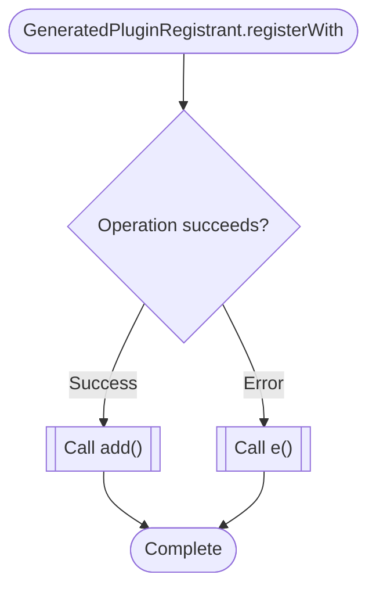

### handle\_new\_rx\_page

`event_handler` · `python` · `generic` · [`flutter_chat/flutter_chat/ios/Flutter/ephemeral/flutter_lldb_helper.py:7`](../flutter_chat/flutter_chat/ios/Flutter/ephemeral/flutter_lldb_helper.py#L7)

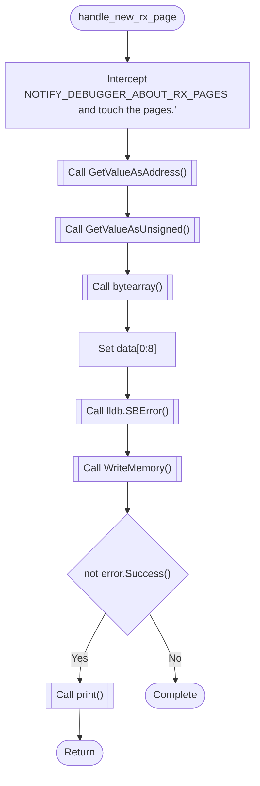

### fl\_register\_plugins

`function` · `cpp` · `generic` · [`flutter_chat/flutter_chat/linux/flutter/generated_plugin_registrant.cc:10`](../flutter_chat/flutter_chat/linux/flutter/generated_plugin_registrant.cc#L10)

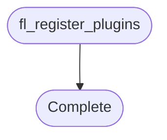

### main

`main` · `cpp` · `cpp` · [`flutter_chat/flutter_chat/linux/runner/main.cc:3`](../flutter_chat/flutter_chat/linux/runner/main.cc#L3)

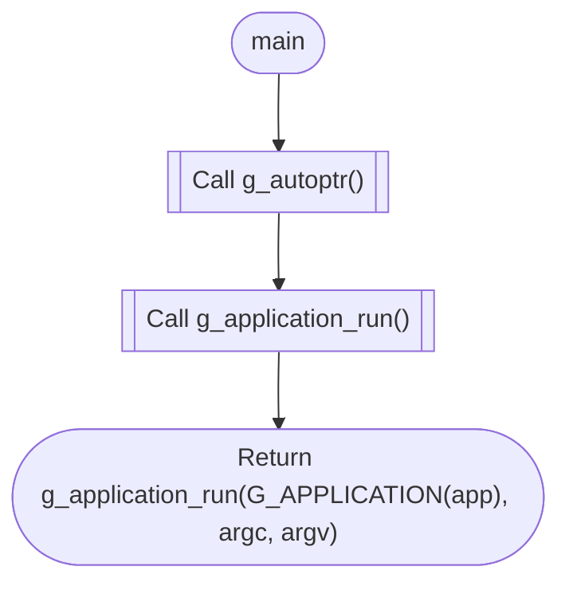

### my\_application\_new

`function` · `cpp` · `generic` · [`flutter_chat/flutter_chat/linux/runner/my_application.cc:138`](../flutter_chat/flutter_chat/linux/runner/my_application.cc#L138)

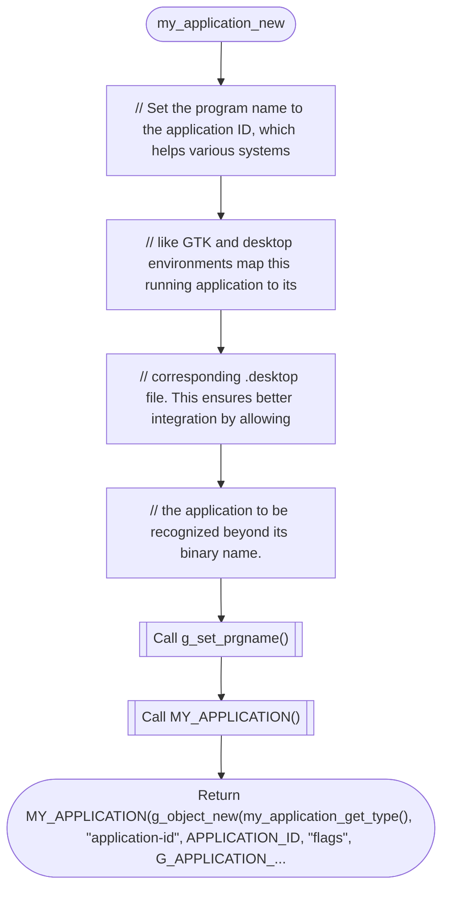

### GetInstance.StandardCodecSerializer.serializer

`method` · `cpp` · `generic` · [`flutter_chat/flutter_chat/windows/flutter/ephemeral/cpp_client_wrapper/standard_codec.cc:293`](../flutter_chat/flutter_chat/windows/flutter/ephemeral/cpp_client_wrapper/standard_codec.cc#L293)

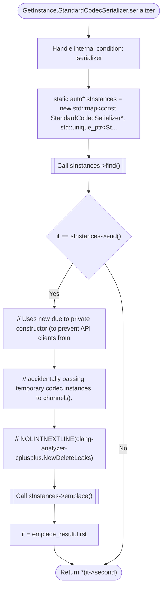

### GetInstance.StandardCodecSerializer.serializer

`method` · `cpp` · `generic` · [`flutter_chat/flutter_chat/windows/flutter/ephemeral/cpp_client_wrapper/standard_codec.cc:341`](../flutter_chat/flutter_chat/windows/flutter/ephemeral/cpp_client_wrapper/standard_codec.cc#L341)


### flutter.AddPlugin

`method` · `cpp` · `generic` · [`flutter_chat/flutter_chat/windows/flutter/ephemeral/cpp_client_wrapper/plugin_registrar.cc:38`](../flutter_chat/flutter_chat/windows/flutter/ephemeral/cpp_client_wrapper/plugin_registrar.cc#L38)

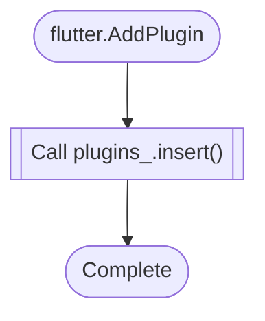

### flutter.BinaryMessengerImpl

`method` · `cpp` · `generic` · [`flutter_chat/flutter_chat/windows/flutter/ephemeral/cpp_client_wrapper/core_implementations.cc:81`](../flutter_chat/flutter_chat/windows/flutter/ephemeral/cpp_client_wrapper/core_implementations.cc#L81)

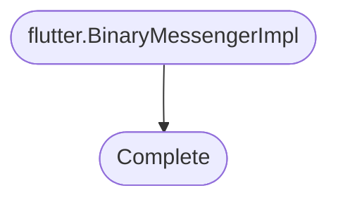

### flutter.ClearPlugins

`method` · `cpp` · `generic` · [`flutter_chat/flutter_chat/windows/flutter/ephemeral/cpp_client_wrapper/plugin_registrar.cc:42`](../flutter_chat/flutter_chat/windows/flutter/ephemeral/cpp_client_wrapper/plugin_registrar.cc#L42)

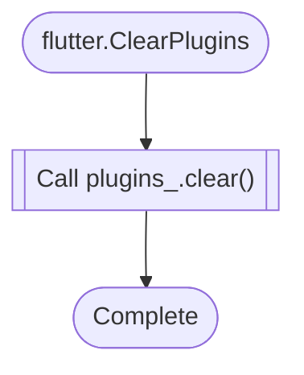

### flutter.DecodeAndProcessResponseEnvelopeInternal

`method` · `cpp` · `generic` · [`flutter_chat/flutter_chat/windows/flutter/ephemeral/cpp_client_wrapper/standard_codec.cc:434`](../flutter_chat/flutter_chat/windows/flutter/ephemeral/cpp_client_wrapper/standard_codec.cc#L434)

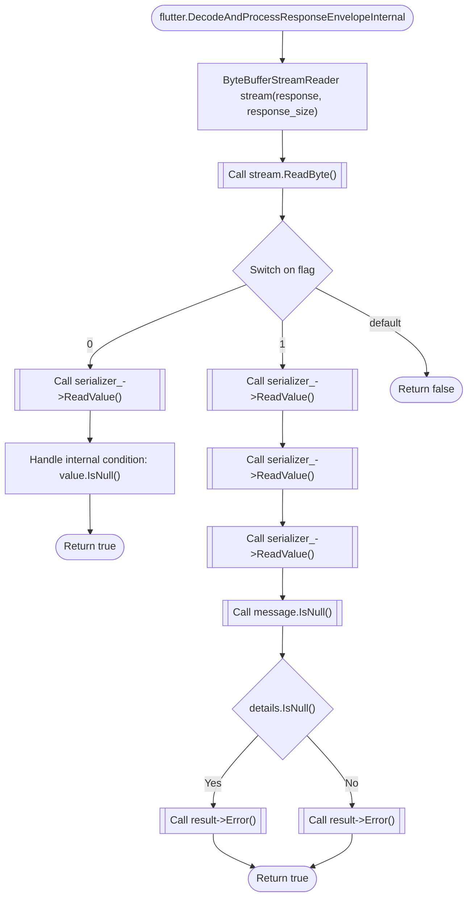

### flutter.DecodeMessageInternal

`method` · `cpp` · `generic` · [`flutter_chat/flutter_chat/windows/flutter/ephemeral/cpp_client_wrapper/standard_codec.cc:319`](../flutter_chat/flutter_chat/windows/flutter/ephemeral/cpp_client_wrapper/standard_codec.cc#L319)

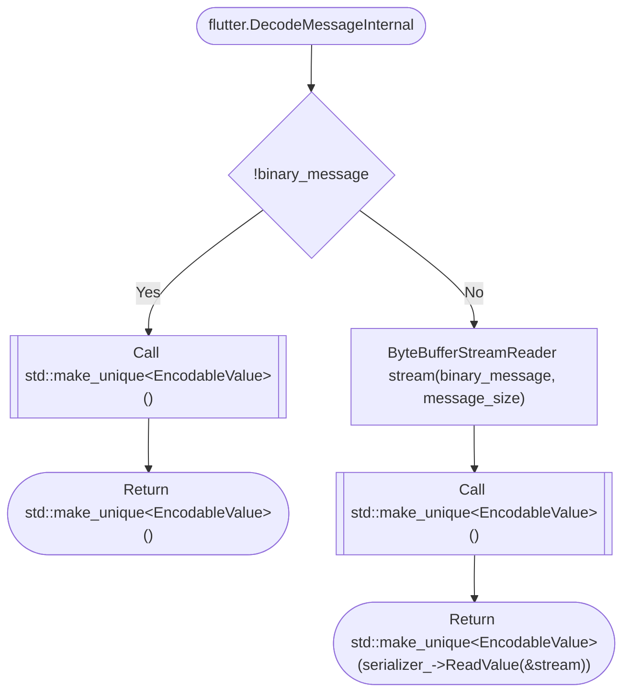

### flutter.DecodeMethodCallInternal

`method` · `cpp` · `generic` · [`flutter_chat/flutter_chat/windows/flutter/ephemeral/cpp_client_wrapper/standard_codec.cc:367`](../flutter_chat/flutter_chat/windows/flutter/ephemeral/cpp_client_wrapper/standard_codec.cc#L367)

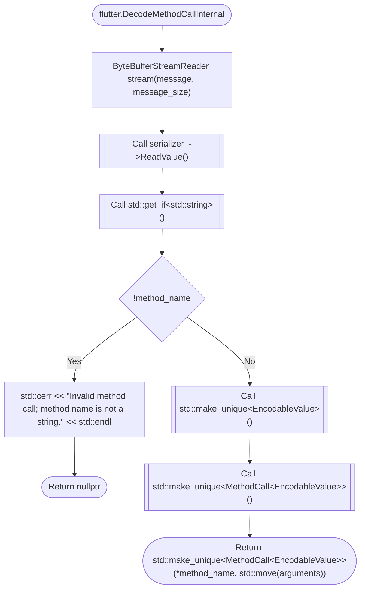

### flutter.EncodeErrorEnvelopeInternal

`method` · `cpp` · `generic` · [`flutter_chat/flutter_chat/windows/flutter/ephemeral/cpp_client_wrapper/standard_codec.cc:412`](../flutter_chat/flutter_chat/windows/flutter/ephemeral/cpp_client_wrapper/standard_codec.cc#L412)

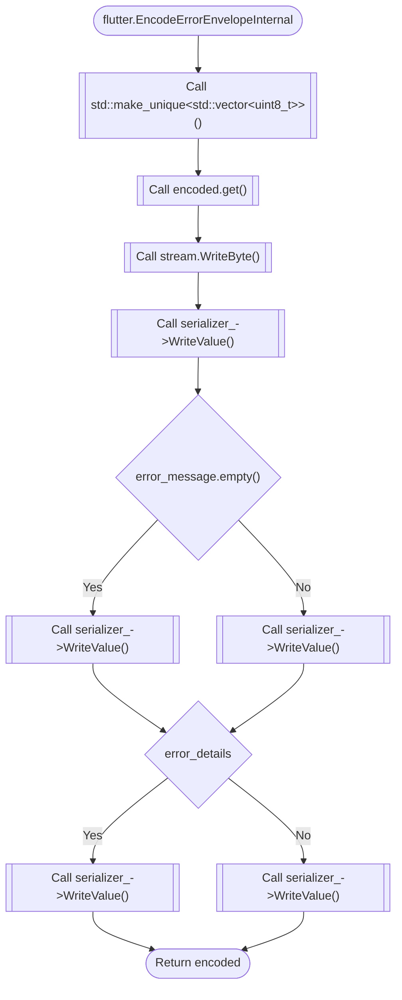

### flutter.EncodeMessageInternal

`method` · `cpp` · `generic` · [`flutter_chat/flutter_chat/windows/flutter/ephemeral/cpp_client_wrapper/standard_codec.cc:329`](../flutter_chat/flutter_chat/windows/flutter/ephemeral/cpp_client_wrapper/standard_codec.cc#L329)

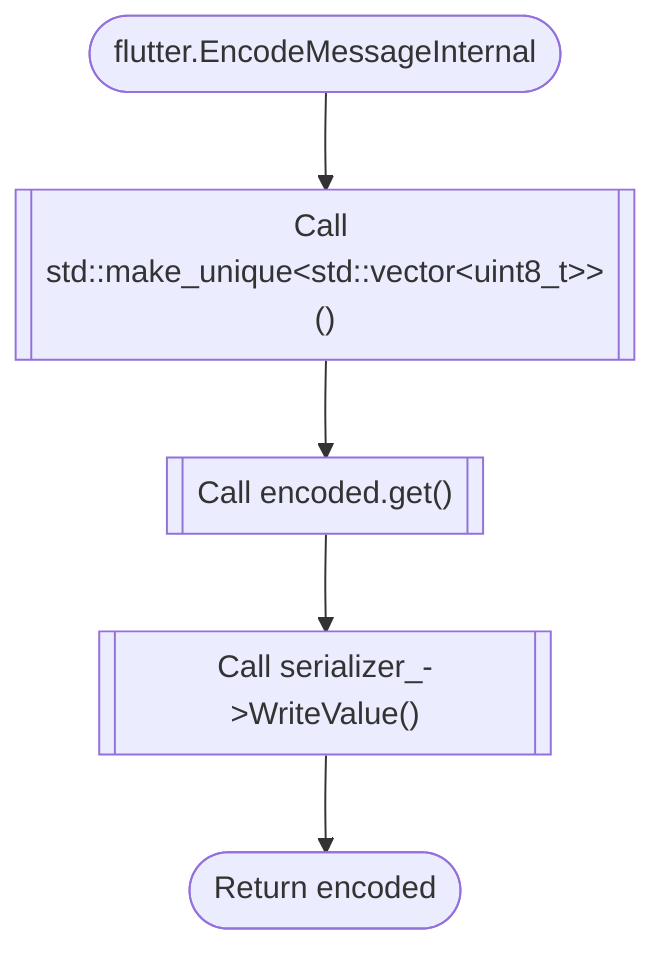

### flutter.EncodeMethodCallInternal

`method` · `cpp` · `generic` · [`flutter_chat/flutter_chat/windows/flutter/ephemeral/cpp_client_wrapper/standard_codec.cc:384`](../flutter_chat/flutter_chat/windows/flutter/ephemeral/cpp_client_wrapper/standard_codec.cc#L384)

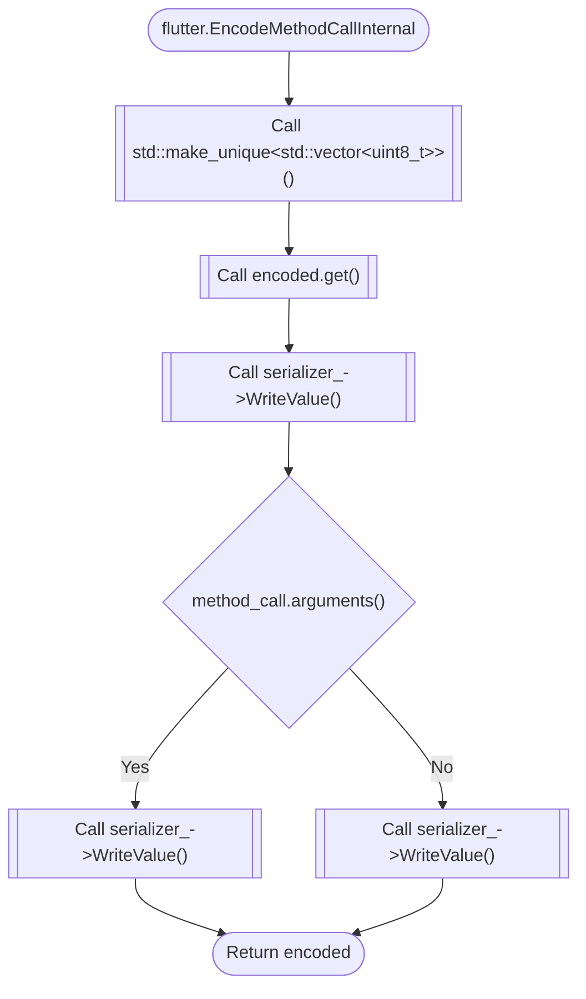

### flutter.EncodeSuccessEnvelopeInternal

`method` · `cpp` · `generic` · [`flutter_chat/flutter_chat/windows/flutter/ephemeral/cpp_client_wrapper/standard_codec.cc:398`](../flutter_chat/flutter_chat/windows/flutter/ephemeral/cpp_client_wrapper/standard_codec.cc#L398)

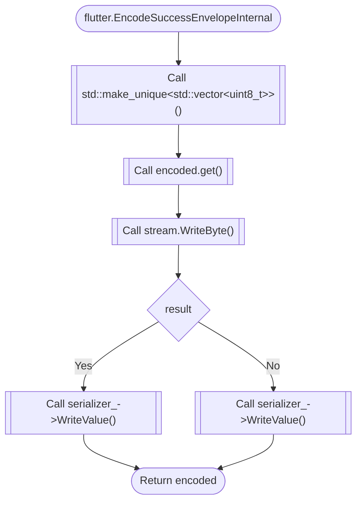

### flutter.EncodedTypeForValue

`method` · `cpp` · `generic` · [`flutter_chat/flutter_chat/windows/flutter/ephemeral/cpp_client_wrapper/standard_codec.cc:48`](../flutter_chat/flutter_chat/windows/flutter/ephemeral/cpp_client_wrapper/standard_codec.cc#L48)

```mermaid
flowchart TD
  mflow_2e67aa4131025f35_n1(["flutter.EncodedTypeForValue"])
  mflow_2e67aa4131025f35_n2{"Switch on value.index()"}
  mflow_2e67aa4131025f35_n3(["Return EncodedType::kNull"])
  mflow_2e67aa4131025f35_n4[["Call std::get&lt;bool&gt;()"]]
  mflow_2e67aa4131025f35_n5(["Return std::get&lt;bool&gt;(value) ? EncodedType::kTrue : EncodedType::kFalse"])
  mflow_2e67aa4131025f35_n6(["Return EncodedType::kInt32"])
  mflow_2e67aa4131025f35_n7(["Return EncodedType::kInt64"])
  mflow_2e67aa4131025f35_n8(["Return EncodedType::kFloat64"])
  mflow_2e67aa4131025f35_n9(["Return EncodedType::kString"])
  mflow_2e67aa4131025f35_n10(["Return EncodedType::kUInt8List"])
  mflow_2e67aa4131025f35_n11(["Return EncodedType::kInt32List"])
  mflow_2e67aa4131025f35_n12(["Return EncodedType::kInt64List"])
  mflow_2e67aa4131025f35_n13(["Return EncodedType::kFloat64List"])
  mflow_2e67aa4131025f35_n14(["Return EncodedType::kList"])
  mflow_2e67aa4131025f35_n15(["Return EncodedType::kMap"])
  mflow_2e67aa4131025f35_n16(["Return EncodedType::kFloat32List"])
  mflow_2e67aa4131025f35_n17[["Call assert()"]]
  mflow_2e67aa4131025f35_n18(["Return EncodedType::kNull"])
  mflow_2e67aa4131025f35_n1 --> mflow_2e67aa4131025f35_n2
  mflow_2e67aa4131025f35_n2 -->|"0"| mflow_2e67aa4131025f35_n3
  mflow_2e67aa4131025f35_n2 -->|"1"| mflow_2e67aa4131025f35_n4
  mflow_2e67aa4131025f35_n4 --> mflow_2e67aa4131025f35_n5
  mflow_2e67aa4131025f35_n2 -->|"2"| mflow_2e67aa4131025f35_n6
  mflow_2e67aa4131025f35_n2 -->|"3"| mflow_2e67aa4131025f35_n7
  mflow_2e67aa4131025f35_n2 -->|"4"| mflow_2e67aa4131025f35_n8
  mflow_2e67aa4131025f35_n2 -->|"5"| mflow_2e67aa4131025f35_n9
  mflow_2e67aa4131025f35_n2 -->|"6"| mflow_2e67aa4131025f35_n10
  mflow_2e67aa4131025f35_n2 -->|"7"| mflow_2e67aa4131025f35_n11
  mflow_2e67aa4131025f35_n2 -->|"8"| mflow_2e67aa4131025f35_n12
  mflow_2e67aa4131025f35_n2 -->|"9"| mflow_2e67aa4131025f35_n13
  mflow_2e67aa4131025f35_n2 -->|"10"| mflow_2e67aa4131025f35_n14
  mflow_2e67aa4131025f35_n2 -->|"11"| mflow_2e67aa4131025f35_n15
  mflow_2e67aa4131025f35_n2 -->|"13"| mflow_2e67aa4131025f35_n16
  mflow_2e67aa4131025f35_n2 -->|"default"| mflow_2e67aa4131025f35_n17
  mflow_2e67aa4131025f35_n17 --> mflow_2e67aa4131025f35_n18
```

### flutter.FlutterEngine

`method` · `cpp` · `generic` · [`flutter_chat/flutter_chat/windows/flutter/ephemeral/cpp_client_wrapper/flutter_engine.cc:15`](../flutter_chat/flutter_chat/windows/flutter/ephemeral/cpp_client_wrapper/flutter_engine.cc#L15)

```mermaid
flowchart TD
  mflow_5dd5f6f74616d5ac_n1(["flutter.FlutterEngine"])
  mflow_5dd5f6f74616d5ac_n2["FlutterDesktopEngineProperties c_engine_properties = {}"]
  mflow_5dd5f6f74616d5ac_n3[["Call project.assets_path().c_str()"]]
  mflow_5dd5f6f74616d5ac_n4[["Call project.icu_data_path().c_str()"]]
  mflow_5dd5f6f74616d5ac_n5[["Call project.aot_library_path().c_str()"]]
  mflow_5dd5f6f74616d5ac_n6[["Call project.dart_entrypoint().c_str()"]]
  mflow_5dd5f6f74616d5ac_n7[["Call static_cast&lt;FlutterDesktopGpuPreference&gt;()"]]
  mflow_5dd5f6f74616d5ac_n8[["Call static_cast&lt;FlutterDesktopUIThreadPolicy&gt;()"]]
  mflow_5dd5f6f74616d5ac_n9[["Call project.dart_entrypoint_arguments()"]]
  mflow_5dd5f6f74616d5ac_n10["std::vector&lt;const char*&gt; entrypoint_argv"]
  mflow_5dd5f6f74616d5ac_n11[["Call std::back_inserter()"]]
  mflow_5dd5f6f74616d5ac_n12[["Call static_cast&lt;int&gt;()"]]
  mflow_5dd5f6f74616d5ac_n13[["Call entrypoint_argv.empty()"]]
  mflow_5dd5f6f74616d5ac_n14[["Call FlutterDesktopEngineCreate()"]]
  mflow_5dd5f6f74616d5ac_n15[["Call FlutterDesktopEngineGetMessenger()"]]
  mflow_5dd5f6f74616d5ac_n16[["Call std::make_unique&lt;BinaryMessengerImpl&gt;()"]]
  mflow_5dd5f6f74616d5ac_n17(["Complete"])
  mflow_5dd5f6f74616d5ac_n1 --> mflow_5dd5f6f74616d5ac_n2
  mflow_5dd5f6f74616d5ac_n2 --> mflow_5dd5f6f74616d5ac_n3
  mflow_5dd5f6f74616d5ac_n3 --> mflow_5dd5f6f74616d5ac_n4
  mflow_5dd5f6f74616d5ac_n4 --> mflow_5dd5f6f74616d5ac_n5
  mflow_5dd5f6f74616d5ac_n5 --> mflow_5dd5f6f74616d5ac_n6
  mflow_5dd5f6f74616d5ac_n6 --> mflow_5dd5f6f74616d5ac_n7
  mflow_5dd5f6f74616d5ac_n7 --> mflow_5dd5f6f74616d5ac_n8
  mflow_5dd5f6f74616d5ac_n8 --> mflow_5dd5f6f74616d5ac_n9
  mflow_5dd5f6f74616d5ac_n9 --> mflow_5dd5f6f74616d5ac_n10
  mflow_5dd5f6f74616d5ac_n10 --> mflow_5dd5f6f74616d5ac_n11
  mflow_5dd5f6f74616d5ac_n11 --> mflow_5dd5f6f74616d5ac_n12
  mflow_5dd5f6f74616d5ac_n12 --> mflow_5dd5f6f74616d5ac_n13
  mflow_5dd5f6f74616d5ac_n13 --> mflow_5dd5f6f74616d5ac_n14
  mflow_5dd5f6f74616d5ac_n14 --> mflow_5dd5f6f74616d5ac_n15
  mflow_5dd5f6f74616d5ac_n15 --> mflow_5dd5f6f74616d5ac_n16
  mflow_5dd5f6f74616d5ac_n16 --> mflow_5dd5f6f74616d5ac_n17
```

### flutter.FlutterEngine

`method` · `cpp` · `generic` · [`flutter_chat/flutter_chat/windows/flutter/ephemeral/cpp_client_wrapper/flutter_engine.cc:45`](../flutter_chat/flutter_chat/windows/flutter/ephemeral/cpp_client_wrapper/flutter_engine.cc#L45)

```mermaid
flowchart TD
  mflow_5dd5f6f74616d5ac_n1(["flutter.FlutterEngine"])
  mflow_5dd5f6f74616d5ac_n2[["Call ShutDown()"]]
  mflow_5dd5f6f74616d5ac_n3(["Complete"])
  mflow_5dd5f6f74616d5ac_n1 --> mflow_5dd5f6f74616d5ac_n2
  mflow_5dd5f6f74616d5ac_n2 --> mflow_5dd5f6f74616d5ac_n3
```

### flutter.FlutterViewController

`method` · `cpp` · `generic` · [`flutter_chat/flutter_chat/windows/flutter/ephemeral/cpp_client_wrapper/flutter_view_controller.cc:12`](../flutter_chat/flutter_chat/windows/flutter/ephemeral/cpp_client_wrapper/flutter_view_controller.cc#L12)

```mermaid
flowchart TD
  mflow_343d44cb66eb8e0a_n1(["flutter.FlutterViewController"])
  mflow_343d44cb66eb8e0a_n2[["Call std::make_shared&lt;FlutterEngine&gt;()"]]
  mflow_343d44cb66eb8e0a_n3[["Call FlutterDesktopViewControllerCreate()"]]
  mflow_343d44cb66eb8e0a_n4{"!controller_"}
  mflow_343d44cb66eb8e0a_n5["std::cerr &lt;&lt; &quot;Failed to create view controller.&quot; &lt;&lt; std::endl"]
  mflow_343d44cb66eb8e0a_n6(["Return"])
  mflow_343d44cb66eb8e0a_n7[["Call std::make_unique&lt;FlutterView&gt;()"]]
  mflow_343d44cb66eb8e0a_n8(["Complete"])
  mflow_343d44cb66eb8e0a_n1 --> mflow_343d44cb66eb8e0a_n2
  mflow_343d44cb66eb8e0a_n2 --> mflow_343d44cb66eb8e0a_n3
  mflow_343d44cb66eb8e0a_n3 --> mflow_343d44cb66eb8e0a_n4
  mflow_343d44cb66eb8e0a_n4 -->|"Yes"| mflow_343d44cb66eb8e0a_n5
  mflow_343d44cb66eb8e0a_n5 --> mflow_343d44cb66eb8e0a_n6
  mflow_343d44cb66eb8e0a_n4 -->|"No"| mflow_343d44cb66eb8e0a_n7
  mflow_343d44cb66eb8e0a_n7 --> mflow_343d44cb66eb8e0a_n8
```

### flutter.FlutterViewController

`method` · `cpp` · `generic` · [`flutter_chat/flutter_chat/windows/flutter/ephemeral/cpp_client_wrapper/flutter_view_controller.cc:26`](../flutter_chat/flutter_chat/windows/flutter/ephemeral/cpp_client_wrapper/flutter_view_controller.cc#L26)

```mermaid
flowchart TD
  mflow_343d44cb66eb8e0a_n1(["flutter.FlutterViewController"])
  mflow_343d44cb66eb8e0a_n2["Handle internal condition: controller_"]
  mflow_343d44cb66eb8e0a_n3(["Complete"])
  mflow_343d44cb66eb8e0a_n1 --> mflow_343d44cb66eb8e0a_n2
  mflow_343d44cb66eb8e0a_n2 --> mflow_343d44cb66eb8e0a_n3
```

### flutter.ForceRedraw

`method` · `cpp` · `generic` · [`flutter_chat/flutter_chat/windows/flutter/ephemeral/cpp_client_wrapper/flutter_view_controller.cc:38`](../flutter_chat/flutter_chat/windows/flutter/ephemeral/cpp_client_wrapper/flutter_view_controller.cc#L38)

```mermaid
flowchart TD
  mflow_230049f34dd6a115_n1(["flutter.ForceRedraw"])
  mflow_230049f34dd6a115_n2[["Call FlutterDesktopViewControllerForceRedraw()"]]
  mflow_230049f34dd6a115_n3(["Complete"])
  mflow_230049f34dd6a115_n1 --> mflow_230049f34dd6a115_n2
  mflow_230049f34dd6a115_n2 --> mflow_230049f34dd6a115_n3
```

### flutter.ForwardToHandler

`method` · `cpp` · `generic` · [`flutter_chat/flutter_chat/windows/flutter/ephemeral/cpp_client_wrapper/core_implementations.cc:42`](../flutter_chat/flutter_chat/windows/flutter/ephemeral/cpp_client_wrapper/core_implementations.cc#L42)

```mermaid
flowchart TD
  mflow_3de8801eb4264737_n1(["flutter.ForwardToHandler"])
  mflow_3de8801eb4264737_n2["auto* response_handle = message-&gt;response_handle"]
  mflow_3de8801eb4264737_n3[["Call std::shared_ptr&lt;FlutterDesktopMessenger&gt;()"]]
  mflow_3de8801eb4264737_n4[["Call FlutterDesktopMessengerSendResponse()"]]
  mflow_3de8801eb4264737_n5[["Call static_cast&lt;BinaryMessageHandler*&gt;()"]]
  mflow_3de8801eb4264737_n6[["Call message_handler()"]]
  mflow_3de8801eb4264737_n7(["Complete"])
  mflow_3de8801eb4264737_n1 --> mflow_3de8801eb4264737_n2
  mflow_3de8801eb4264737_n2 --> mflow_3de8801eb4264737_n3
  mflow_3de8801eb4264737_n3 --> mflow_3de8801eb4264737_n4
  mflow_3de8801eb4264737_n4 --> mflow_3de8801eb4264737_n5
  mflow_3de8801eb4264737_n5 --> mflow_3de8801eb4264737_n6
  mflow_3de8801eb4264737_n6 --> mflow_3de8801eb4264737_n7
```

### flutter.GetInstance

`method` · `cpp` · `generic` · [`flutter_chat/flutter_chat/windows/flutter/ephemeral/cpp_client_wrapper/plugin_registrar.cc:49`](../flutter_chat/flutter_chat/windows/flutter/ephemeral/cpp_client_wrapper/plugin_registrar.cc#L49)

```mermaid
flowchart TD
  mflow_8fda99cbe7690271_n1(["flutter.GetInstance"])
  mflow_8fda99cbe7690271_n2["static PluginRegistrarManager* instance = new PluginRegistrarManager()"]
  mflow_8fda99cbe7690271_n3(["Return instance"])
  mflow_8fda99cbe7690271_n1 --> mflow_8fda99cbe7690271_n2
  mflow_8fda99cbe7690271_n2 --> mflow_8fda99cbe7690271_n3
```

### flutter.GetInstance

`method` · `cpp` · `generic` · [`flutter_chat/flutter_chat/windows/flutter/ephemeral/cpp_client_wrapper/standard_codec.cc:87`](../flutter_chat/flutter_chat/windows/flutter/ephemeral/cpp_client_wrapper/standard_codec.cc#L87)

```mermaid
flowchart TD
  mflow_8fda99cbe7690271_n1(["flutter.GetInstance"])
  mflow_8fda99cbe7690271_n2["static StandardCodecSerializer sInstance"]
  mflow_8fda99cbe7690271_n3(["Return sInstance"])
  mflow_8fda99cbe7690271_n1 --> mflow_8fda99cbe7690271_n2
  mflow_8fda99cbe7690271_n2 --> mflow_8fda99cbe7690271_n3
```

### flutter.GetRegistrarForPlugin

`method` · `cpp` · `generic` · [`flutter_chat/flutter_chat/windows/flutter/ephemeral/cpp_client_wrapper/flutter_engine.cc:85`](../flutter_chat/flutter_chat/windows/flutter/ephemeral/cpp_client_wrapper/flutter_engine.cc#L85)

```mermaid
flowchart TD
  mflow_70f2f8d1d5c749bf_n1(["flutter.GetRegistrarForPlugin"])
  mflow_70f2f8d1d5c749bf_n2{"!engine_"}
  mflow_70f2f8d1d5c749bf_n3["std::cerr &lt;&lt; &quot;Cannot get plugin registrar on an engine that isn't running; &quot; &quot;call Run fi..."]
  mflow_70f2f8d1d5c749bf_n4(["Return nullptr"])
  mflow_70f2f8d1d5c749bf_n5[["Call FlutterDesktopEngineGetPluginRegistrar()"]]
  mflow_70f2f8d1d5c749bf_n6(["Return FlutterDesktopEngineGetPluginRegistrar(engine_, plugin_name.c_str())"])
  mflow_70f2f8d1d5c749bf_n1 --> mflow_70f2f8d1d5c749bf_n2
  mflow_70f2f8d1d5c749bf_n2 -->|"Yes"| mflow_70f2f8d1d5c749bf_n3
  mflow_70f2f8d1d5c749bf_n3 --> mflow_70f2f8d1d5c749bf_n4
  mflow_70f2f8d1d5c749bf_n2 -->|"No"| mflow_70f2f8d1d5c749bf_n5
  mflow_70f2f8d1d5c749bf_n5 --> mflow_70f2f8d1d5c749bf_n6
```

### flutter.HandleTopLevelWindowProc

`method` · `cpp` · `generic` · [`flutter_chat/flutter_chat/windows/flutter/ephemeral/cpp_client_wrapper/flutter_view_controller.cc:42`](../flutter_chat/flutter_chat/windows/flutter/ephemeral/cpp_client_wrapper/flutter_view_controller.cc#L42)

```mermaid
flowchart TD
  mflow_048552eb4b5f1fd0_n1(["flutter.HandleTopLevelWindowProc"])
  mflow_048552eb4b5f1fd0_n2["LRESULT result"]
  mflow_048552eb4b5f1fd0_n3[["Call FlutterDesktopViewControllerHandleTopLevelWindowProc()"]]
  mflow_048552eb4b5f1fd0_n4[["Call std::optional&lt;LRESULT&gt;()"]]
  mflow_048552eb4b5f1fd0_n5(["Return handled ? result : std::optional&lt;LRESULT&gt;(std::nullopt)"])
  mflow_048552eb4b5f1fd0_n1 --> mflow_048552eb4b5f1fd0_n2
  mflow_048552eb4b5f1fd0_n2 --> mflow_048552eb4b5f1fd0_n3
  mflow_048552eb4b5f1fd0_n3 --> mflow_048552eb4b5f1fd0_n4
  mflow_048552eb4b5f1fd0_n4 --> mflow_048552eb4b5f1fd0_n5
```

### flutter.MarkTextureFrameAvailable

`method` · `cpp` · `generic` · [`flutter_chat/flutter_chat/windows/flutter/ephemeral/cpp_client_wrapper/core_implementations.cc:251`](../flutter_chat/flutter_chat/windows/flutter/ephemeral/cpp_client_wrapper/core_implementations.cc#L251)

```mermaid
flowchart TD
  mflow_1e7947de4d80c9c1_n1(["flutter.MarkTextureFrameAvailable"])
  mflow_1e7947de4d80c9c1_n2[["Call FlutterDesktopTextureRegistrarMarkExternalTextureFrameAvailable()"]]
  mflow_1e7947de4d80c9c1_n3(["Return FlutterDesktopTextureRegistrarMarkExternalTextureFrameAvailable( texture_registrar_ref_, texture_id)"])
  mflow_1e7947de4d80c9c1_n1 --> mflow_1e7947de4d80c9c1_n2
  mflow_1e7947de4d80c9c1_n2 --> mflow_1e7947de4d80c9c1_n3
```

### flutter.OnRegistrarDestroyed

`method` · `cpp` · `generic` · [`flutter_chat/flutter_chat/windows/flutter/ephemeral/cpp_client_wrapper/plugin_registrar.cc:57`](../flutter_chat/flutter_chat/windows/flutter/ephemeral/cpp_client_wrapper/plugin_registrar.cc#L57)

```mermaid
flowchart TD
  mflow_1dfbdb369300467e_n1(["flutter.OnRegistrarDestroyed"])
  mflow_1dfbdb369300467e_n2[["Call GetInstance()-&gt;registrars()-&gt;erase()"]]
  mflow_1dfbdb369300467e_n3(["Complete"])
  mflow_1dfbdb369300467e_n1 --> mflow_1dfbdb369300467e_n2
  mflow_1dfbdb369300467e_n2 --> mflow_1dfbdb369300467e_n3
```

### flutter.PluginRegistrar

`method` · `cpp` · `generic` · [`flutter_chat/flutter_chat/windows/flutter/ephemeral/cpp_client_wrapper/plugin_registrar.cc:19`](../flutter_chat/flutter_chat/windows/flutter/ephemeral/cpp_client_wrapper/plugin_registrar.cc#L19)

```mermaid
flowchart TD
  mflow_29dc85e8cead08bb_n1(["flutter.PluginRegistrar"])
  mflow_29dc85e8cead08bb_n2[["Call FlutterDesktopPluginRegistrarGetMessenger()"]]
  mflow_29dc85e8cead08bb_n3[["Call std::make_unique&lt;BinaryMessengerImpl&gt;()"]]
  mflow_29dc85e8cead08bb_n4[["Call FlutterDesktopRegistrarGetTextureRegistrar()"]]
  mflow_29dc85e8cead08bb_n5[["Call std::make_unique&lt;TextureRegistrarImpl&gt;()"]]
  mflow_29dc85e8cead08bb_n6(["Complete"])
  mflow_29dc85e8cead08bb_n1 --> mflow_29dc85e8cead08bb_n2
  mflow_29dc85e8cead08bb_n2 --> mflow_29dc85e8cead08bb_n3
  mflow_29dc85e8cead08bb_n3 --> mflow_29dc85e8cead08bb_n4
  mflow_29dc85e8cead08bb_n4 --> mflow_29dc85e8cead08bb_n5
  mflow_29dc85e8cead08bb_n5 --> mflow_29dc85e8cead08bb_n6
```

### flutter.PluginRegistrar

`method` · `cpp` · `generic` · [`flutter_chat/flutter_chat/windows/flutter/ephemeral/cpp_client_wrapper/plugin_registrar.cc:30`](../flutter_chat/flutter_chat/windows/flutter/ephemeral/cpp_client_wrapper/plugin_registrar.cc#L30)

```mermaid
flowchart TD
  mflow_29dc85e8cead08bb_n1(["flutter.PluginRegistrar"])
  mflow_29dc85e8cead08bb_n2["// This must always be the first call."]
  mflow_29dc85e8cead08bb_n3[["Call ClearPlugins()"]]
  mflow_29dc85e8cead08bb_n4["// Explicitly cleared to facilitate testing of destruction order."]
  mflow_29dc85e8cead08bb_n5[["Call messenger_.reset()"]]
  mflow_29dc85e8cead08bb_n6(["Complete"])
  mflow_29dc85e8cead08bb_n1 --> mflow_29dc85e8cead08bb_n2
  mflow_29dc85e8cead08bb_n2 --> mflow_29dc85e8cead08bb_n3
  mflow_29dc85e8cead08bb_n3 --> mflow_29dc85e8cead08bb_n4
  mflow_29dc85e8cead08bb_n4 --> mflow_29dc85e8cead08bb_n5
  mflow_29dc85e8cead08bb_n5 --> mflow_29dc85e8cead08bb_n6
```

### flutter.ProcessExternalWindowMessage

`method` · `cpp` · `generic` · [`flutter_chat/flutter_chat/windows/flutter/ephemeral/cpp_client_wrapper/flutter_engine.cc:108`](../flutter_chat/flutter_chat/windows/flutter/ephemeral/cpp_client_wrapper/flutter_engine.cc#L108)

```mermaid
flowchart TD
  mflow_3d7ad08cffbb57da_n1(["flutter.ProcessExternalWindowMessage"])
  mflow_3d7ad08cffbb57da_n2["LRESULT result"]
  mflow_3d7ad08cffbb57da_n3{"FlutterDesktopEngineProcessExternalWindowMessage( engine_, hwnd, message, wparam, lparam, &result)"}
  mflow_3d7ad08cffbb57da_n4(["Return result"])
  mflow_3d7ad08cffbb57da_n5(["Return std::nullopt"])
  mflow_3d7ad08cffbb57da_n1 --> mflow_3d7ad08cffbb57da_n2
  mflow_3d7ad08cffbb57da_n2 --> mflow_3d7ad08cffbb57da_n3
  mflow_3d7ad08cffbb57da_n3 -->|"Yes"| mflow_3d7ad08cffbb57da_n4
  mflow_3d7ad08cffbb57da_n3 -->|"No"| mflow_3d7ad08cffbb57da_n5
```

### flutter.ProcessMessages

`method` · `cpp` · `generic` · [`flutter_chat/flutter_chat/windows/flutter/ephemeral/cpp_client_wrapper/flutter_engine.cc:77`](../flutter_chat/flutter_chat/windows/flutter/ephemeral/cpp_client_wrapper/flutter_engine.cc#L77)

```mermaid
flowchart TD
  mflow_22fbf6681facb103_n1(["flutter.ProcessMessages"])
  mflow_22fbf6681facb103_n2[["Call std::chrono::nanoseconds()"]]
  mflow_22fbf6681facb103_n3(["Return std::chrono::nanoseconds(FlutterDesktopEngineProcessMessages(engine_))"])
  mflow_22fbf6681facb103_n1 --> mflow_22fbf6681facb103_n2
  mflow_22fbf6681facb103_n2 --> mflow_22fbf6681facb103_n3
```

### flutter.ReadSize

`method` · `cpp` · `generic` · [`flutter_chat/flutter_chat/windows/flutter/ephemeral/cpp_client_wrapper/standard_codec.cc:229`](../flutter_chat/flutter_chat/windows/flutter/ephemeral/cpp_client_wrapper/standard_codec.cc#L229)

```mermaid
flowchart TD
  mflow_28f687fdfa3a3aa7_n1(["flutter.ReadSize"])
  mflow_28f687fdfa3a3aa7_n2[["Call stream-&gt;ReadByte()"]]
  mflow_28f687fdfa3a3aa7_n3{"byte &lt; 254"}
  mflow_28f687fdfa3a3aa7_n4(["Return byte"])
  mflow_28f687fdfa3a3aa7_n5[["Call stream-&gt;ReadBytes()"]]
  mflow_28f687fdfa3a3aa7_n6(["Complete"])
  mflow_28f687fdfa3a3aa7_n1 --> mflow_28f687fdfa3a3aa7_n2
  mflow_28f687fdfa3a3aa7_n2 --> mflow_28f687fdfa3a3aa7_n3
  mflow_28f687fdfa3a3aa7_n3 -->|"Yes"| mflow_28f687fdfa3a3aa7_n4
  mflow_28f687fdfa3a3aa7_n3 -->|"No"| mflow_28f687fdfa3a3aa7_n5
  mflow_28f687fdfa3a3aa7_n5 --> mflow_28f687fdfa3a3aa7_n6
```

### flutter.ReadValue

`method` · `cpp` · `generic` · [`flutter_chat/flutter_chat/windows/flutter/ephemeral/cpp_client_wrapper/standard_codec.cc:92`](../flutter_chat/flutter_chat/windows/flutter/ephemeral/cpp_client_wrapper/standard_codec.cc#L92)

```mermaid
flowchart TD
  mflow_39148e9d6a028e6a_n1(["flutter.ReadValue"])
  mflow_39148e9d6a028e6a_n2[["Call stream-&gt;ReadByte()"]]
  mflow_39148e9d6a028e6a_n3[["Call ReadValueOfType()"]]
  mflow_39148e9d6a028e6a_n4(["Return ReadValueOfType(type, stream)"])
  mflow_39148e9d6a028e6a_n1 --> mflow_39148e9d6a028e6a_n2
  mflow_39148e9d6a028e6a_n2 --> mflow_39148e9d6a028e6a_n3
  mflow_39148e9d6a028e6a_n3 --> mflow_39148e9d6a028e6a_n4
```

### flutter.ReadValueOfType

`method` · `cpp` · `generic` · [`flutter_chat/flutter_chat/windows/flutter/ephemeral/cpp_client_wrapper/standard_codec.cc:168`](../flutter_chat/flutter_chat/windows/flutter/ephemeral/cpp_client_wrapper/standard_codec.cc#L168)

```mermaid
flowchart TD
  mflow_a633f582f16115d7_n1(["flutter.ReadValueOfType"])
  mflow_a633f582f16115d7_n2{"Switch on static_cast&lt;EncodedType&gt;(type)"}
  mflow_a633f582f16115d7_n3[["Call EncodableValue()"]]
  mflow_a633f582f16115d7_n4(["Return EncodableValue()"])
  mflow_a633f582f16115d7_n5[["Call EncodableValue()"]]
  mflow_a633f582f16115d7_n6(["Return EncodableValue(true)"])
  mflow_a633f582f16115d7_n7[["Call EncodableValue()"]]
  mflow_a633f582f16115d7_n8(["Return EncodableValue(false)"])
  mflow_a633f582f16115d7_n9[["Call EncodableValue()"]]
  mflow_a633f582f16115d7_n10(["Return EncodableValue(stream-&gt;ReadInt32())"])
  mflow_a633f582f16115d7_n11[["Call EncodableValue()"]]
  mflow_a633f582f16115d7_n12(["Return EncodableValue(stream-&gt;ReadInt64())"])
  mflow_a633f582f16115d7_n13[["Call stream-&gt;ReadAlignment()"]]
  mflow_a633f582f16115d7_n14[["Call EncodableValue()"]]
  mflow_a633f582f16115d7_n15(["Return EncodableValue(stream-&gt;ReadDouble())"])
  mflow_a633f582f16115d7_n16[["Call ReadSize()"]]
  mflow_a633f582f16115d7_n17["std::string string_value"]
  mflow_a633f582f16115d7_n18[["Call string_value.resize()"]]
  mflow_a633f582f16115d7_n19[["Call stream-&gt;ReadBytes()"]]
  mflow_a633f582f16115d7_n20[["Call EncodableValue()"]]
  mflow_a633f582f16115d7_n21(["Return EncodableValue(string_value)"])
  mflow_a633f582f16115d7_n22[["Call ReadVector&lt;uint8_t&gt;()"]]
  mflow_a633f582f16115d7_n23(["Return ReadVector&lt;uint8_t&gt;(stream)"])
  mflow_a633f582f16115d7_n24[["Call ReadVector&lt;int32_t&gt;()"]]
  mflow_a633f582f16115d7_n25(["Return ReadVector&lt;int32_t&gt;(stream)"])
  mflow_a633f582f16115d7_n26[["Call ReadVector&lt;int64_t&gt;()"]]
  mflow_a633f582f16115d7_n27(["Return ReadVector&lt;int64_t&gt;(stream)"])
  mflow_a633f582f16115d7_n28[["Call ReadVector&lt;double&gt;()"]]
  mflow_a633f582f16115d7_n29(["Return ReadVector&lt;double&gt;(stream)"])
  mflow_a633f582f16115d7_n30[["Call ReadSize()"]]
  mflow_a633f582f16115d7_n31["EncodableList list_value"]
  mflow_a633f582f16115d7_n32[["Call list_value.reserve()"]]
  mflow_a633f582f16115d7_n33["Repeat: for (size_t i = 0; i &lt; length; ++i)"]
  mflow_a633f582f16115d7_n34[["Call list_value.push_back()"]]
  mflow_a633f582f16115d7_n35[["Call EncodableValue()"]]
  mflow_a633f582f16115d7_n36(["Return EncodableValue(list_value)"])
  mflow_a633f582f16115d7_n37[["Call ReadSize()"]]
  mflow_a633f582f16115d7_n38["EncodableMap map_value"]
  mflow_a633f582f16115d7_n39["Repeat: for (size_t i = 0; i &lt; length; ++i)"]
  mflow_a633f582f16115d7_n40[["Call ReadValue()"]]
  mflow_a633f582f16115d7_n41[["Call ReadValue()"]]
  mflow_a633f582f16115d7_n42[["Call map_value.emplace()"]]
  mflow_a633f582f16115d7_n43[["Call EncodableValue()"]]
  mflow_a633f582f16115d7_n44(["Return EncodableValue(map_value)"])
  mflow_a633f582f16115d7_n45[["Call ReadVector&lt;float&gt;()"]]
  mflow_a633f582f16115d7_n46(["Return ReadVector&lt;float&gt;(stream)"])
  mflow_a633f582f16115d7_n47[["Call static_cast&lt;int&gt;()"]]
  mflow_a633f582f16115d7_n48[["Call EncodableValue()"]]
  mflow_a633f582f16115d7_n49(["Return EncodableValue()"])
  mflow_a633f582f16115d7_n1 --> mflow_a633f582f16115d7_n2
  mflow_a633f582f16115d7_n2 -->|"EncodedType::kNull"| mflow_a633f582f16115d7_n3
  mflow_a633f582f16115d7_n3 --> mflow_a633f582f16115d7_n4
  mflow_a633f582f16115d7_n2 -->|"EncodedType::kTrue"| mflow_a633f582f16115d7_n5
  mflow_a633f582f16115d7_n5 --> mflow_a633f582f16115d7_n6
  mflow_a633f582f16115d7_n2 -->|"EncodedType::kFalse"| mflow_a633f582f16115d7_n7
  mflow_a633f582f16115d7_n7 --> mflow_a633f582f16115d7_n8
  mflow_a633f582f16115d7_n2 -->|"EncodedType::kInt32"| mflow_a633f582f16115d7_n9
  mflow_a633f582f16115d7_n9 --> mflow_a633f582f16115d7_n10
  mflow_a633f582f16115d7_n2 -->|"EncodedType::kInt64"| mflow_a633f582f16115d7_n11
  mflow_a633f582f16115d7_n11 --> mflow_a633f582f16115d7_n12
  mflow_a633f582f16115d7_n2 -->|"EncodedType::kFloat64"| mflow_a633f582f16115d7_n13
  mflow_a633f582f16115d7_n13 --> mflow_a633f582f16115d7_n14
  mflow_a633f582f16115d7_n14 --> mflow_a633f582f16115d7_n15
  mflow_a633f582f16115d7_n2 -->|"EncodedType::kString"| mflow_a633f582f16115d7_n16
  mflow_a633f582f16115d7_n2 -->|"EncodedType::kLargeInt"| mflow_a633f582f16115d7_n16
  mflow_a633f582f16115d7_n16 --> mflow_a633f582f16115d7_n17
  mflow_a633f582f16115d7_n17 --> mflow_a633f582f16115d7_n18
  mflow_a633f582f16115d7_n18 --> mflow_a633f582f16115d7_n19
  mflow_a633f582f16115d7_n19 --> mflow_a633f582f16115d7_n20
  mflow_a633f582f16115d7_n20 --> mflow_a633f582f16115d7_n21
  mflow_a633f582f16115d7_n2 -->|"EncodedType::kUInt8List"| mflow_a633f582f16115d7_n22
  mflow_a633f582f16115d7_n22 --> mflow_a633f582f16115d7_n23
  mflow_a633f582f16115d7_n2 -->|"EncodedType::kInt32List"| mflow_a633f582f16115d7_n24
  mflow_a633f582f16115d7_n24 --> mflow_a633f582f16115d7_n25
  mflow_a633f582f16115d7_n2 -->|"EncodedType::kInt64List"| mflow_a633f582f16115d7_n26
  mflow_a633f582f16115d7_n26 --> mflow_a633f582f16115d7_n27
  mflow_a633f582f16115d7_n2 -->|"EncodedType::kFloat64List"| mflow_a633f582f16115d7_n28
  mflow_a633f582f16115d7_n28 --> mflow_a633f582f16115d7_n29
  mflow_a633f582f16115d7_n2 -->|"EncodedType::kList"| mflow_a633f582f16115d7_n30
  mflow_a633f582f16115d7_n30 --> mflow_a633f582f16115d7_n31
  mflow_a633f582f16115d7_n31 --> mflow_a633f582f16115d7_n32
  mflow_a633f582f16115d7_n32 --> mflow_a633f582f16115d7_n33
  mflow_a633f582f16115d7_n33 -->|"Iteration"| mflow_a633f582f16115d7_n34
  mflow_a633f582f16115d7_n33 -->|"Done"| mflow_a633f582f16115d7_n35
  mflow_a633f582f16115d7_n34 --> mflow_a633f582f16115d7_n35
  mflow_a633f582f16115d7_n35 --> mflow_a633f582f16115d7_n36
  mflow_a633f582f16115d7_n2 -->|"EncodedType::kMap"| mflow_a633f582f16115d7_n37
  mflow_a633f582f16115d7_n37 --> mflow_a633f582f16115d7_n38
  mflow_a633f582f16115d7_n38 --> mflow_a633f582f16115d7_n39
  mflow_a633f582f16115d7_n39 -->|"Iteration"| mflow_a633f582f16115d7_n40
  mflow_a633f582f16115d7_n40 --> mflow_a633f582f16115d7_n41
  mflow_a633f582f16115d7_n41 --> mflow_a633f582f16115d7_n42
  mflow_a633f582f16115d7_n39 -->|"Done"| mflow_a633f582f16115d7_n43
  mflow_a633f582f16115d7_n42 --> mflow_a633f582f16115d7_n43
  mflow_a633f582f16115d7_n43 --> mflow_a633f582f16115d7_n44
  mflow_a633f582f16115d7_n2 -->|"EncodedType::kFloat32List"| mflow_a633f582f16115d7_n45
  mflow_a633f582f16115d7_n45 --> mflow_a633f582f16115d7_n46
  mflow_a633f582f16115d7_n2 -->|"default"| mflow_a633f582f16115d7_n47
  mflow_a633f582f16115d7_n47 --> mflow_a633f582f16115d7_n48
  mflow_a633f582f16115d7_n48 --> mflow_a633f582f16115d7_n49
```

### flutter.ReadVector

`method` · `cpp` · `generic` · [`flutter_chat/flutter_chat/windows/flutter/ephemeral/cpp_client_wrapper/standard_codec.cc:260`](../flutter_chat/flutter_chat/windows/flutter/ephemeral/cpp_client_wrapper/standard_codec.cc#L260)

```mermaid
flowchart TD
  mflow_7decf64b07eb24a3_n1(["flutter.ReadVector"])
  mflow_7decf64b07eb24a3_n2[["Call ReadSize()"]]
  mflow_7decf64b07eb24a3_n3["std::vector&lt;T&gt; vector"]
  mflow_7decf64b07eb24a3_n4[["Call vector.resize()"]]
  mflow_7decf64b07eb24a3_n5[["Call static_cast&lt;uint8_t&gt;()"]]
  mflow_7decf64b07eb24a3_n6["Handle internal condition: type_size &gt; 1"]
  mflow_7decf64b07eb24a3_n7[["Call stream-&gt;ReadBytes()"]]
  mflow_7decf64b07eb24a3_n8[["Call EncodableValue()"]]
  mflow_7decf64b07eb24a3_n9(["Return EncodableValue(vector)"])
  mflow_7decf64b07eb24a3_n1 --> mflow_7decf64b07eb24a3_n2
  mflow_7decf64b07eb24a3_n2 --> mflow_7decf64b07eb24a3_n3
  mflow_7decf64b07eb24a3_n3 --> mflow_7decf64b07eb24a3_n4
  mflow_7decf64b07eb24a3_n4 --> mflow_7decf64b07eb24a3_n5
  mflow_7decf64b07eb24a3_n5 --> mflow_7decf64b07eb24a3_n6
  mflow_7decf64b07eb24a3_n6 --> mflow_7decf64b07eb24a3_n7
  mflow_7decf64b07eb24a3_n7 --> mflow_7decf64b07eb24a3_n8
  mflow_7decf64b07eb24a3_n8 --> mflow_7decf64b07eb24a3_n9
```

### flutter.RegisterTexture

`method` · `cpp` · `generic` · [`flutter_chat/flutter_chat/windows/flutter/ephemeral/cpp_client_wrapper/core_implementations.cc:217`](../flutter_chat/flutter_chat/windows/flutter/ephemeral/cpp_client_wrapper/core_implementations.cc#L217)

```mermaid
flowchart TD
  mflow_eaca5488f10eced1_n1(["flutter.RegisterTexture"])
  mflow_eaca5488f10eced1_n2["FlutterDesktopTextureInfo info = {}"]
  mflow_eaca5488f10eced1_n3{"auto pixel_buffer_texture = std::get_if&lt;PixelBufferTexture&gt;(texture)"}
  mflow_eaca5488f10eced1_n4["info.type = kFlutterDesktopPixelBufferTexture"]
  mflow_eaca5488f10eced1_n5["info.pixel_buffer_config.user_data = pixel_buffer_texture"]
  mflow_eaca5488f10eced1_n6[["Call static_cast&lt;PixelBufferTexture*&gt;()"]]
  mflow_eaca5488f10eced1_n7[["Call std::get_if&lt;GpuSurfaceTexture&gt;()"]]
  mflow_eaca5488f10eced1_n8[["Call FlutterDesktopTextureRegistrarRegisterExternalTexture()"]]
  mflow_eaca5488f10eced1_n9(["Return texture_id"])
  mflow_eaca5488f10eced1_n1 --> mflow_eaca5488f10eced1_n2
  mflow_eaca5488f10eced1_n2 --> mflow_eaca5488f10eced1_n3
  mflow_eaca5488f10eced1_n3 -->|"Yes"| mflow_eaca5488f10eced1_n4
  mflow_eaca5488f10eced1_n4 --> mflow_eaca5488f10eced1_n5
  mflow_eaca5488f10eced1_n5 --> mflow_eaca5488f10eced1_n6
  mflow_eaca5488f10eced1_n3 -->|"No"| mflow_eaca5488f10eced1_n7
  mflow_eaca5488f10eced1_n6 --> mflow_eaca5488f10eced1_n8
  mflow_eaca5488f10eced1_n7 --> mflow_eaca5488f10eced1_n8
  mflow_eaca5488f10eced1_n8 --> mflow_eaca5488f10eced1_n9
```

### flutter.RelinquishEngine

`method` · `cpp` · `generic` · [`flutter_chat/flutter_chat/windows/flutter/ephemeral/cpp_client_wrapper/flutter_engine.cc:121`](../flutter_chat/flutter_chat/windows/flutter/ephemeral/cpp_client_wrapper/flutter_engine.cc#L121)

```mermaid
flowchart TD
  mflow_43055dd55a96546d_n1(["flutter.RelinquishEngine"])
  mflow_43055dd55a96546d_n2["owns_engine_ = false"]
  mflow_43055dd55a96546d_n3(["Return engine_"])
  mflow_43055dd55a96546d_n1 --> mflow_43055dd55a96546d_n2
  mflow_43055dd55a96546d_n2 --> mflow_43055dd55a96546d_n3
```

### flutter.ReloadSystemFonts

`method` · `cpp` · `generic` · [`flutter_chat/flutter_chat/windows/flutter/ephemeral/cpp_client_wrapper/flutter_engine.cc:81`](../flutter_chat/flutter_chat/windows/flutter/ephemeral/cpp_client_wrapper/flutter_engine.cc#L81)

```mermaid
flowchart TD
  mflow_f1f53cffde55e777_n1(["flutter.ReloadSystemFonts"])
  mflow_f1f53cffde55e777_n2[["Call FlutterDesktopEngineReloadSystemFonts()"]]
  mflow_f1f53cffde55e777_n3(["Complete"])
  mflow_f1f53cffde55e777_n1 --> mflow_f1f53cffde55e777_n2
  mflow_f1f53cffde55e777_n2 --> mflow_f1f53cffde55e777_n3
```

### flutter.Run

`method` · `cpp` · `generic` · [`flutter_chat/flutter_chat/windows/flutter/ephemeral/cpp_client_wrapper/flutter_engine.cc:49`](../flutter_chat/flutter_chat/windows/flutter/ephemeral/cpp_client_wrapper/flutter_engine.cc#L49)

```mermaid
flowchart TD
  mflow_f7a8a31495d7de21_n1(["flutter.Run"])
  mflow_f7a8a31495d7de21_n2[["Call Run()"]]
  mflow_f7a8a31495d7de21_n3(["Return Run(nullptr)"])
  mflow_f7a8a31495d7de21_n1 --> mflow_f7a8a31495d7de21_n2
  mflow_f7a8a31495d7de21_n2 --> mflow_f7a8a31495d7de21_n3
```

### flutter.Run

`method` · `cpp` · `generic` · [`flutter_chat/flutter_chat/windows/flutter/ephemeral/cpp_client_wrapper/flutter_engine.cc:53`](../flutter_chat/flutter_chat/windows/flutter/ephemeral/cpp_client_wrapper/flutter_engine.cc#L53)

```mermaid
flowchart TD
  mflow_f7a8a31495d7de21_n1(["flutter.Run"])
  mflow_f7a8a31495d7de21_n2{"!engine_"}
  mflow_f7a8a31495d7de21_n3["std::cerr &lt;&lt; &quot;Cannot run an engine that failed creation.&quot; &lt;&lt; std::endl"]
  mflow_f7a8a31495d7de21_n4(["Return false"])
  mflow_f7a8a31495d7de21_n5{"run_succeeded_"}
  mflow_f7a8a31495d7de21_n6["std::cerr &lt;&lt; &quot;Cannot run an engine more than once.&quot; &lt;&lt; std::endl"]
  mflow_f7a8a31495d7de21_n7(["Return false"])
  mflow_f7a8a31495d7de21_n8[["Call FlutterDesktopEngineRun()"]]
  mflow_f7a8a31495d7de21_n9{"!run_succeeded"}
  mflow_f7a8a31495d7de21_n10["std::cerr &lt;&lt; &quot;Failed to start engine.&quot; &lt;&lt; std::endl"]
  mflow_f7a8a31495d7de21_n11["run_succeeded_ = true"]
  mflow_f7a8a31495d7de21_n12(["Return run_succeeded"])
  mflow_f7a8a31495d7de21_n1 --> mflow_f7a8a31495d7de21_n2
  mflow_f7a8a31495d7de21_n2 -->|"Yes"| mflow_f7a8a31495d7de21_n3
  mflow_f7a8a31495d7de21_n3 --> mflow_f7a8a31495d7de21_n4
  mflow_f7a8a31495d7de21_n2 -->|"No"| mflow_f7a8a31495d7de21_n5
  mflow_f7a8a31495d7de21_n5 -->|"Yes"| mflow_f7a8a31495d7de21_n6
  mflow_f7a8a31495d7de21_n6 --> mflow_f7a8a31495d7de21_n7
  mflow_f7a8a31495d7de21_n5 -->|"No"| mflow_f7a8a31495d7de21_n8
  mflow_f7a8a31495d7de21_n8 --> mflow_f7a8a31495d7de21_n9
  mflow_f7a8a31495d7de21_n9 -->|"Yes"| mflow_f7a8a31495d7de21_n10
  mflow_f7a8a31495d7de21_n10 --> mflow_f7a8a31495d7de21_n11
  mflow_f7a8a31495d7de21_n9 -->|"No"| mflow_f7a8a31495d7de21_n11
  mflow_f7a8a31495d7de21_n11 --> mflow_f7a8a31495d7de21_n12
```

### flutter.Send

`method` · `cpp` · `generic` · [`flutter_chat/flutter_chat/windows/flutter/ephemeral/cpp_client_wrapper/core_implementations.cc:87`](../flutter_chat/flutter_chat/windows/flutter/ephemeral/cpp_client_wrapper/core_implementations.cc#L87)

```mermaid
flowchart TD
  mflow_24b9c0097bc84ffe_n1(["flutter.Send"])
  mflow_24b9c0097bc84ffe_n2{"reply == nullptr"}
  mflow_24b9c0097bc84ffe_n3[["Call FlutterDesktopMessengerSend()"]]
  mflow_24b9c0097bc84ffe_n4(["Return"])
  mflow_24b9c0097bc84ffe_n5["struct Captures { BinaryReply reply; }"]
  mflow_24b9c0097bc84ffe_n6["auto captures = new Captures()"]
  mflow_24b9c0097bc84ffe_n7["captures-&gt;reply = reply"]
  mflow_24b9c0097bc84ffe_n8[["Call reinterpret_cast&lt;Captures*&gt;()"]]
  mflow_24b9c0097bc84ffe_n9[["Call FlutterDesktopMessengerSendWithReply()"]]
  mflow_24b9c0097bc84ffe_n10{"!result"}
  mflow_24b9c0097bc84ffe_n11["delete captures"]
  mflow_24b9c0097bc84ffe_n12(["Complete"])
  mflow_24b9c0097bc84ffe_n1 --> mflow_24b9c0097bc84ffe_n2
  mflow_24b9c0097bc84ffe_n2 -->|"Yes"| mflow_24b9c0097bc84ffe_n3
  mflow_24b9c0097bc84ffe_n3 --> mflow_24b9c0097bc84ffe_n4
  mflow_24b9c0097bc84ffe_n2 -->|"No"| mflow_24b9c0097bc84ffe_n5
  mflow_24b9c0097bc84ffe_n5 --> mflow_24b9c0097bc84ffe_n6
  mflow_24b9c0097bc84ffe_n6 --> mflow_24b9c0097bc84ffe_n7
  mflow_24b9c0097bc84ffe_n7 --> mflow_24b9c0097bc84ffe_n8
  mflow_24b9c0097bc84ffe_n8 --> mflow_24b9c0097bc84ffe_n9
  mflow_24b9c0097bc84ffe_n9 --> mflow_24b9c0097bc84ffe_n10
  mflow_24b9c0097bc84ffe_n10 -->|"Yes"| mflow_24b9c0097bc84ffe_n11
  mflow_24b9c0097bc84ffe_n11 --> mflow_24b9c0097bc84ffe_n12
  mflow_24b9c0097bc84ffe_n10 -->|"No"| mflow_24b9c0097bc84ffe_n12
```

### flutter.SetMessageHandler

`method` · `cpp` · `generic` · [`flutter_chat/flutter_chat/windows/flutter/ephemeral/cpp_client_wrapper/core_implementations.cc:116`](../flutter_chat/flutter_chat/windows/flutter/ephemeral/cpp_client_wrapper/core_implementations.cc#L116)

```mermaid
flowchart TD
  mflow_c915b683372c3f9b_n1(["flutter.SetMessageHandler"])
  mflow_c915b683372c3f9b_n2{"!handler"}
  mflow_c915b683372c3f9b_n3[["Call handlers_.erase()"]]
  mflow_c915b683372c3f9b_n4[["Call FlutterDesktopMessengerSetCallback()"]]
  mflow_c915b683372c3f9b_n5(["Return"])
  mflow_c915b683372c3f9b_n6["// Save the handler, to keep it alive."]
  mflow_c915b683372c3f9b_n7[["Call std::move()"]]
  mflow_c915b683372c3f9b_n8["BinaryMessageHandler* message_handler = &handlers_[channel]"]
  mflow_c915b683372c3f9b_n9["// Set an adaptor callback that will invoke the handler."]
  mflow_c915b683372c3f9b_n10[["Call FlutterDesktopMessengerSetCallback()"]]
  mflow_c915b683372c3f9b_n11(["Complete"])
  mflow_c915b683372c3f9b_n1 --> mflow_c915b683372c3f9b_n2
  mflow_c915b683372c3f9b_n2 -->|"Yes"| mflow_c915b683372c3f9b_n3
  mflow_c915b683372c3f9b_n3 --> mflow_c915b683372c3f9b_n4
  mflow_c915b683372c3f9b_n4 --> mflow_c915b683372c3f9b_n5
  mflow_c915b683372c3f9b_n2 -->|"No"| mflow_c915b683372c3f9b_n6
  mflow_c915b683372c3f9b_n6 --> mflow_c915b683372c3f9b_n7
  mflow_c915b683372c3f9b_n7 --> mflow_c915b683372c3f9b_n8
  mflow_c915b683372c3f9b_n8 --> mflow_c915b683372c3f9b_n9
  mflow_c915b683372c3f9b_n9 --> mflow_c915b683372c3f9b_n10
  mflow_c915b683372c3f9b_n10 --> mflow_c915b683372c3f9b_n11
```

### flutter.SetNextFrameCallback

`method` · `cpp` · `generic` · [`flutter_chat/flutter_chat/windows/flutter/ephemeral/cpp_client_wrapper/flutter_engine.cc:96`](../flutter_chat/flutter_chat/windows/flutter/ephemeral/cpp_client_wrapper/flutter_engine.cc#L96)

```mermaid
flowchart TD
  mflow_fc732d830b277682_n1(["flutter.SetNextFrameCallback"])
  mflow_fc732d830b277682_n2[["Call std::move()"]]
  mflow_fc732d830b277682_n3[["Call FlutterDesktopEngineSetNextFrameCallback()"]]
  mflow_fc732d830b277682_n4(["Complete"])
  mflow_fc732d830b277682_n1 --> mflow_fc732d830b277682_n2
  mflow_fc732d830b277682_n2 --> mflow_fc732d830b277682_n3
  mflow_fc732d830b277682_n3 --> mflow_fc732d830b277682_n4
```

### flutter.ShutDown

`method` · `cpp` · `generic` · [`flutter_chat/flutter_chat/windows/flutter/ephemeral/cpp_client_wrapper/flutter_engine.cc:70`](../flutter_chat/flutter_chat/windows/flutter/ephemeral/cpp_client_wrapper/flutter_engine.cc#L70)

```mermaid
flowchart TD
  mflow_f3a783389f3c0e44_n1(["flutter.ShutDown"])
  mflow_f3a783389f3c0e44_n2["Handle internal condition: engine_ && owns_engine_"]
  mflow_f3a783389f3c0e44_n3["engine_ = nullptr"]
  mflow_f3a783389f3c0e44_n4(["Complete"])
  mflow_f3a783389f3c0e44_n1 --> mflow_f3a783389f3c0e44_n2
  mflow_f3a783389f3c0e44_n2 --> mflow_f3a783389f3c0e44_n3
  mflow_f3a783389f3c0e44_n3 --> mflow_f3a783389f3c0e44_n4
```

### flutter.StandardMessageCodec

`method` · `cpp` · `generic` · [`flutter_chat/flutter_chat/windows/flutter/ephemeral/cpp_client_wrapper/standard_codec.cc:313`](../flutter_chat/flutter_chat/windows/flutter/ephemeral/cpp_client_wrapper/standard_codec.cc#L313)

```mermaid
flowchart TD
  mflow_e36091420f684bdd_n1(["flutter.StandardMessageCodec"])
  mflow_e36091420f684bdd_n2(["Complete"])
  mflow_e36091420f684bdd_n1 --> mflow_e36091420f684bdd_n2
```

### flutter.StandardMethodCodec

`method` · `cpp` · `generic` · [`flutter_chat/flutter_chat/windows/flutter/ephemeral/cpp_client_wrapper/standard_codec.cc:361`](../flutter_chat/flutter_chat/windows/flutter/ephemeral/cpp_client_wrapper/standard_codec.cc#L361)

```mermaid
flowchart TD
  mflow_184443cc1d4c3d33_n1(["flutter.StandardMethodCodec"])
  mflow_184443cc1d4c3d33_n2(["Complete"])
  mflow_184443cc1d4c3d33_n1 --> mflow_184443cc1d4c3d33_n2
```

### flutter.TextureRegistrarImpl

`method` · `cpp` · `generic` · [`flutter_chat/flutter_chat/windows/flutter/ephemeral/cpp_client_wrapper/core_implementations.cc:211`](../flutter_chat/flutter_chat/windows/flutter/ephemeral/cpp_client_wrapper/core_implementations.cc#L211)

```mermaid
flowchart TD
  mflow_d99b81de9d0700c9_n1(["flutter.TextureRegistrarImpl"])
  mflow_d99b81de9d0700c9_n2(["Complete"])
  mflow_d99b81de9d0700c9_n1 --> mflow_d99b81de9d0700c9_n2
```

### flutter.UnregisterTexture

`method` · `cpp` · `generic` · [`flutter_chat/flutter_chat/windows/flutter/ephemeral/cpp_client_wrapper/core_implementations.cc:256`](../flutter_chat/flutter_chat/windows/flutter/ephemeral/cpp_client_wrapper/core_implementations.cc#L256)

```mermaid
flowchart TD
  mflow_2c202fd603ac29e3_n1(["flutter.UnregisterTexture"])
  mflow_2c202fd603ac29e3_n2{"callback == nullptr"}
  mflow_2c202fd603ac29e3_n3[["Call FlutterDesktopTextureRegistrarUnregisterExternalTexture()"]]
  mflow_2c202fd603ac29e3_n4(["Return"])
  mflow_2c202fd603ac29e3_n5["struct Captures { std::function&lt;void()&gt; callback; }"]
  mflow_2c202fd603ac29e3_n6["auto captures = new Captures()"]
  mflow_2c202fd603ac29e3_n7[["Call std::move()"]]
  mflow_2c202fd603ac29e3_n8[["Call FlutterDesktopTextureRegistrarUnregisterExternalTexture()"]]
  mflow_2c202fd603ac29e3_n9(["Complete"])
  mflow_2c202fd603ac29e3_n1 --> mflow_2c202fd603ac29e3_n2
  mflow_2c202fd603ac29e3_n2 -->|"Yes"| mflow_2c202fd603ac29e3_n3
  mflow_2c202fd603ac29e3_n3 --> mflow_2c202fd603ac29e3_n4
  mflow_2c202fd603ac29e3_n2 -->|"No"| mflow_2c202fd603ac29e3_n5
  mflow_2c202fd603ac29e3_n5 --> mflow_2c202fd603ac29e3_n6
  mflow_2c202fd603ac29e3_n6 --> mflow_2c202fd603ac29e3_n7
  mflow_2c202fd603ac29e3_n7 --> mflow_2c202fd603ac29e3_n8
  mflow_2c202fd603ac29e3_n8 --> mflow_2c202fd603ac29e3_n9
```

### flutter.UnregisterTexture

`method` · `cpp` · `generic` · [`flutter_chat/flutter_chat/windows/flutter/ephemeral/cpp_client_wrapper/core_implementations.cc:279`](../flutter_chat/flutter_chat/windows/flutter/ephemeral/cpp_client_wrapper/core_implementations.cc#L279)

```mermaid
flowchart TD
  mflow_2c202fd603ac29e3_n1(["flutter.UnregisterTexture"])
  mflow_2c202fd603ac29e3_n2[["Call UnregisterTexture()"]]
  mflow_2c202fd603ac29e3_n3(["Return true"])
  mflow_2c202fd603ac29e3_n1 --> mflow_2c202fd603ac29e3_n2
  mflow_2c202fd603ac29e3_n2 --> mflow_2c202fd603ac29e3_n3
```

### flutter.WriteSize

`method` · `cpp` · `generic` · [`flutter_chat/flutter_chat/windows/flutter/ephemeral/cpp_client_wrapper/standard_codec.cc:244`](../flutter_chat/flutter_chat/windows/flutter/ephemeral/cpp_client_wrapper/standard_codec.cc#L244)

```mermaid
flowchart TD
  mflow_190cc391283b91ae_n1(["flutter.WriteSize"])
  mflow_190cc391283b91ae_n2{"size &lt; 254"}
  mflow_190cc391283b91ae_n3[["Call stream-&gt;WriteByte()"]]
  mflow_190cc391283b91ae_n4[["Call stream-&gt;WriteByte()"]]
  mflow_190cc391283b91ae_n5(["Complete"])
  mflow_190cc391283b91ae_n1 --> mflow_190cc391283b91ae_n2
  mflow_190cc391283b91ae_n2 -->|"Yes"| mflow_190cc391283b91ae_n3
  mflow_190cc391283b91ae_n2 -->|"No"| mflow_190cc391283b91ae_n4
  mflow_190cc391283b91ae_n3 --> mflow_190cc391283b91ae_n5
  mflow_190cc391283b91ae_n4 --> mflow_190cc391283b91ae_n5
```

### flutter.WriteValue

`method` · `cpp` · `generic` · [`flutter_chat/flutter_chat/windows/flutter/ephemeral/cpp_client_wrapper/standard_codec.cc:98`](../flutter_chat/flutter_chat/windows/flutter/ephemeral/cpp_client_wrapper/standard_codec.cc#L98)

```mermaid
flowchart TD
  mflow_3521a50ee7758ec9_n1(["flutter.WriteValue"])
  mflow_3521a50ee7758ec9_n2[["Call stream-&gt;WriteByte()"]]
  mflow_3521a50ee7758ec9_n3["// TODO(cbracken): Consider replacing this with std::visit."]
  mflow_3521a50ee7758ec9_n4{"Switch on value.index()"}
  mflow_3521a50ee7758ec9_n5["// Null and bool are encoded directly in the type."]
  mflow_3521a50ee7758ec9_n6["Break loop"]
  mflow_3521a50ee7758ec9_n7[["Call stream-&gt;WriteInt32()"]]
  mflow_3521a50ee7758ec9_n8["Break loop"]
  mflow_3521a50ee7758ec9_n9[["Call stream-&gt;WriteInt64()"]]
  mflow_3521a50ee7758ec9_n10["Break loop"]
  mflow_3521a50ee7758ec9_n11[["Call stream-&gt;WriteAlignment()"]]
  mflow_3521a50ee7758ec9_n12[["Call stream-&gt;WriteDouble()"]]
  mflow_3521a50ee7758ec9_n13["Break loop"]
  mflow_3521a50ee7758ec9_n14[["Call std::get&lt;std::string&gt;()"]]
  mflow_3521a50ee7758ec9_n15[["Call string_value.size()"]]
  mflow_3521a50ee7758ec9_n16[["Call WriteSize()"]]
  mflow_3521a50ee7758ec9_n17{"size &gt; 0"}
  mflow_3521a50ee7758ec9_n18[["Call stream-&gt;WriteBytes()"]]
  mflow_3521a50ee7758ec9_n19["Break loop"]
  mflow_3521a50ee7758ec9_n20[["Call WriteVector()"]]
  mflow_3521a50ee7758ec9_n21["Break loop"]
  mflow_3521a50ee7758ec9_n22[["Call WriteVector()"]]
  mflow_3521a50ee7758ec9_n23["Break loop"]
  mflow_3521a50ee7758ec9_n24[["Call WriteVector()"]]
  mflow_3521a50ee7758ec9_n25["Break loop"]
  mflow_3521a50ee7758ec9_n26[["Call WriteVector()"]]
  mflow_3521a50ee7758ec9_n27["Break loop"]
  mflow_3521a50ee7758ec9_n28[["Call std::get&lt;EncodableList&gt;()"]]
  mflow_3521a50ee7758ec9_n29[["Call WriteSize()"]]
  mflow_3521a50ee7758ec9_n30[["Call WriteValue()"]]
  mflow_3521a50ee7758ec9_n31["Break loop"]
  mflow_3521a50ee7758ec9_n32[["Call std::get&lt;EncodableMap&gt;()"]]
  mflow_3521a50ee7758ec9_n33[["Call WriteSize()"]]
  mflow_3521a50ee7758ec9_n34[["Call WriteValue()"]]
  mflow_3521a50ee7758ec9_n35["Break loop"]
  mflow_3521a50ee7758ec9_n36["std::cerr &lt;&lt; &quot;Unhandled custom type in StandardCodecSerializer::WriteValue. &quot; &lt;&lt; &quot;Custom..."]
  mflow_3521a50ee7758ec9_n37["Break loop"]
  mflow_3521a50ee7758ec9_n38[["Call WriteVector()"]]
  mflow_3521a50ee7758ec9_n39["Break loop"]
  mflow_3521a50ee7758ec9_n40(["Complete"])
  mflow_3521a50ee7758ec9_n1 --> mflow_3521a50ee7758ec9_n2
  mflow_3521a50ee7758ec9_n2 --> mflow_3521a50ee7758ec9_n3
  mflow_3521a50ee7758ec9_n3 --> mflow_3521a50ee7758ec9_n4
  mflow_3521a50ee7758ec9_n4 -->|"1"| mflow_3521a50ee7758ec9_n5
  mflow_3521a50ee7758ec9_n4 -->|"0"| mflow_3521a50ee7758ec9_n5
  mflow_3521a50ee7758ec9_n5 --> mflow_3521a50ee7758ec9_n6
  mflow_3521a50ee7758ec9_n4 -->|"2"| mflow_3521a50ee7758ec9_n7
  mflow_3521a50ee7758ec9_n7 --> mflow_3521a50ee7758ec9_n8
  mflow_3521a50ee7758ec9_n4 -->|"3"| mflow_3521a50ee7758ec9_n9
  mflow_3521a50ee7758ec9_n9 --> mflow_3521a50ee7758ec9_n10
  mflow_3521a50ee7758ec9_n4 -->|"4"| mflow_3521a50ee7758ec9_n11
  mflow_3521a50ee7758ec9_n11 --> mflow_3521a50ee7758ec9_n12
  mflow_3521a50ee7758ec9_n12 --> mflow_3521a50ee7758ec9_n13
  mflow_3521a50ee7758ec9_n4 -->|"5"| mflow_3521a50ee7758ec9_n14
  mflow_3521a50ee7758ec9_n14 --> mflow_3521a50ee7758ec9_n15
  mflow_3521a50ee7758ec9_n15 --> mflow_3521a50ee7758ec9_n16
  mflow_3521a50ee7758ec9_n16 --> mflow_3521a50ee7758ec9_n17
  mflow_3521a50ee7758ec9_n17 -->|"Yes"| mflow_3521a50ee7758ec9_n18
  mflow_3521a50ee7758ec9_n18 --> mflow_3521a50ee7758ec9_n19
  mflow_3521a50ee7758ec9_n17 -->|"No"| mflow_3521a50ee7758ec9_n19
  mflow_3521a50ee7758ec9_n4 -->|"6"| mflow_3521a50ee7758ec9_n20
  mflow_3521a50ee7758ec9_n20 --> mflow_3521a50ee7758ec9_n21
  mflow_3521a50ee7758ec9_n4 -->|"7"| mflow_3521a50ee7758ec9_n22
  mflow_3521a50ee7758ec9_n22 --> mflow_3521a50ee7758ec9_n23
  mflow_3521a50ee7758ec9_n4 -->|"8"| mflow_3521a50ee7758ec9_n24
  mflow_3521a50ee7758ec9_n24 --> mflow_3521a50ee7758ec9_n25
  mflow_3521a50ee7758ec9_n4 -->|"9"| mflow_3521a50ee7758ec9_n26
  mflow_3521a50ee7758ec9_n26 --> mflow_3521a50ee7758ec9_n27
  mflow_3521a50ee7758ec9_n4 -->|"10"| mflow_3521a50ee7758ec9_n28
  mflow_3521a50ee7758ec9_n28 --> mflow_3521a50ee7758ec9_n29
  mflow_3521a50ee7758ec9_n29 --> mflow_3521a50ee7758ec9_n30
  mflow_3521a50ee7758ec9_n30 --> mflow_3521a50ee7758ec9_n31
  mflow_3521a50ee7758ec9_n4 -->|"11"| mflow_3521a50ee7758ec9_n32
  mflow_3521a50ee7758ec9_n32 --> mflow_3521a50ee7758ec9_n33
  mflow_3521a50ee7758ec9_n33 --> mflow_3521a50ee7758ec9_n34
  mflow_3521a50ee7758ec9_n34 --> mflow_3521a50ee7758ec9_n35
  mflow_3521a50ee7758ec9_n4 -->|"12"| mflow_3521a50ee7758ec9_n36
  mflow_3521a50ee7758ec9_n36 --> mflow_3521a50ee7758ec9_n37
  mflow_3521a50ee7758ec9_n4 -->|"13"| mflow_3521a50ee7758ec9_n38
  mflow_3521a50ee7758ec9_n38 --> mflow_3521a50ee7758ec9_n39
  mflow_3521a50ee7758ec9_n6 --> mflow_3521a50ee7758ec9_n40
  mflow_3521a50ee7758ec9_n8 --> mflow_3521a50ee7758ec9_n40
  mflow_3521a50ee7758ec9_n10 --> mflow_3521a50ee7758ec9_n40
  mflow_3521a50ee7758ec9_n13 --> mflow_3521a50ee7758ec9_n40
  mflow_3521a50ee7758ec9_n19 --> mflow_3521a50ee7758ec9_n40
  mflow_3521a50ee7758ec9_n21 --> mflow_3521a50ee7758ec9_n40
  mflow_3521a50ee7758ec9_n23 --> mflow_3521a50ee7758ec9_n40
  mflow_3521a50ee7758ec9_n25 --> mflow_3521a50ee7758ec9_n40
  mflow_3521a50ee7758ec9_n27 --> mflow_3521a50ee7758ec9_n40
  mflow_3521a50ee7758ec9_n31 --> mflow_3521a50ee7758ec9_n40
  mflow_3521a50ee7758ec9_n35 --> mflow_3521a50ee7758ec9_n40
  mflow_3521a50ee7758ec9_n37 --> mflow_3521a50ee7758ec9_n40
  mflow_3521a50ee7758ec9_n39 --> mflow_3521a50ee7758ec9_n40
  mflow_3521a50ee7758ec9_n4 -->|"default"| mflow_3521a50ee7758ec9_n40
```

### flutter.WriteVector

`method` · `cpp` · `generic` · [`flutter_chat/flutter_chat/windows/flutter/ephemeral/cpp_client_wrapper/standard_codec.cc:275`](../flutter_chat/flutter_chat/windows/flutter/ephemeral/cpp_client_wrapper/standard_codec.cc#L275)

```mermaid
flowchart TD
  mflow_6169e67e9b04625c_n1(["flutter.WriteVector"])
  mflow_6169e67e9b04625c_n2[["Call vector.size()"]]
  mflow_6169e67e9b04625c_n3[["Call WriteSize()"]]
  mflow_6169e67e9b04625c_n4{"count == 0"}
  mflow_6169e67e9b04625c_n5(["Return"])
  mflow_6169e67e9b04625c_n6[["Call static_cast&lt;uint8_t&gt;()"]]
  mflow_6169e67e9b04625c_n7{"type_size &gt; 1"}
  mflow_6169e67e9b04625c_n8[["Call stream-&gt;WriteAlignment()"]]
  mflow_6169e67e9b04625c_n9[["Call stream-&gt;WriteBytes()"]]
  mflow_6169e67e9b04625c_n10(["Complete"])
  mflow_6169e67e9b04625c_n1 --> mflow_6169e67e9b04625c_n2
  mflow_6169e67e9b04625c_n2 --> mflow_6169e67e9b04625c_n3
  mflow_6169e67e9b04625c_n3 --> mflow_6169e67e9b04625c_n4
  mflow_6169e67e9b04625c_n4 -->|"Yes"| mflow_6169e67e9b04625c_n5
  mflow_6169e67e9b04625c_n4 -->|"No"| mflow_6169e67e9b04625c_n6
  mflow_6169e67e9b04625c_n6 --> mflow_6169e67e9b04625c_n7
  mflow_6169e67e9b04625c_n7 -->|"Yes"| mflow_6169e67e9b04625c_n8
  mflow_6169e67e9b04625c_n8 --> mflow_6169e67e9b04625c_n9
  mflow_6169e67e9b04625c_n7 -->|"No"| mflow_6169e67e9b04625c_n9
  mflow_6169e67e9b04625c_n9 --> mflow_6169e67e9b04625c_n10
```

### flutter.internal.ReplyManager

`method` · `cpp` · `generic` · [`flutter_chat/flutter_chat/windows/flutter/ephemeral/cpp_client_wrapper/core_implementations.cc:136`](../flutter_chat/flutter_chat/windows/flutter/ephemeral/cpp_client_wrapper/core_implementations.cc#L136)

```mermaid
flowchart TD
  mflow_785a3f7f459fabcb_n1(["flutter.internal.ReplyManager"])
  mflow_785a3f7f459fabcb_n2[["Call assert()"]]
  mflow_785a3f7f459fabcb_n3(["Complete"])
  mflow_785a3f7f459fabcb_n1 --> mflow_785a3f7f459fabcb_n2
  mflow_785a3f7f459fabcb_n2 --> mflow_785a3f7f459fabcb_n3
```

### flutter.internal.ReplyManager

`method` · `cpp` · `generic` · [`flutter_chat/flutter_chat/windows/flutter/ephemeral/cpp_client_wrapper/core_implementations.cc:141`](../flutter_chat/flutter_chat/windows/flutter/ephemeral/cpp_client_wrapper/core_implementations.cc#L141)

```mermaid
flowchart TD
  mflow_785a3f7f459fabcb_n1(["flutter.internal.ReplyManager"])
  mflow_785a3f7f459fabcb_n2{"reply_handler_"}
  mflow_785a3f7f459fabcb_n3["// Warn, rather than send a not-implemented response, since the engine may"]
  mflow_785a3f7f459fabcb_n4["// no longer be valid at this point."]
  mflow_785a3f7f459fabcb_n5["std::cerr &lt;&lt; &quot;Warning: Failed to respond to a message. This is a memory leak.&quot; &lt;&lt; std::en..."]
  mflow_785a3f7f459fabcb_n6(["Complete"])
  mflow_785a3f7f459fabcb_n1 --> mflow_785a3f7f459fabcb_n2
  mflow_785a3f7f459fabcb_n2 -->|"Yes"| mflow_785a3f7f459fabcb_n3
  mflow_785a3f7f459fabcb_n3 --> mflow_785a3f7f459fabcb_n4
  mflow_785a3f7f459fabcb_n4 --> mflow_785a3f7f459fabcb_n5
  mflow_785a3f7f459fabcb_n5 --> mflow_785a3f7f459fabcb_n6
  mflow_785a3f7f459fabcb_n2 -->|"No"| mflow_785a3f7f459fabcb_n6
```

### flutter.internal.ResizeChannel

`method` · `cpp` · `generic` · [`flutter_chat/flutter_chat/windows/flutter/ephemeral/cpp_client_wrapper/core_implementations.cc:181`](../flutter_chat/flutter_chat/windows/flutter/ephemeral/cpp_client_wrapper/core_implementations.cc#L181)

```mermaid
flowchart TD
  mflow_350f61d88b15da90_n1(["flutter.internal.ResizeChannel"])
  mflow_350f61d88b15da90_n2[["Call std::make_unique&lt;MethodChannel&lt;EncodableValue&gt;&gt;()"]]
  mflow_350f61d88b15da90_n3["// The deserialization logic handles only 32 bits values, see"]
  mflow_350f61d88b15da90_n4["// https://github.com/flutter/engine/blob/93e8901490e78c7ba7e319cce4470d9c6478c6dc/lib/ui..."]
  mflow_350f61d88b15da90_n5[["Call control_channel-&gt;InvokeMethod()"]]
  mflow_350f61d88b15da90_n6(["Complete"])
  mflow_350f61d88b15da90_n1 --> mflow_350f61d88b15da90_n2
  mflow_350f61d88b15da90_n2 --> mflow_350f61d88b15da90_n3
  mflow_350f61d88b15da90_n3 --> mflow_350f61d88b15da90_n4
  mflow_350f61d88b15da90_n4 --> mflow_350f61d88b15da90_n5
  mflow_350f61d88b15da90_n5 --> mflow_350f61d88b15da90_n6
```

### flutter.internal.SendResponseData

`method` · `cpp` · `generic` · [`flutter_chat/flutter_chat/windows/flutter/ephemeral/cpp_client_wrapper/core_implementations.cc:151`](../flutter_chat/flutter_chat/windows/flutter/ephemeral/cpp_client_wrapper/core_implementations.cc#L151)

```mermaid
flowchart TD
  mflow_5a8bacaa188da230_n1(["flutter.internal.SendResponseData"])
  mflow_5a8bacaa188da230_n2{"!reply_handler_"}
  mflow_5a8bacaa188da230_n3["std::cerr &lt;&lt; &quot;Error: Only one of Success, Error, or NotImplemented can be &quot; &quot;called,&quot; &lt;&lt;..."]
  mflow_5a8bacaa188da230_n4(["Return"])
  mflow_5a8bacaa188da230_n5[["Call data-&gt;empty()"]]
  mflow_5a8bacaa188da230_n6[["Call data-&gt;size()"]]
  mflow_5a8bacaa188da230_n7[["Call reply_handler_()"]]
  mflow_5a8bacaa188da230_n8["reply_handler_ = nullptr"]
  mflow_5a8bacaa188da230_n9(["Complete"])
  mflow_5a8bacaa188da230_n1 --> mflow_5a8bacaa188da230_n2
  mflow_5a8bacaa188da230_n2 -->|"Yes"| mflow_5a8bacaa188da230_n3
  mflow_5a8bacaa188da230_n3 --> mflow_5a8bacaa188da230_n4
  mflow_5a8bacaa188da230_n2 -->|"No"| mflow_5a8bacaa188da230_n5
  mflow_5a8bacaa188da230_n5 --> mflow_5a8bacaa188da230_n6
  mflow_5a8bacaa188da230_n6 --> mflow_5a8bacaa188da230_n7
  mflow_5a8bacaa188da230_n7 --> mflow_5a8bacaa188da230_n8
  mflow_5a8bacaa188da230_n8 --> mflow_5a8bacaa188da230_n9
```

### flutter.internal.SetChannelWarnsOnOverflow

`method` · `cpp` · `generic` · [`flutter_chat/flutter_chat/windows/flutter/ephemeral/cpp_client_wrapper/core_implementations.cc:194`](../flutter_chat/flutter_chat/windows/flutter/ephemeral/cpp_client_wrapper/core_implementations.cc#L194)

```mermaid
flowchart TD
  mflow_ff85386ed31fb3d0_n1(["flutter.internal.SetChannelWarnsOnOverflow"])
  mflow_ff85386ed31fb3d0_n2[["Call std::make_unique&lt;MethodChannel&lt;EncodableValue&gt;&gt;()"]]
  mflow_ff85386ed31fb3d0_n3[["Call control_channel-&gt;InvokeMethod()"]]
  mflow_ff85386ed31fb3d0_n4(["Complete"])
  mflow_ff85386ed31fb3d0_n1 --> mflow_ff85386ed31fb3d0_n2
  mflow_ff85386ed31fb3d0_n2 --> mflow_ff85386ed31fb3d0_n3
  mflow_ff85386ed31fb3d0_n3 --> mflow_ff85386ed31fb3d0_n4
```

### flutter.view\_id

`method` · `cpp` · `generic` · [`flutter_chat/flutter_chat/windows/flutter/ephemeral/cpp_client_wrapper/flutter_view_controller.cc:32`](../flutter_chat/flutter_chat/windows/flutter/ephemeral/cpp_client_wrapper/flutter_view_controller.cc#L32)

```mermaid
flowchart TD
  mflow_13833737c6013572_n1(["flutter.view_id"])
  mflow_13833737c6013572_n2[["Call FlutterDesktopViewControllerGetViewId()"]]
  mflow_13833737c6013572_n3[["Call static_cast&lt;FlutterViewId&gt;()"]]
  mflow_13833737c6013572_n4(["Return static_cast&lt;FlutterViewId&gt;(view_id)"])
  mflow_13833737c6013572_n1 --> mflow_13833737c6013572_n2
  mflow_13833737c6013572_n2 --> mflow_13833737c6013572_n3
  mflow_13833737c6013572_n3 --> mflow_13833737c6013572_n4
```

### RegisterPlugins

`function` · `cpp` · `generic` · [`flutter_chat/flutter_chat/windows/flutter/generated_plugin_registrant.cc:10`](../flutter_chat/flutter_chat/windows/flutter/generated_plugin_registrant.cc#L10)

```mermaid
flowchart TD
  mflow_fedf30a5e4cf99f1_n1(["RegisterPlugins"])
  mflow_fedf30a5e4cf99f1_n2(["Complete"])
  mflow_fedf30a5e4cf99f1_n1 --> mflow_fedf30a5e4cf99f1_n2
```

### Create

`function` · `cpp` · `generic` · [`flutter_chat/flutter_chat/windows/runner/win32_window.cpp:123`](../flutter_chat/flutter_chat/windows/runner/win32_window.cpp#L123)

```mermaid
flowchart TD
  mflow_450e90d3975f5af7_n1(["Create"])
  mflow_450e90d3975f5af7_n2[["Call Destroy()"]]
  mflow_450e90d3975f5af7_n3[["Call WindowClassRegistrar::GetInstance()-&gt;GetWindowClass()"]]
  mflow_450e90d3975f5af7_n4[["Call static_cast&lt;LONG&gt;()"]]
  mflow_450e90d3975f5af7_n5[["Call MonitorFromPoint()"]]
  mflow_450e90d3975f5af7_n6[["Call FlutterDesktopGetDpiForMonitor()"]]
  mflow_450e90d3975f5af7_n7["double scale_factor = dpi / 96.0"]
  mflow_450e90d3975f5af7_n8[["Call CreateWindow()"]]
  mflow_450e90d3975f5af7_n9{"!window"}
  mflow_450e90d3975f5af7_n10(["Return false"])
  mflow_450e90d3975f5af7_n11[["Call UpdateTheme()"]]
  mflow_450e90d3975f5af7_n12[["Call OnCreate()"]]
  mflow_450e90d3975f5af7_n13(["Return OnCreate()"])
  mflow_450e90d3975f5af7_n1 --> mflow_450e90d3975f5af7_n2
  mflow_450e90d3975f5af7_n2 --> mflow_450e90d3975f5af7_n3
  mflow_450e90d3975f5af7_n3 --> mflow_450e90d3975f5af7_n4
  mflow_450e90d3975f5af7_n4 --> mflow_450e90d3975f5af7_n5
  mflow_450e90d3975f5af7_n5 --> mflow_450e90d3975f5af7_n6
  mflow_450e90d3975f5af7_n6 --> mflow_450e90d3975f5af7_n7
  mflow_450e90d3975f5af7_n7 --> mflow_450e90d3975f5af7_n8
  mflow_450e90d3975f5af7_n8 --> mflow_450e90d3975f5af7_n9
  mflow_450e90d3975f5af7_n9 -->|"Yes"| mflow_450e90d3975f5af7_n10
  mflow_450e90d3975f5af7_n9 -->|"No"| mflow_450e90d3975f5af7_n11
  mflow_450e90d3975f5af7_n11 --> mflow_450e90d3975f5af7_n12
  mflow_450e90d3975f5af7_n12 --> mflow_450e90d3975f5af7_n13
```

### CreateAndAttachConsole

`function` · `cpp` · `generic` · [`flutter_chat/flutter_chat/windows/runner/utils.cpp:10`](../flutter_chat/flutter_chat/windows/runner/utils.cpp#L10)

```mermaid
flowchart TD
  mflow_12cc6a1925ce35b0_n1(["CreateAndAttachConsole"])
  mflow_12cc6a1925ce35b0_n2["Handle internal condition: ::AllocConsole()"]
  mflow_12cc6a1925ce35b0_n3(["Complete"])
  mflow_12cc6a1925ce35b0_n1 --> mflow_12cc6a1925ce35b0_n2
  mflow_12cc6a1925ce35b0_n2 --> mflow_12cc6a1925ce35b0_n3
```

### Destroy

`function` · `cpp` · `generic` · [`flutter_chat/flutter_chat/windows/runner/win32_window.cpp:224`](../flutter_chat/flutter_chat/windows/runner/win32_window.cpp#L224)

```mermaid
flowchart TD
  mflow_fc07972929f89c24_n1(["Destroy"])
  mflow_fc07972929f89c24_n2[["Call OnDestroy()"]]
  mflow_fc07972929f89c24_n3["Handle internal condition: window_handle_"]
  mflow_fc07972929f89c24_n4["Handle internal condition: g_active_window_count == 0"]
  mflow_fc07972929f89c24_n5(["Complete"])
  mflow_fc07972929f89c24_n1 --> mflow_fc07972929f89c24_n2
  mflow_fc07972929f89c24_n2 --> mflow_fc07972929f89c24_n3
  mflow_fc07972929f89c24_n3 --> mflow_fc07972929f89c24_n4
  mflow_fc07972929f89c24_n4 --> mflow_fc07972929f89c24_n5
```

### EnableFullDpiSupportIfAvailable

`function` · `cpp` · `generic` · [`flutter_chat/flutter_chat/windows/runner/win32_window.cpp:42`](../flutter_chat/flutter_chat/windows/runner/win32_window.cpp#L42)

```mermaid
flowchart TD
  mflow_c0716d705678f0bd_n1(["EnableFullDpiSupportIfAvailable"])
  mflow_c0716d705678f0bd_n2[["Call LoadLibraryA()"]]
  mflow_c0716d705678f0bd_n3{"!user32_module"}
  mflow_c0716d705678f0bd_n4(["Return"])
  mflow_c0716d705678f0bd_n5[["Call reinterpret_cast&lt;EnableNonClientDpiScaling*&gt;()"]]
  mflow_c0716d705678f0bd_n6["Handle internal condition: enable_non_client_dpi_scaling != nullptr"]
  mflow_c0716d705678f0bd_n7[["Call FreeLibrary()"]]
  mflow_c0716d705678f0bd_n8(["Complete"])
  mflow_c0716d705678f0bd_n1 --> mflow_c0716d705678f0bd_n2
  mflow_c0716d705678f0bd_n2 --> mflow_c0716d705678f0bd_n3
  mflow_c0716d705678f0bd_n3 -->|"Yes"| mflow_c0716d705678f0bd_n4
  mflow_c0716d705678f0bd_n3 -->|"No"| mflow_c0716d705678f0bd_n5
  mflow_c0716d705678f0bd_n5 --> mflow_c0716d705678f0bd_n6
  mflow_c0716d705678f0bd_n6 --> mflow_c0716d705678f0bd_n7
  mflow_c0716d705678f0bd_n7 --> mflow_c0716d705678f0bd_n8
```

### FlutterWindow

`function` · `cpp` · `generic` · [`flutter_chat/flutter_chat/windows/runner/flutter_window.cpp:7`](../flutter_chat/flutter_chat/windows/runner/flutter_window.cpp#L7)

```mermaid
flowchart TD
  mflow_a093cb73f6e44490_n1(["FlutterWindow"])
  mflow_a093cb73f6e44490_n2(["Complete"])
  mflow_a093cb73f6e44490_n1 --> mflow_a093cb73f6e44490_n2
```

### FlutterWindow

`function` · `cpp` · `generic` · [`flutter_chat/flutter_chat/windows/runner/flutter_window.cpp:10`](../flutter_chat/flutter_chat/windows/runner/flutter_window.cpp#L10)

```mermaid
flowchart TD
  mflow_a093cb73f6e44490_n1(["FlutterWindow"])
  mflow_a093cb73f6e44490_n2(["Complete"])
  mflow_a093cb73f6e44490_n1 --> mflow_a093cb73f6e44490_n2
```

### GetClientArea

`function` · `cpp` · `generic` · [`flutter_chat/flutter_chat/windows/runner/win32_window.cpp:252`](../flutter_chat/flutter_chat/windows/runner/win32_window.cpp#L252)

```mermaid
flowchart TD
  mflow_f0f226654c0be33e_n1(["GetClientArea"])
  mflow_f0f226654c0be33e_n2["RECT frame"]
  mflow_f0f226654c0be33e_n3[["Call GetClientRect()"]]
  mflow_f0f226654c0be33e_n4(["Return frame"])
  mflow_f0f226654c0be33e_n1 --> mflow_f0f226654c0be33e_n2
  mflow_f0f226654c0be33e_n2 --> mflow_f0f226654c0be33e_n3
  mflow_f0f226654c0be33e_n3 --> mflow_f0f226654c0be33e_n4
```

### GetCommandLineArguments

`function` · `cpp` · `generic` · [`flutter_chat/flutter_chat/windows/runner/utils.cpp:24`](../flutter_chat/flutter_chat/windows/runner/utils.cpp#L24)

```mermaid
flowchart TD
  mflow_909686918bd53502_n1(["GetCommandLineArguments"])
  mflow_909686918bd53502_n2["// Convert the UTF-16 command line arguments to UTF-8 for the Engine to use."]
  mflow_909686918bd53502_n3["int argc"]
  mflow_909686918bd53502_n4[["Call ::CommandLineToArgvW()"]]
  mflow_909686918bd53502_n5{"argv == nullptr"}
  mflow_909686918bd53502_n6[["Call std::vector&lt;std::string&gt;()"]]
  mflow_909686918bd53502_n7(["Return std::vector&lt;std::string&gt;()"])
  mflow_909686918bd53502_n8["std::vector&lt;std::string&gt; command_line_arguments"]
  mflow_909686918bd53502_n9["// Skip the first argument as it's the binary name."]
  mflow_909686918bd53502_n10["Repeat: for (int i = 1; i &lt; argc; i++)"]
  mflow_909686918bd53502_n11[["Call command_line_arguments.push_back()"]]
  mflow_909686918bd53502_n12[["Call ::LocalFree()"]]
  mflow_909686918bd53502_n13(["Return command_line_arguments"])
  mflow_909686918bd53502_n1 --> mflow_909686918bd53502_n2
  mflow_909686918bd53502_n2 --> mflow_909686918bd53502_n3
  mflow_909686918bd53502_n3 --> mflow_909686918bd53502_n4
  mflow_909686918bd53502_n4 --> mflow_909686918bd53502_n5
  mflow_909686918bd53502_n5 -->|"Yes"| mflow_909686918bd53502_n6
  mflow_909686918bd53502_n6 --> mflow_909686918bd53502_n7
  mflow_909686918bd53502_n5 -->|"No"| mflow_909686918bd53502_n8
  mflow_909686918bd53502_n8 --> mflow_909686918bd53502_n9
  mflow_909686918bd53502_n9 --> mflow_909686918bd53502_n10
  mflow_909686918bd53502_n10 -->|"Iteration"| mflow_909686918bd53502_n11
  mflow_909686918bd53502_n10 -->|"Done"| mflow_909686918bd53502_n12
  mflow_909686918bd53502_n11 --> mflow_909686918bd53502_n12
  mflow_909686918bd53502_n12 --> mflow_909686918bd53502_n13
```

### GetHandle

`function` · `cpp` · `generic` · [`flutter_chat/flutter_chat/windows/runner/win32_window.cpp:258`](../flutter_chat/flutter_chat/windows/runner/win32_window.cpp#L258)

```mermaid
flowchart TD
  mflow_b9699d170dc0401f_n1(["GetHandle"])
  mflow_b9699d170dc0401f_n2(["Return window_handle_"])
  mflow_b9699d170dc0401f_n1 --> mflow_b9699d170dc0401f_n2
```

### GetThisFromHandle

`function` · `cpp` · `generic` · [`flutter_chat/flutter_chat/windows/runner/win32_window.cpp:236`](../flutter_chat/flutter_chat/windows/runner/win32_window.cpp#L236)

```mermaid
flowchart TD
  mflow_6ba2062271a4cf9d_n1(["GetThisFromHandle"])
  mflow_6ba2062271a4cf9d_n2[["Call reinterpret_cast&lt;Win32Window*&gt;()"]]
  mflow_6ba2062271a4cf9d_n3(["Return reinterpret_cast&lt;Win32Window*&gt;( GetWindowLongPtr(window, GWLP_USERDATA))"])
  mflow_6ba2062271a4cf9d_n1 --> mflow_6ba2062271a4cf9d_n2
  mflow_6ba2062271a4cf9d_n2 --> mflow_6ba2062271a4cf9d_n3
```

### GetWindowClass

`function` · `cpp` · `generic` · [`flutter_chat/flutter_chat/windows/runner/win32_window.cpp:89`](../flutter_chat/flutter_chat/windows/runner/win32_window.cpp#L89)

```mermaid
flowchart TD
  mflow_dbaa02248801183c_n1(["GetWindowClass"])
  mflow_dbaa02248801183c_n2["Handle internal condition: !class_registered_"]
  mflow_dbaa02248801183c_n3(["Return kWindowClassName"])
  mflow_dbaa02248801183c_n1 --> mflow_dbaa02248801183c_n2
  mflow_dbaa02248801183c_n2 --> mflow_dbaa02248801183c_n3
```

### MessageHandler

`function` · `cpp` · `generic` · [`flutter_chat/flutter_chat/windows/runner/flutter_window.cpp:50`](../flutter_chat/flutter_chat/windows/runner/flutter_window.cpp#L50)

```mermaid
flowchart TD
  mflow_cfe1915d54762f42_n1(["MessageHandler"])
  mflow_cfe1915d54762f42_n2["// Give Flutter, including plugins, an opportunity to handle window messages."]
  mflow_cfe1915d54762f42_n3{"flutter_controller_"}
  mflow_cfe1915d54762f42_n4[["Call flutter_controller_-&gt;HandleTopLevelWindowProc()"]]
  mflow_cfe1915d54762f42_n5{"result"}
  mflow_cfe1915d54762f42_n6(["Return *result"])
  mflow_cfe1915d54762f42_n7{"Switch on message"}
  mflow_cfe1915d54762f42_n8[["Call flutter_controller_-&gt;engine()-&gt;ReloadSystemFonts()"]]
  mflow_cfe1915d54762f42_n9["Break loop"]
  mflow_cfe1915d54762f42_n10[["Call Win32Window::MessageHandler()"]]
  mflow_cfe1915d54762f42_n11(["Return Win32Window::MessageHandler(hwnd, message, wparam, lparam)"])
  mflow_cfe1915d54762f42_n1 --> mflow_cfe1915d54762f42_n2
  mflow_cfe1915d54762f42_n2 --> mflow_cfe1915d54762f42_n3
  mflow_cfe1915d54762f42_n3 -->|"Yes"| mflow_cfe1915d54762f42_n4
  mflow_cfe1915d54762f42_n4 --> mflow_cfe1915d54762f42_n5
  mflow_cfe1915d54762f42_n5 -->|"Yes"| mflow_cfe1915d54762f42_n6
  mflow_cfe1915d54762f42_n5 -->|"No"| mflow_cfe1915d54762f42_n7
  mflow_cfe1915d54762f42_n3 -->|"No"| mflow_cfe1915d54762f42_n7
  mflow_cfe1915d54762f42_n7 -->|"WM_FONTCHANGE"| mflow_cfe1915d54762f42_n8
  mflow_cfe1915d54762f42_n8 --> mflow_cfe1915d54762f42_n9
  mflow_cfe1915d54762f42_n9 --> mflow_cfe1915d54762f42_n10
  mflow_cfe1915d54762f42_n7 -->|"default"| mflow_cfe1915d54762f42_n10
  mflow_cfe1915d54762f42_n10 --> mflow_cfe1915d54762f42_n11
```

### MessageHandler

`function` · `cpp` · `generic` · [`flutter_chat/flutter_chat/windows/runner/win32_window.cpp:176`](../flutter_chat/flutter_chat/windows/runner/win32_window.cpp#L176)

```mermaid
flowchart TD
  mflow_cfe1915d54762f42_n1(["MessageHandler"])
  mflow_cfe1915d54762f42_n2{"Switch on message"}
  mflow_cfe1915d54762f42_n3["window_handle_ = nullptr"]
  mflow_cfe1915d54762f42_n4[["Call Destroy()"]]
  mflow_cfe1915d54762f42_n5["Handle internal condition: quit_on_close_"]
  mflow_cfe1915d54762f42_n6(["Return 0"])
  mflow_cfe1915d54762f42_n7[["Call reinterpret_cast&lt;RECT*&gt;()"]]
  mflow_cfe1915d54762f42_n8["LONG newWidth = newRectSize-&gt;right - newRectSize-&gt;left"]
  mflow_cfe1915d54762f42_n9["LONG newHeight = newRectSize-&gt;bottom - newRectSize-&gt;top"]
  mflow_cfe1915d54762f42_n10[["Call SetWindowPos()"]]
  mflow_cfe1915d54762f42_n11(["Return 0"])
  mflow_cfe1915d54762f42_n12[["Call GetClientArea()"]]
  mflow_cfe1915d54762f42_n13["Handle internal condition: child_content_ != nullptr"]
  mflow_cfe1915d54762f42_n14(["Return 0"])
  mflow_cfe1915d54762f42_n15["Handle internal condition: child_content_ != nullptr"]
  mflow_cfe1915d54762f42_n16(["Return 0"])
  mflow_cfe1915d54762f42_n17[["Call UpdateTheme()"]]
  mflow_cfe1915d54762f42_n18(["Return 0"])
  mflow_cfe1915d54762f42_n19[["Call DefWindowProc()"]]
  mflow_cfe1915d54762f42_n20(["Return DefWindowProc(window_handle_, message, wparam, lparam)"])
  mflow_cfe1915d54762f42_n1 --> mflow_cfe1915d54762f42_n2
  mflow_cfe1915d54762f42_n2 -->|"WM_DESTROY"| mflow_cfe1915d54762f42_n3
  mflow_cfe1915d54762f42_n3 --> mflow_cfe1915d54762f42_n4
  mflow_cfe1915d54762f42_n4 --> mflow_cfe1915d54762f42_n5
  mflow_cfe1915d54762f42_n5 --> mflow_cfe1915d54762f42_n6
  mflow_cfe1915d54762f42_n2 -->|"WM_DPICHANGED"| mflow_cfe1915d54762f42_n7
  mflow_cfe1915d54762f42_n7 --> mflow_cfe1915d54762f42_n8
  mflow_cfe1915d54762f42_n8 --> mflow_cfe1915d54762f42_n9
  mflow_cfe1915d54762f42_n9 --> mflow_cfe1915d54762f42_n10
  mflow_cfe1915d54762f42_n10 --> mflow_cfe1915d54762f42_n11
  mflow_cfe1915d54762f42_n2 -->|"WM_SIZE"| mflow_cfe1915d54762f42_n12
  mflow_cfe1915d54762f42_n12 --> mflow_cfe1915d54762f42_n13
  mflow_cfe1915d54762f42_n13 --> mflow_cfe1915d54762f42_n14
  mflow_cfe1915d54762f42_n2 -->|"WM_ACTIVATE"| mflow_cfe1915d54762f42_n15
  mflow_cfe1915d54762f42_n15 --> mflow_cfe1915d54762f42_n16
  mflow_cfe1915d54762f42_n2 -->|"WM_DWMCOLORIZATIONCOLORCHANGED"| mflow_cfe1915d54762f42_n17
  mflow_cfe1915d54762f42_n17 --> mflow_cfe1915d54762f42_n18
  mflow_cfe1915d54762f42_n2 -->|"default"| mflow_cfe1915d54762f42_n19
  mflow_cfe1915d54762f42_n19 --> mflow_cfe1915d54762f42_n20
```

### OnCreate

`function` · `cpp` · `generic` · [`flutter_chat/flutter_chat/windows/runner/flutter_window.cpp:12`](../flutter_chat/flutter_chat/windows/runner/flutter_window.cpp#L12)

```mermaid
flowchart TD
  mflow_3a1775872feafdba_n1(["OnCreate"])
  mflow_3a1775872feafdba_n2{"!Win32Window::OnCreate()"}
  mflow_3a1775872feafdba_n3(["Return false"])
  mflow_3a1775872feafdba_n4[["Call GetClientArea()"]]
  mflow_3a1775872feafdba_n5["// The size here must match the window dimensions to avoid unnecessary surface"]
  mflow_3a1775872feafdba_n6["// creation / destruction in the startup path."]
  mflow_3a1775872feafdba_n7[["Call std::make_unique&lt;flutter::FlutterViewController&gt;()"]]
  mflow_3a1775872feafdba_n8["// Ensure that basic setup of the controller was successful."]
  mflow_3a1775872feafdba_n9{"!flutter_controller_-&gt;engine() || !flutter_controller_-&gt;view()"}
  mflow_3a1775872feafdba_n10(["Return false"])
  mflow_3a1775872feafdba_n11[["Call RegisterPlugins()"]]
  mflow_3a1775872feafdba_n12[["Call SetChildContent()"]]
  mflow_3a1775872feafdba_n13[["Call flutter_controller_-&gt;engine()-&gt;SetNextFrameCallback()"]]
  mflow_3a1775872feafdba_n14["// Flutter can complete the first frame before the &quot;show window&quot; callback is"]
  mflow_3a1775872feafdba_n15["// registered. The following call ensures a frame is pending to ensure the"]
  mflow_3a1775872feafdba_n16["// window is shown. It is a no-op if the first frame hasn't completed yet."]
  mflow_3a1775872feafdba_n17[["Call flutter_controller_-&gt;ForceRedraw()"]]
  mflow_3a1775872feafdba_n18(["Return true"])
  mflow_3a1775872feafdba_n1 --> mflow_3a1775872feafdba_n2
  mflow_3a1775872feafdba_n2 -->|"Yes"| mflow_3a1775872feafdba_n3
  mflow_3a1775872feafdba_n2 -->|"No"| mflow_3a1775872feafdba_n4
  mflow_3a1775872feafdba_n4 --> mflow_3a1775872feafdba_n5
  mflow_3a1775872feafdba_n5 --> mflow_3a1775872feafdba_n6
  mflow_3a1775872feafdba_n6 --> mflow_3a1775872feafdba_n7
  mflow_3a1775872feafdba_n7 --> mflow_3a1775872feafdba_n8
  mflow_3a1775872feafdba_n8 --> mflow_3a1775872feafdba_n9
  mflow_3a1775872feafdba_n9 -->|"Yes"| mflow_3a1775872feafdba_n10
  mflow_3a1775872feafdba_n9 -->|"No"| mflow_3a1775872feafdba_n11
  mflow_3a1775872feafdba_n11 --> mflow_3a1775872feafdba_n12
  mflow_3a1775872feafdba_n12 --> mflow_3a1775872feafdba_n13
  mflow_3a1775872feafdba_n13 --> mflow_3a1775872feafdba_n14
  mflow_3a1775872feafdba_n14 --> mflow_3a1775872feafdba_n15
  mflow_3a1775872feafdba_n15 --> mflow_3a1775872feafdba_n16
  mflow_3a1775872feafdba_n16 --> mflow_3a1775872feafdba_n17
  mflow_3a1775872feafdba_n17 --> mflow_3a1775872feafdba_n18
```

### OnCreate

`function` · `cpp` · `generic` · [`flutter_chat/flutter_chat/windows/runner/win32_window.cpp:266`](../flutter_chat/flutter_chat/windows/runner/win32_window.cpp#L266)

```mermaid
flowchart TD
  mflow_3a1775872feafdba_n1(["OnCreate"])
  mflow_3a1775872feafdba_n2["// No-op; provided for subclasses."]
  mflow_3a1775872feafdba_n3(["Return true"])
  mflow_3a1775872feafdba_n1 --> mflow_3a1775872feafdba_n2
  mflow_3a1775872feafdba_n2 --> mflow_3a1775872feafdba_n3
```

### OnDestroy

`function` · `cpp` · `generic` · [`flutter_chat/flutter_chat/windows/runner/flutter_window.cpp:42`](../flutter_chat/flutter_chat/windows/runner/flutter_window.cpp#L42)

```mermaid
flowchart TD
  mflow_235437268882a5d1_n1(["OnDestroy"])
  mflow_235437268882a5d1_n2["Handle internal condition: flutter_controller_"]
  mflow_235437268882a5d1_n3[["Call Win32Window::OnDestroy()"]]
  mflow_235437268882a5d1_n4(["Complete"])
  mflow_235437268882a5d1_n1 --> mflow_235437268882a5d1_n2
  mflow_235437268882a5d1_n2 --> mflow_235437268882a5d1_n3
  mflow_235437268882a5d1_n3 --> mflow_235437268882a5d1_n4
```

### OnDestroy

`function` · `cpp` · `generic` · [`flutter_chat/flutter_chat/windows/runner/win32_window.cpp:271`](../flutter_chat/flutter_chat/windows/runner/win32_window.cpp#L271)

```mermaid
flowchart TD
  mflow_235437268882a5d1_n1(["OnDestroy"])
  mflow_235437268882a5d1_n2["// No-op; provided for subclasses."]
  mflow_235437268882a5d1_n3(["Complete"])
  mflow_235437268882a5d1_n1 --> mflow_235437268882a5d1_n2
  mflow_235437268882a5d1_n2 --> mflow_235437268882a5d1_n3
```

### Scale

`function` · `cpp` · `generic` · [`flutter_chat/flutter_chat/windows/runner/win32_window.cpp:36`](../flutter_chat/flutter_chat/windows/runner/win32_window.cpp#L36)

```mermaid
flowchart TD
  mflow_24e1749b5cd4af7d_n1(["Scale"])
  mflow_24e1749b5cd4af7d_n2[["Call static_cast&lt;int&gt;()"]]
  mflow_24e1749b5cd4af7d_n3(["Return static_cast&lt;int&gt;(source * scale_factor)"])
  mflow_24e1749b5cd4af7d_n1 --> mflow_24e1749b5cd4af7d_n2
  mflow_24e1749b5cd4af7d_n2 --> mflow_24e1749b5cd4af7d_n3
```

### SetChildContent

`function` · `cpp` · `generic` · [`flutter_chat/flutter_chat/windows/runner/win32_window.cpp:241`](../flutter_chat/flutter_chat/windows/runner/win32_window.cpp#L241)

```mermaid
flowchart TD
  mflow_7e7b960f3f61f473_n1(["SetChildContent"])
  mflow_7e7b960f3f61f473_n2["child_content_ = content"]
  mflow_7e7b960f3f61f473_n3[["Call SetParent()"]]
  mflow_7e7b960f3f61f473_n4[["Call GetClientArea()"]]
  mflow_7e7b960f3f61f473_n5[["Call MoveWindow()"]]
  mflow_7e7b960f3f61f473_n6[["Call SetFocus()"]]
  mflow_7e7b960f3f61f473_n7(["Complete"])
  mflow_7e7b960f3f61f473_n1 --> mflow_7e7b960f3f61f473_n2
  mflow_7e7b960f3f61f473_n2 --> mflow_7e7b960f3f61f473_n3
  mflow_7e7b960f3f61f473_n3 --> mflow_7e7b960f3f61f473_n4
  mflow_7e7b960f3f61f473_n4 --> mflow_7e7b960f3f61f473_n5
  mflow_7e7b960f3f61f473_n5 --> mflow_7e7b960f3f61f473_n6
  mflow_7e7b960f3f61f473_n6 --> mflow_7e7b960f3f61f473_n7
```

### SetQuitOnClose

`function` · `cpp` · `generic` · [`flutter_chat/flutter_chat/windows/runner/win32_window.cpp:262`](../flutter_chat/flutter_chat/windows/runner/win32_window.cpp#L262)

```mermaid
flowchart TD
  mflow_9bec34dab4a3b33f_n1(["SetQuitOnClose"])
  mflow_9bec34dab4a3b33f_n2["quit_on_close_ = quit_on_close"]
  mflow_9bec34dab4a3b33f_n3(["Complete"])
  mflow_9bec34dab4a3b33f_n1 --> mflow_9bec34dab4a3b33f_n2
  mflow_9bec34dab4a3b33f_n2 --> mflow_9bec34dab4a3b33f_n3
```

### Show

`function` · `cpp` · `generic` · [`flutter_chat/flutter_chat/windows/runner/win32_window.cpp:152`](../flutter_chat/flutter_chat/windows/runner/win32_window.cpp#L152)

```mermaid
flowchart TD
  mflow_d259d5829fb2b487_n1(["Show"])
  mflow_d259d5829fb2b487_n2[["Call ShowWindow()"]]
  mflow_d259d5829fb2b487_n3(["Return ShowWindow(window_handle_, SW_SHOWNORMAL)"])
  mflow_d259d5829fb2b487_n1 --> mflow_d259d5829fb2b487_n2
  mflow_d259d5829fb2b487_n2 --> mflow_d259d5829fb2b487_n3
```

### UnregisterWindowClass

`function` · `cpp` · `generic` · [`flutter_chat/flutter_chat/windows/runner/win32_window.cpp:109`](../flutter_chat/flutter_chat/windows/runner/win32_window.cpp#L109)

```mermaid
flowchart TD
  mflow_30f4ae38d6f137eb_n1(["UnregisterWindowClass"])
  mflow_30f4ae38d6f137eb_n2[["Call UnregisterClass()"]]
  mflow_30f4ae38d6f137eb_n3["class_registered_ = false"]
  mflow_30f4ae38d6f137eb_n4(["Complete"])
  mflow_30f4ae38d6f137eb_n1 --> mflow_30f4ae38d6f137eb_n2
  mflow_30f4ae38d6f137eb_n2 --> mflow_30f4ae38d6f137eb_n3
  mflow_30f4ae38d6f137eb_n3 --> mflow_30f4ae38d6f137eb_n4
```

### UpdateTheme

`function` · `cpp` · `generic` · [`flutter_chat/flutter_chat/windows/runner/win32_window.cpp:275`](../flutter_chat/flutter_chat/windows/runner/win32_window.cpp#L275)

```mermaid
flowchart TD
  mflow_5278a403f1cb94bc_n1(["UpdateTheme"])
  mflow_5278a403f1cb94bc_n2["DWORD light_mode"]
  mflow_5278a403f1cb94bc_n3["DWORD light_mode_size = sizeof(light_mode)"]
  mflow_5278a403f1cb94bc_n4[["Call RegGetValue()"]]
  mflow_5278a403f1cb94bc_n5["Handle internal condition: result == ERROR_SUCCESS"]
  mflow_5278a403f1cb94bc_n6(["Complete"])
  mflow_5278a403f1cb94bc_n1 --> mflow_5278a403f1cb94bc_n2
  mflow_5278a403f1cb94bc_n2 --> mflow_5278a403f1cb94bc_n3
  mflow_5278a403f1cb94bc_n3 --> mflow_5278a403f1cb94bc_n4
  mflow_5278a403f1cb94bc_n4 --> mflow_5278a403f1cb94bc_n5
  mflow_5278a403f1cb94bc_n5 --> mflow_5278a403f1cb94bc_n6
```

### Utf8FromUtf16

`function` · `cpp` · `generic` · [`flutter_chat/flutter_chat/windows/runner/utils.cpp:44`](../flutter_chat/flutter_chat/windows/runner/utils.cpp#L44)

```mermaid
flowchart TD
  mflow_013f6a8ee3b5c789_n1(["Utf8FromUtf16"])
  mflow_013f6a8ee3b5c789_n2{"utf16_string == nullptr"}
  mflow_013f6a8ee3b5c789_n3[["Call std::string()"]]
  mflow_013f6a8ee3b5c789_n4(["Return std::string()"])
  mflow_013f6a8ee3b5c789_n5[["Call ::WideCharToMultiByte()"]]
  mflow_013f6a8ee3b5c789_n6["// remove the trailing null character"]
  mflow_013f6a8ee3b5c789_n7[["Call wcslen()"]]
  mflow_013f6a8ee3b5c789_n8["std::string utf8_string"]
  mflow_013f6a8ee3b5c789_n9{"target_length == 0 || target_length &gt; utf8_string.max_size()"}
  mflow_013f6a8ee3b5c789_n10(["Return utf8_string"])
  mflow_013f6a8ee3b5c789_n11[["Call utf8_string.resize()"]]
  mflow_013f6a8ee3b5c789_n12[["Call ::WideCharToMultiByte()"]]
  mflow_013f6a8ee3b5c789_n13{"converted_length == 0"}
  mflow_013f6a8ee3b5c789_n14[["Call std::string()"]]
  mflow_013f6a8ee3b5c789_n15(["Return std::string()"])
  mflow_013f6a8ee3b5c789_n16(["Return utf8_string"])
  mflow_013f6a8ee3b5c789_n1 --> mflow_013f6a8ee3b5c789_n2
  mflow_013f6a8ee3b5c789_n2 -->|"Yes"| mflow_013f6a8ee3b5c789_n3
  mflow_013f6a8ee3b5c789_n3 --> mflow_013f6a8ee3b5c789_n4
  mflow_013f6a8ee3b5c789_n2 -->|"No"| mflow_013f6a8ee3b5c789_n5
  mflow_013f6a8ee3b5c789_n5 --> mflow_013f6a8ee3b5c789_n6
  mflow_013f6a8ee3b5c789_n6 --> mflow_013f6a8ee3b5c789_n7
  mflow_013f6a8ee3b5c789_n7 --> mflow_013f6a8ee3b5c789_n8
  mflow_013f6a8ee3b5c789_n8 --> mflow_013f6a8ee3b5c789_n9
  mflow_013f6a8ee3b5c789_n9 -->|"Yes"| mflow_013f6a8ee3b5c789_n10
  mflow_013f6a8ee3b5c789_n9 -->|"No"| mflow_013f6a8ee3b5c789_n11
  mflow_013f6a8ee3b5c789_n11 --> mflow_013f6a8ee3b5c789_n12
  mflow_013f6a8ee3b5c789_n12 --> mflow_013f6a8ee3b5c789_n13
  mflow_013f6a8ee3b5c789_n13 -->|"Yes"| mflow_013f6a8ee3b5c789_n14
  mflow_013f6a8ee3b5c789_n14 --> mflow_013f6a8ee3b5c789_n15
  mflow_013f6a8ee3b5c789_n13 -->|"No"| mflow_013f6a8ee3b5c789_n16
```

### Win32Window

`function` · `cpp` · `generic` · [`flutter_chat/flutter_chat/windows/runner/win32_window.cpp:114`](../flutter_chat/flutter_chat/windows/runner/win32_window.cpp#L114)

```mermaid
flowchart TD
  mflow_b9ec64ae2009705d_n1(["Win32Window"])
  mflow_b9ec64ae2009705d_n2["++g_active_window_count"]
  mflow_b9ec64ae2009705d_n3(["Complete"])
  mflow_b9ec64ae2009705d_n1 --> mflow_b9ec64ae2009705d_n2
  mflow_b9ec64ae2009705d_n2 --> mflow_b9ec64ae2009705d_n3
```

### Win32Window

`function` · `cpp` · `generic` · [`flutter_chat/flutter_chat/windows/runner/win32_window.cpp:118`](../flutter_chat/flutter_chat/windows/runner/win32_window.cpp#L118)

```mermaid
flowchart TD
  mflow_b9ec64ae2009705d_n1(["Win32Window"])
  mflow_b9ec64ae2009705d_n2["--g_active_window_count"]
  mflow_b9ec64ae2009705d_n3[["Call Destroy()"]]
  mflow_b9ec64ae2009705d_n4(["Complete"])
  mflow_b9ec64ae2009705d_n1 --> mflow_b9ec64ae2009705d_n2
  mflow_b9ec64ae2009705d_n2 --> mflow_b9ec64ae2009705d_n3
  mflow_b9ec64ae2009705d_n3 --> mflow_b9ec64ae2009705d_n4
```

### WndProc

`function` · `cpp` · `generic` · [`flutter_chat/flutter_chat/windows/runner/win32_window.cpp:157`](../flutter_chat/flutter_chat/windows/runner/win32_window.cpp#L157)

```mermaid
flowchart TD
  mflow_8b743ede29a65d82_n1(["WndProc"])
  mflow_8b743ede29a65d82_n2{"message == WM_NCCREATE"}
  mflow_8b743ede29a65d82_n3[["Call reinterpret_cast&lt;CREATESTRUCT*&gt;()"]]
  mflow_8b743ede29a65d82_n4[["Call SetWindowLongPtr()"]]
  mflow_8b743ede29a65d82_n5[["Call static_cast&lt;Win32Window*&gt;()"]]
  mflow_8b743ede29a65d82_n6[["Call EnableFullDpiSupportIfAvailable()"]]
  mflow_8b743ede29a65d82_n7["that-&gt;window_handle_ = window"]
  mflow_8b743ede29a65d82_n8[["Call GetThisFromHandle()"]]
  mflow_8b743ede29a65d82_n9[["Call DefWindowProc()"]]
  mflow_8b743ede29a65d82_n10(["Return DefWindowProc(window, message, wparam, lparam)"])
  mflow_8b743ede29a65d82_n1 --> mflow_8b743ede29a65d82_n2
  mflow_8b743ede29a65d82_n2 -->|"Yes"| mflow_8b743ede29a65d82_n3
  mflow_8b743ede29a65d82_n3 --> mflow_8b743ede29a65d82_n4
  mflow_8b743ede29a65d82_n4 --> mflow_8b743ede29a65d82_n5
  mflow_8b743ede29a65d82_n5 --> mflow_8b743ede29a65d82_n6
  mflow_8b743ede29a65d82_n6 --> mflow_8b743ede29a65d82_n7
  mflow_8b743ede29a65d82_n2 -->|"No"| mflow_8b743ede29a65d82_n8
  mflow_8b743ede29a65d82_n7 --> mflow_8b743ede29a65d82_n9
  mflow_8b743ede29a65d82_n8 --> mflow_8b743ede29a65d82_n9
  mflow_8b743ede29a65d82_n9 --> mflow_8b743ede29a65d82_n10
```

### wWinMain

`function` · `cpp` · `generic` · [`flutter_chat/flutter_chat/windows/runner/main.cpp:8`](../flutter_chat/flutter_chat/windows/runner/main.cpp#L8)

```mermaid
flowchart TD
  mflow_fb0b89f9a9a7d9d7_n1(["wWinMain"])
  mflow_fb0b89f9a9a7d9d7_n2["// Attach to console when present (e.g., 'flutter run') or create a"]
  mflow_fb0b89f9a9a7d9d7_n3["// new console when running with a debugger."]
  mflow_fb0b89f9a9a7d9d7_n4{"!::AttachConsole(ATTACH_PARENT_PROCESS) && ::IsDebuggerPresent()"}
  mflow_fb0b89f9a9a7d9d7_n5[["Call CreateAndAttachConsole()"]]
  mflow_fb0b89f9a9a7d9d7_n6["// Initialize COM, so that it is available for use in the library and/or"]
  mflow_fb0b89f9a9a7d9d7_n7["// plugins."]
  mflow_fb0b89f9a9a7d9d7_n8[["Call ::CoInitializeEx()"]]
  mflow_fb0b89f9a9a7d9d7_n9["flutter::DartProject project(L&quot;data&quot;)"]
  mflow_fb0b89f9a9a7d9d7_n10[["Call GetCommandLineArguments()"]]
  mflow_fb0b89f9a9a7d9d7_n11[["Call project.set_dart_entrypoint_arguments()"]]
  mflow_fb0b89f9a9a7d9d7_n12["FlutterWindow window(project)"]
  mflow_fb0b89f9a9a7d9d7_n13["Win32Window::Point origin(10, 10)"]
  mflow_fb0b89f9a9a7d9d7_n14["Win32Window::Size size(1280, 720)"]
  mflow_fb0b89f9a9a7d9d7_n15{"!window.Create(L&quot;flutter_chat&quot;, origin, size)"}
  mflow_fb0b89f9a9a7d9d7_n16(["Return EXIT_FAILURE"])
  mflow_fb0b89f9a9a7d9d7_n17[["Call window.SetQuitOnClose()"]]
  mflow_fb0b89f9a9a7d9d7_n18["::MSG msg"]
  mflow_fb0b89f9a9a7d9d7_n19["Repeat: while (::GetMessage(&msg, nullptr, 0, 0))"]
  mflow_fb0b89f9a9a7d9d7_n20[["Call ::TranslateMessage()"]]
  mflow_fb0b89f9a9a7d9d7_n21[["Call ::DispatchMessage()"]]
  mflow_fb0b89f9a9a7d9d7_n22[["Call ::CoUninitialize()"]]
  mflow_fb0b89f9a9a7d9d7_n23(["Return EXIT_SUCCESS"])
  mflow_fb0b89f9a9a7d9d7_n1 --> mflow_fb0b89f9a9a7d9d7_n2
  mflow_fb0b89f9a9a7d9d7_n2 --> mflow_fb0b89f9a9a7d9d7_n3
  mflow_fb0b89f9a9a7d9d7_n3 --> mflow_fb0b89f9a9a7d9d7_n4
  mflow_fb0b89f9a9a7d9d7_n4 -->|"Yes"| mflow_fb0b89f9a9a7d9d7_n5
  mflow_fb0b89f9a9a7d9d7_n5 --> mflow_fb0b89f9a9a7d9d7_n6
  mflow_fb0b89f9a9a7d9d7_n4 -->|"No"| mflow_fb0b89f9a9a7d9d7_n6
  mflow_fb0b89f9a9a7d9d7_n6 --> mflow_fb0b89f9a9a7d9d7_n7
  mflow_fb0b89f9a9a7d9d7_n7 --> mflow_fb0b89f9a9a7d9d7_n8
  mflow_fb0b89f9a9a7d9d7_n8 --> mflow_fb0b89f9a9a7d9d7_n9
  mflow_fb0b89f9a9a7d9d7_n9 --> mflow_fb0b89f9a9a7d9d7_n10
  mflow_fb0b89f9a9a7d9d7_n10 --> mflow_fb0b89f9a9a7d9d7_n11
  mflow_fb0b89f9a9a7d9d7_n11 --> mflow_fb0b89f9a9a7d9d7_n12
  mflow_fb0b89f9a9a7d9d7_n12 --> mflow_fb0b89f9a9a7d9d7_n13
  mflow_fb0b89f9a9a7d9d7_n13 --> mflow_fb0b89f9a9a7d9d7_n14
  mflow_fb0b89f9a9a7d9d7_n14 --> mflow_fb0b89f9a9a7d9d7_n15
  mflow_fb0b89f9a9a7d9d7_n15 -->|"Yes"| mflow_fb0b89f9a9a7d9d7_n16
  mflow_fb0b89f9a9a7d9d7_n15 -->|"No"| mflow_fb0b89f9a9a7d9d7_n17
  mflow_fb0b89f9a9a7d9d7_n17 --> mflow_fb0b89f9a9a7d9d7_n18
  mflow_fb0b89f9a9a7d9d7_n18 --> mflow_fb0b89f9a9a7d9d7_n19
  mflow_fb0b89f9a9a7d9d7_n19 -->|"Iteration"| mflow_fb0b89f9a9a7d9d7_n20
  mflow_fb0b89f9a9a7d9d7_n20 --> mflow_fb0b89f9a9a7d9d7_n21
  mflow_fb0b89f9a9a7d9d7_n19 -->|"Done"| mflow_fb0b89f9a9a7d9d7_n22
  mflow_fb0b89f9a9a7d9d7_n21 --> mflow_fb0b89f9a9a7d9d7_n22
  mflow_fb0b89f9a9a7d9d7_n22 --> mflow_fb0b89f9a9a7d9d7_n23
```

### R.handleAll

`event_handler` · `javascript` · `react` · [`public/workbox-4754cb34.js:1`](../public/workbox-4754cb34.js#L1)

```mermaid
flowchart TD
  mflow_c865ce51760674ac_n1(["Event: R.handleAll"])
  mflow_c865ce51760674ac_n2["t instanceof FetchEvent&&(t={event:t,request:t.request})"]
  mflow_c865ce51760674ac_n3[["Call this.q()"]]
  mflow_c865ce51760674ac_n4[["Call this.D()"]]
  mflow_c865ce51760674ac_n5(["Return [i,this.D(i,r,s,e)]"])
  mflow_c865ce51760674ac_n1 --> mflow_c865ce51760674ac_n2
  mflow_c865ce51760674ac_n2 --> mflow_c865ce51760674ac_n3
  mflow_c865ce51760674ac_n3 --> mflow_c865ce51760674ac_n4
  mflow_c865ce51760674ac_n4 --> mflow_c865ce51760674ac_n5
```

### a.handleRequest

`event_handler` · `javascript` · `react` · [`public/workbox-4754cb34.js:1`](../public/workbox-4754cb34.js#L1)

```mermaid
flowchart TD
  mflow_d5409f42b8197bd4_n1(["Event: a.handleRequest"])
  mflow_d5409f42b8197bd4_n2["Set s"]
  mflow_d5409f42b8197bd4_n3{"!s.protocol.startsWith(&quot;http&quot;)"}
  mflow_d5409f42b8197bd4_n4(["Return"])
  mflow_d5409f42b8197bd4_n5[["Call this.findMatchingRoute()"]]
  mflow_d5409f42b8197bd4_n6["Set a"]
  mflow_d5409f42b8197bd4_n7["Set o"]
  mflow_d5409f42b8197bd4_n8{"!a&&this.i.has(o)&&(a=this.i.get(o)),!a"}
  mflow_d5409f42b8197bd4_n9(["Return"])
  mflow_d5409f42b8197bd4_n10["Set c"]
  mflow_d5409f42b8197bd4_n11{"Operation succeeds?"}
  mflow_d5409f42b8197bd4_n12[["Call a.handle()"]]
  mflow_d5409f42b8197bd4_n13[["Call Promise.reject()"]]
  mflow_d5409f42b8197bd4_n14["Set h"]
  mflow_d5409f42b8197bd4_n15[["Call c.catch()"]]
  mflow_d5409f42b8197bd4_n16(["Return c instanceof Promise&&(this.o||h)&&(c=c.catch(async n=&gt;{if(h)try{return await h.handle({url:s,request:t,event:e,..."])
  mflow_d5409f42b8197bd4_n1 --> mflow_d5409f42b8197bd4_n2
  mflow_d5409f42b8197bd4_n2 --> mflow_d5409f42b8197bd4_n3
  mflow_d5409f42b8197bd4_n3 -->|"Yes"| mflow_d5409f42b8197bd4_n4
  mflow_d5409f42b8197bd4_n3 -->|"No"| mflow_d5409f42b8197bd4_n5
  mflow_d5409f42b8197bd4_n5 --> mflow_d5409f42b8197bd4_n6
  mflow_d5409f42b8197bd4_n6 --> mflow_d5409f42b8197bd4_n7
  mflow_d5409f42b8197bd4_n7 --> mflow_d5409f42b8197bd4_n8
  mflow_d5409f42b8197bd4_n8 -->|"Yes"| mflow_d5409f42b8197bd4_n9
  mflow_d5409f42b8197bd4_n8 -->|"No"| mflow_d5409f42b8197bd4_n10
  mflow_d5409f42b8197bd4_n10 --> mflow_d5409f42b8197bd4_n11
  mflow_d5409f42b8197bd4_n11 -->|"Success"| mflow_d5409f42b8197bd4_n12
  mflow_d5409f42b8197bd4_n11 -->|"Error"| mflow_d5409f42b8197bd4_n13
  mflow_d5409f42b8197bd4_n12 --> mflow_d5409f42b8197bd4_n14
  mflow_d5409f42b8197bd4_n13 --> mflow_d5409f42b8197bd4_n14
  mflow_d5409f42b8197bd4_n14 --> mflow_d5409f42b8197bd4_n15
  mflow_d5409f42b8197bd4_n15 --> mflow_d5409f42b8197bd4_n16
```

### CatchAllPage

`component` · `typescript` · `nextjs` · [`src/app/[locale]/[...rest]/page.tsx:13`](../src/app/%5Blocale%5D/%5B...rest%5D/page.tsx#L13)

```mermaid
flowchart TD
  mflow_4eab60536ea09c72_n1(["Component: CatchAllPage"])
  mflow_4eab60536ea09c72_n2["Set { rest = [] }"]
  mflow_4eab60536ea09c72_n3["Set slug"]
  mflow_4eab60536ea09c72_n4{"slug === 'imprint'"}
  mflow_4eab60536ea09c72_n5(["Return &lt;ImprintPage /&gt;"])
  mflow_4eab60536ea09c72_n6{"slug === 'privacy'"}
  mflow_4eab60536ea09c72_n7(["Return &lt;PrivacyPage /&gt;"])
  mflow_4eab60536ea09c72_n8{"slug === 'terms'"}
  mflow_4eab60536ea09c72_n9(["Return &lt;TermsPage /&gt;"])
  mflow_4eab60536ea09c72_n10{"slug === 'subprocessors'"}
  mflow_4eab60536ea09c72_n11(["Return &lt;SubprocessorsPage /&gt;"])
  mflow_4eab60536ea09c72_n12[["Call notFound()"]]
  mflow_4eab60536ea09c72_n13(["Complete"])
  mflow_4eab60536ea09c72_n1 --> mflow_4eab60536ea09c72_n2
  mflow_4eab60536ea09c72_n2 --> mflow_4eab60536ea09c72_n3
  mflow_4eab60536ea09c72_n3 --> mflow_4eab60536ea09c72_n4
  mflow_4eab60536ea09c72_n4 -->|"Yes"| mflow_4eab60536ea09c72_n5
  mflow_4eab60536ea09c72_n4 -->|"No"| mflow_4eab60536ea09c72_n6
  mflow_4eab60536ea09c72_n6 -->|"Yes"| mflow_4eab60536ea09c72_n7
  mflow_4eab60536ea09c72_n6 -->|"No"| mflow_4eab60536ea09c72_n8
  mflow_4eab60536ea09c72_n8 -->|"Yes"| mflow_4eab60536ea09c72_n9
  mflow_4eab60536ea09c72_n8 -->|"No"| mflow_4eab60536ea09c72_n10
  mflow_4eab60536ea09c72_n10 -->|"Yes"| mflow_4eab60536ea09c72_n11
  mflow_4eab60536ea09c72_n10 -->|"No"| mflow_4eab60536ea09c72_n12
  mflow_4eab60536ea09c72_n12 --> mflow_4eab60536ea09c72_n13
```

### AccessPage

`component` · `typescript` · `nextjs` · [`src/app/[locale]/access/page.tsx:10`](../src/app/%5Blocale%5D/access/page.tsx#L10)

```mermaid
flowchart TD
  mflow_2d8d938100dafb56_n1(["Component: AccessPage"])
  mflow_2d8d938100dafb56_n2[["Call useTranslations()"]]
  mflow_2d8d938100dafb56_n3[["Call useTranslations()"]]
  mflow_2d8d938100dafb56_n4[["Call useRouter()"]]
  mflow_2d8d938100dafb56_n5[["Call useState()"]]
  mflow_2d8d938100dafb56_n6[["Call useState()"]]
  mflow_2d8d938100dafb56_n7[["Call useState()"]]
  mflow_2d8d938100dafb56_n8[["Call useDisclosure()"]]
  mflow_2d8d938100dafb56_n9["Set handleSubmit"]
  mflow_2d8d938100dafb56_n10[["Call t()"]]
  mflow_2d8d938100dafb56_n11(["Return ( &lt;div className=&quot;min-h-screen bg-[#FDFBF8] flex flex-col items-center justify-center p-4&quot;&gt; &lt;div className=&quot;mb-8..."])
  mflow_2d8d938100dafb56_n1 --> mflow_2d8d938100dafb56_n2
  mflow_2d8d938100dafb56_n2 --> mflow_2d8d938100dafb56_n3
  mflow_2d8d938100dafb56_n3 --> mflow_2d8d938100dafb56_n4
  mflow_2d8d938100dafb56_n4 --> mflow_2d8d938100dafb56_n5
  mflow_2d8d938100dafb56_n5 --> mflow_2d8d938100dafb56_n6
  mflow_2d8d938100dafb56_n6 --> mflow_2d8d938100dafb56_n7
  mflow_2d8d938100dafb56_n7 --> mflow_2d8d938100dafb56_n8
  mflow_2d8d938100dafb56_n8 --> mflow_2d8d938100dafb56_n9
  mflow_2d8d938100dafb56_n9 --> mflow_2d8d938100dafb56_n10
  mflow_2d8d938100dafb56_n10 --> mflow_2d8d938100dafb56_n11
```

### GET

`route` · `typescript` · `nextjs` · [`src/app/[locale]/auth/callback/route.ts:4`](../src/app/%5Blocale%5D/auth/callback/route.ts#L4)

```mermaid
flowchart TD
  mflow_8fd72a72fab80f3f_n1(["Route: GET"])
  mflow_8fd72a72fab80f3f_n2["Set { searchParams, origin }"]
  mflow_8fd72a72fab80f3f_n3[["Call searchParams.get()"]]
  mflow_8fd72a72fab80f3f_n4["// if &quot;next&quot; is in search params, use it as the redirection URL"]
  mflow_8fd72a72fab80f3f_n5[["Call searchParams.get()"]]
  mflow_8fd72a72fab80f3f_n6{"code"}
  mflow_8fd72a72fab80f3f_n7[["Call createClient()"]]
  mflow_8fd72a72fab80f3f_n8[["Call supabase.auth.exchangeCodeForSession()"]]
  mflow_8fd72a72fab80f3f_n9{"!error"}
  mflow_8fd72a72fab80f3f_n10[["Call request.headers.get()"]]
  mflow_8fd72a72fab80f3f_n11["Set isLocalEnv"]
  mflow_8fd72a72fab80f3f_n12{"isLocalEnv"}
  mflow_8fd72a72fab80f3f_n13["// we can be sure that originated from the same origin anyway"]
  mflow_8fd72a72fab80f3f_n14[["Call NextResponse.redirect()"]]
  mflow_8fd72a72fab80f3f_n15(["Return NextResponse.redirect(`${origin}${next}`)"])
  mflow_8fd72a72fab80f3f_n16{"forwardedHost"}
  mflow_8fd72a72fab80f3f_n17[["Call NextResponse.redirect()"]]
  mflow_8fd72a72fab80f3f_n18(["Return NextResponse.redirect(`https://${forwardedHost}${next}`)"])
  mflow_8fd72a72fab80f3f_n19[["Call NextResponse.redirect()"]]
  mflow_8fd72a72fab80f3f_n20(["Return NextResponse.redirect(`${origin}${next}`)"])
  mflow_8fd72a72fab80f3f_n21["// return the user to an error page with instructions"]
  mflow_8fd72a72fab80f3f_n22[["Call NextResponse.redirect()"]]
  mflow_8fd72a72fab80f3f_n23(["Return NextResponse.redirect(`${origin}/auth/auth-code-error`)"])
  mflow_8fd72a72fab80f3f_n1 --> mflow_8fd72a72fab80f3f_n2
  mflow_8fd72a72fab80f3f_n2 --> mflow_8fd72a72fab80f3f_n3
  mflow_8fd72a72fab80f3f_n3 --> mflow_8fd72a72fab80f3f_n4
  mflow_8fd72a72fab80f3f_n4 --> mflow_8fd72a72fab80f3f_n5
  mflow_8fd72a72fab80f3f_n5 --> mflow_8fd72a72fab80f3f_n6
  mflow_8fd72a72fab80f3f_n6 -->|"Yes"| mflow_8fd72a72fab80f3f_n7
  mflow_8fd72a72fab80f3f_n7 --> mflow_8fd72a72fab80f3f_n8
  mflow_8fd72a72fab80f3f_n8 --> mflow_8fd72a72fab80f3f_n9
  mflow_8fd72a72fab80f3f_n9 -->|"Yes"| mflow_8fd72a72fab80f3f_n10
  mflow_8fd72a72fab80f3f_n10 --> mflow_8fd72a72fab80f3f_n11
  mflow_8fd72a72fab80f3f_n11 --> mflow_8fd72a72fab80f3f_n12
  mflow_8fd72a72fab80f3f_n12 -->|"Yes"| mflow_8fd72a72fab80f3f_n13
  mflow_8fd72a72fab80f3f_n13 --> mflow_8fd72a72fab80f3f_n14
  mflow_8fd72a72fab80f3f_n14 --> mflow_8fd72a72fab80f3f_n15
  mflow_8fd72a72fab80f3f_n12 -->|"No"| mflow_8fd72a72fab80f3f_n16
  mflow_8fd72a72fab80f3f_n16 -->|"Yes"| mflow_8fd72a72fab80f3f_n17
  mflow_8fd72a72fab80f3f_n17 --> mflow_8fd72a72fab80f3f_n18
  mflow_8fd72a72fab80f3f_n16 -->|"No"| mflow_8fd72a72fab80f3f_n19
  mflow_8fd72a72fab80f3f_n19 --> mflow_8fd72a72fab80f3f_n20
  mflow_8fd72a72fab80f3f_n9 -->|"No"| mflow_8fd72a72fab80f3f_n21
  mflow_8fd72a72fab80f3f_n6 -->|"No"| mflow_8fd72a72fab80f3f_n21
  mflow_8fd72a72fab80f3f_n21 --> mflow_8fd72a72fab80f3f_n22
  mflow_8fd72a72fab80f3f_n22 --> mflow_8fd72a72fab80f3f_n23
```

### VerifiedPage

`component` · `typescript` · `nextjs` · [`src/app/[locale]/auth/verified/page.tsx:9`](../src/app/%5Blocale%5D/auth/verified/page.tsx#L9)

```mermaid
flowchart TD
  mflow_a2574e7a46794308_n1(["Component: VerifiedPage"])
  mflow_a2574e7a46794308_n2[["Call useTranslations()"]]
  mflow_a2574e7a46794308_n3[["Call useLocale()"]]
  mflow_a2574e7a46794308_n4[["Call t()"]]
  mflow_a2574e7a46794308_n5(["Return ( &lt;div className=&quot;min-h-screen flex items-center justify-center bg-gray-50/50 p-4&quot;&gt; &lt;Card className=&quot;max-w-[450p..."])
  mflow_a2574e7a46794308_n1 --> mflow_a2574e7a46794308_n2
  mflow_a2574e7a46794308_n2 --> mflow_a2574e7a46794308_n3
  mflow_a2574e7a46794308_n3 --> mflow_a2574e7a46794308_n4
  mflow_a2574e7a46794308_n4 --> mflow_a2574e7a46794308_n5
```

### HistoryPage

`component` · `typescript` · `nextjs` · [`src/app/[locale]/chat/history/page.tsx:6`](../src/app/%5Blocale%5D/chat/history/page.tsx#L6)

```mermaid
flowchart TD
  mflow_2b2f29a34f2d0b02_n1(["Component: HistoryPage"])
  mflow_2b2f29a34f2d0b02_n2[["Call getMessages()"]]
  mflow_2b2f29a34f2d0b02_n3(["Return ( &lt;NextIntlClientProvider messages={messages} locale={locale}&gt; &lt;HistoryClient /&gt; &lt;/NextIntlClientProvider&gt; )"])
  mflow_2b2f29a34f2d0b02_n1 --> mflow_2b2f29a34f2d0b02_n2
  mflow_2b2f29a34f2d0b02_n2 --> mflow_2b2f29a34f2d0b02_n3
```

### ChatLayout

`component` · `typescript` · `nextjs` · [`src/app/[locale]/chat/layout.tsx:23`](../src/app/%5Blocale%5D/chat/layout.tsx#L23)

```mermaid
flowchart TD
  mflow_127cea447d290dee_n1(["Component: ChatLayout"])
  mflow_127cea447d290dee_n2(["Return ( &lt;ChildProvider&gt; {children} &lt;/ChildProvider&gt; )"])
  mflow_127cea447d290dee_n1 --> mflow_127cea447d290dee_n2
```

### generateMetadata

`component` · `typescript` · `nextjs` · [`src/app/[locale]/chat/layout.tsx:3`](../src/app/%5Blocale%5D/chat/layout.tsx#L3)

```mermaid
flowchart TD
  mflow_33046ed6bd06525a_n1(["Component: generateMetadata"])
  mflow_33046ed6bd06525a_n2["Set { locale }"]
  mflow_33046ed6bd06525a_n3(["Return { manifest: `/${locale}/chat/manifest.json`, appleWebApp: { capable: true, statusBarStyle: 'default', title: 'Sa..."])
  mflow_33046ed6bd06525a_n1 --> mflow_33046ed6bd06525a_n2
  mflow_33046ed6bd06525a_n2 --> mflow_33046ed6bd06525a_n3
```

### GET

`route` · `typescript` · `nextjs` · [`src/app/[locale]/chat/manifest.json/route.ts:3`](../src/app/%5Blocale%5D/chat/manifest.json/route.ts#L3)

```mermaid
flowchart TD
  mflow_48a97f60f308a8b4_n1(["Route: GET"])
  mflow_48a97f60f308a8b4_n2["Set locale"]
  mflow_48a97f60f308a8b4_n3["Set manifest"]
  mflow_48a97f60f308a8b4_n4[["Call NextResponse.json()"]]
  mflow_48a97f60f308a8b4_n5(["Return NextResponse.json(manifest)"])
  mflow_48a97f60f308a8b4_n1 --> mflow_48a97f60f308a8b4_n2
  mflow_48a97f60f308a8b4_n2 --> mflow_48a97f60f308a8b4_n3
  mflow_48a97f60f308a8b4_n3 --> mflow_48a97f60f308a8b4_n4
  mflow_48a97f60f308a8b4_n4 --> mflow_48a97f60f308a8b4_n5
```

### ChatPage

`component` · `typescript` · `nextjs` · [`src/app/[locale]/chat/page.tsx:5`](../src/app/%5Blocale%5D/chat/page.tsx#L5)

```mermaid
flowchart TD
  mflow_0e030dece4ee5d47_n1(["Component: ChatPage"])
  mflow_0e030dece4ee5d47_n2[["Call getMessages()"]]
  mflow_0e030dece4ee5d47_n3(["Return ( &lt;NextIntlClientProvider locale={locale} messages={messages}&gt; &lt;ChatClient /&gt; &lt;/NextIntlClientProvider&gt; )"])
  mflow_0e030dece4ee5d47_n1 --> mflow_0e030dece4ee5d47_n2
  mflow_0e030dece4ee5d47_n2 --> mflow_0e030dece4ee5d47_n3
```

### DashboardPage

`component` · `typescript` · `nextjs` · [`src/app/[locale]/dashboard/page.tsx:15`](../src/app/%5Blocale%5D/dashboard/page.tsx#L15)

```mermaid
flowchart TD
  mflow_74ccda007edc54e3_n1(["Component: DashboardPage"])
  mflow_74ccda007edc54e3_n2["Set { locale }"]
  mflow_74ccda007edc54e3_n3[["Call createClient()"]]
  mflow_74ccda007edc54e3_n4[["Call supabase.auth.getSession()"]]
  mflow_74ccda007edc54e3_n5{"!session"}
  mflow_74ccda007edc54e3_n6[["Call redirect()"]]
  mflow_74ccda007edc54e3_n7["// Simplified user object for client component"]
  mflow_74ccda007edc54e3_n8["Set user"]
  mflow_74ccda007edc54e3_n9(["Return ( &lt;div className=&quot;min-h-screen&quot;&gt; &lt;DashboardClient user={user} /&gt; &lt;/div&gt; )"])
  mflow_74ccda007edc54e3_n1 --> mflow_74ccda007edc54e3_n2
  mflow_74ccda007edc54e3_n2 --> mflow_74ccda007edc54e3_n3
  mflow_74ccda007edc54e3_n3 --> mflow_74ccda007edc54e3_n4
  mflow_74ccda007edc54e3_n4 --> mflow_74ccda007edc54e3_n5
  mflow_74ccda007edc54e3_n5 -->|"Yes"| mflow_74ccda007edc54e3_n6
  mflow_74ccda007edc54e3_n6 --> mflow_74ccda007edc54e3_n7
  mflow_74ccda007edc54e3_n5 -->|"No"| mflow_74ccda007edc54e3_n7
  mflow_74ccda007edc54e3_n7 --> mflow_74ccda007edc54e3_n8
  mflow_74ccda007edc54e3_n8 --> mflow_74ccda007edc54e3_n9
```

### generateMetadata

`component` · `typescript` · `nextjs` · [`src/app/[locale]/dashboard/page.tsx:6`](../src/app/%5Blocale%5D/dashboard/page.tsx#L6)

```mermaid
flowchart TD
  mflow_5ebc5f1fda37aff1_n1(["Component: generateMetadata"])
  mflow_5ebc5f1fda37aff1_n2["Set { locale }"]
  mflow_5ebc5f1fda37aff1_n3[["Call getTranslations()"]]
  mflow_5ebc5f1fda37aff1_n4[["Call t()"]]
  mflow_5ebc5f1fda37aff1_n5(["Return { title: t('title'), }"])
  mflow_5ebc5f1fda37aff1_n1 --> mflow_5ebc5f1fda37aff1_n2
  mflow_5ebc5f1fda37aff1_n2 --> mflow_5ebc5f1fda37aff1_n3
  mflow_5ebc5f1fda37aff1_n3 --> mflow_5ebc5f1fda37aff1_n4
  mflow_5ebc5f1fda37aff1_n4 --> mflow_5ebc5f1fda37aff1_n5
```

### LocaleLayout

`component` · `typescript` · `nextjs` · [`src/app/[locale]/layout.tsx:47`](../src/app/%5Blocale%5D/layout.tsx#L47)

```mermaid
flowchart TD
  mflow_665a85d795721d09_n1(["Component: LocaleLayout"])
  mflow_665a85d795721d09_n2["Set { locale }"]
  mflow_665a85d795721d09_n3["// Valida o locale"]
  mflow_665a85d795721d09_n4["Handle internal condition: !locales.includes(locale as any)"]
  mflow_665a85d795721d09_n5["// Carrega as mensagens"]
  mflow_665a85d795721d09_n6["Set messages"]
  mflow_665a85d795721d09_n7{"Operation succeeds?"}
  mflow_665a85d795721d09_n8[["Call getMessages()"]]
  mflow_665a85d795721d09_n9[["Call console.error()"]]
  mflow_665a85d795721d09_n10[["Call notFound()"]]
  mflow_665a85d795721d09_n11(["Return ( &lt;html lang={locale} suppressHydrationWarning className={`${inter.variable} ${libreBaskerville.variable} ${sour..."])
  mflow_665a85d795721d09_n1 --> mflow_665a85d795721d09_n2
  mflow_665a85d795721d09_n2 --> mflow_665a85d795721d09_n3
  mflow_665a85d795721d09_n3 --> mflow_665a85d795721d09_n4
  mflow_665a85d795721d09_n4 --> mflow_665a85d795721d09_n5
  mflow_665a85d795721d09_n5 --> mflow_665a85d795721d09_n6
  mflow_665a85d795721d09_n6 --> mflow_665a85d795721d09_n7
  mflow_665a85d795721d09_n7 -->|"Success"| mflow_665a85d795721d09_n8
  mflow_665a85d795721d09_n7 -->|"Error"| mflow_665a85d795721d09_n9
  mflow_665a85d795721d09_n9 --> mflow_665a85d795721d09_n10
  mflow_665a85d795721d09_n8 --> mflow_665a85d795721d09_n11
  mflow_665a85d795721d09_n10 --> mflow_665a85d795721d09_n11
```

### generateStaticParams

`component` · `typescript` · `nextjs` · [`src/app/[locale]/layout.tsx:41`](../src/app/%5Blocale%5D/layout.tsx#L41)

```mermaid
flowchart TD
  mflow_fa524862dbbb0412_n1(["Component: generateStaticParams"])
  mflow_fa524862dbbb0412_n2[["Call locales.map()"]]
  mflow_fa524862dbbb0412_n3(["Return locales.map((locale) =&gt; ({ locale }))"])
  mflow_fa524862dbbb0412_n1 --> mflow_fa524862dbbb0412_n2
  mflow_fa524862dbbb0412_n2 --> mflow_fa524862dbbb0412_n3
```

### LoginPage

`component` · `typescript` · `nextjs` · [`src/app/[locale]/login/page.tsx:13`](../src/app/%5Blocale%5D/login/page.tsx#L13)

```mermaid
flowchart TD
  mflow_3ce98cdf1a23ed0e_n1(["Component: LoginPage"])
  mflow_3ce98cdf1a23ed0e_n2[["Call useState()"]]
  mflow_3ce98cdf1a23ed0e_n3[["Call useState()"]]
  mflow_3ce98cdf1a23ed0e_n4[["Call useState()"]]
  mflow_3ce98cdf1a23ed0e_n5[["Call useState()"]]
  mflow_3ce98cdf1a23ed0e_n6[["Call useState()"]]
  mflow_3ce98cdf1a23ed0e_n7["Set toggleVisibility"]
  mflow_3ce98cdf1a23ed0e_n8[["Call useRouter()"]]
  mflow_3ce98cdf1a23ed0e_n9[["Call createClient()"]]
  mflow_3ce98cdf1a23ed0e_n10[["Call useLocale()"]]
  mflow_3ce98cdf1a23ed0e_n11[["Call useTranslations()"]]
  mflow_3ce98cdf1a23ed0e_n12[["Call useTranslations()"]]
  mflow_3ce98cdf1a23ed0e_n13[["Call useTranslations()"]]
  mflow_3ce98cdf1a23ed0e_n14[["Call useTranslations()"]]
  mflow_3ce98cdf1a23ed0e_n15[["Call useTranslations()"]]
  mflow_3ce98cdf1a23ed0e_n16[["Call useDisclosure()"]]
  mflow_3ce98cdf1a23ed0e_n17["Set handleLogin"]
  mflow_3ce98cdf1a23ed0e_n18[["Call tLogin()"]]
  mflow_3ce98cdf1a23ed0e_n19(["Return ( &lt;div className=&quot;min-h-screen flex items-center justify-center bg-gray-50/50 p-4&quot;&gt; &lt;Card className=&quot;max-w-[400p..."])
  mflow_3ce98cdf1a23ed0e_n1 --> mflow_3ce98cdf1a23ed0e_n2
  mflow_3ce98cdf1a23ed0e_n2 --> mflow_3ce98cdf1a23ed0e_n3
  mflow_3ce98cdf1a23ed0e_n3 --> mflow_3ce98cdf1a23ed0e_n4
  mflow_3ce98cdf1a23ed0e_n4 --> mflow_3ce98cdf1a23ed0e_n5
  mflow_3ce98cdf1a23ed0e_n5 --> mflow_3ce98cdf1a23ed0e_n6
  mflow_3ce98cdf1a23ed0e_n6 --> mflow_3ce98cdf1a23ed0e_n7
  mflow_3ce98cdf1a23ed0e_n7 --> mflow_3ce98cdf1a23ed0e_n8
  mflow_3ce98cdf1a23ed0e_n8 --> mflow_3ce98cdf1a23ed0e_n9
  mflow_3ce98cdf1a23ed0e_n9 --> mflow_3ce98cdf1a23ed0e_n10
  mflow_3ce98cdf1a23ed0e_n10 --> mflow_3ce98cdf1a23ed0e_n11
  mflow_3ce98cdf1a23ed0e_n11 --> mflow_3ce98cdf1a23ed0e_n12
  mflow_3ce98cdf1a23ed0e_n12 --> mflow_3ce98cdf1a23ed0e_n13
  mflow_3ce98cdf1a23ed0e_n13 --> mflow_3ce98cdf1a23ed0e_n14
  mflow_3ce98cdf1a23ed0e_n14 --> mflow_3ce98cdf1a23ed0e_n15
  mflow_3ce98cdf1a23ed0e_n15 --> mflow_3ce98cdf1a23ed0e_n16
  mflow_3ce98cdf1a23ed0e_n16 --> mflow_3ce98cdf1a23ed0e_n17
  mflow_3ce98cdf1a23ed0e_n17 --> mflow_3ce98cdf1a23ed0e_n18
  mflow_3ce98cdf1a23ed0e_n18 --> mflow_3ce98cdf1a23ed0e_n19
```

### NotFound

`component` · `typescript` · `react` · [`src/app/[locale]/not-found.tsx:9`](../src/app/%5Blocale%5D/not-found.tsx#L9)

```mermaid
flowchart TD
  mflow_03ae613904eff43c_n1(["Component: NotFound"])
  mflow_03ae613904eff43c_n2[["Call useTranslations()"]]
  mflow_03ae613904eff43c_n3[["Call useLocale()"]]
  mflow_03ae613904eff43c_n4[["Call t()"]]
  mflow_03ae613904eff43c_n5(["Return ( &lt;div className=&quot;min-h-screen flex items-center justify-center bg-gray-50/50 p-4&quot;&gt; &lt;Card className=&quot;max-w-[500p..."])
  mflow_03ae613904eff43c_n1 --> mflow_03ae613904eff43c_n2
  mflow_03ae613904eff43c_n2 --> mflow_03ae613904eff43c_n3
  mflow_03ae613904eff43c_n3 --> mflow_03ae613904eff43c_n4
  mflow_03ae613904eff43c_n4 --> mflow_03ae613904eff43c_n5
```

### HomePage

`component` · `typescript` · `nextjs` · [`src/app/[locale]/page.tsx:27`](../src/app/%5Blocale%5D/page.tsx#L27)

```mermaid
flowchart TD
  mflow_8ea2344570f5bf7e_n1(["Component: HomePage"])
  mflow_8ea2344570f5bf7e_n2(["Return ( &lt;div className=&quot;min-h-screen bg-[#FDFBF8] text-[#4A4540]&quot;&gt; &lt;Navigation /&gt; &lt;main className=&quot;flex flex-col&quot;&gt; &lt;Sa..."])
  mflow_8ea2344570f5bf7e_n1 --> mflow_8ea2344570f5bf7e_n2
```

### generateMetadata

`component` · `typescript` · `nextjs` · [`src/app/[locale]/page.tsx:13`](../src/app/%5Blocale%5D/page.tsx#L13)

```mermaid
flowchart TD
  mflow_07ef570a9e0bd1db_n1(["Component: generateMetadata"])
  mflow_07ef570a9e0bd1db_n2["Set { locale }"]
  mflow_07ef570a9e0bd1db_n3[["Call getTranslations()"]]
  mflow_07ef570a9e0bd1db_n4[["Call t()"]]
  mflow_07ef570a9e0bd1db_n5(["Return { title: t('title'), }"])
  mflow_07ef570a9e0bd1db_n1 --> mflow_07ef570a9e0bd1db_n2
  mflow_07ef570a9e0bd1db_n2 --> mflow_07ef570a9e0bd1db_n3
  mflow_07ef570a9e0bd1db_n3 --> mflow_07ef570a9e0bd1db_n4
  mflow_07ef570a9e0bd1db_n4 --> mflow_07ef570a9e0bd1db_n5
```

### generateStaticParams

`component` · `typescript` · `nextjs` · [`src/app/[locale]/page.tsx:23`](../src/app/%5Blocale%5D/page.tsx#L23)

```mermaid
flowchart TD
  mflow_e0c66b3d485a931b_n1(["Component: generateStaticParams"])
  mflow_e0c66b3d485a931b_n2[["Call locales.map()"]]
  mflow_e0c66b3d485a931b_n3(["Return locales.map((locale) =&gt; ({ locale }))"])
  mflow_e0c66b3d485a931b_n1 --> mflow_e0c66b3d485a931b_n2
  mflow_e0c66b3d485a931b_n2 --> mflow_e0c66b3d485a931b_n3
```

### Page

`component` · `typescript` · `nextjs` · [`src/app/[locale]/register/page.tsx:3`](../src/app/%5Blocale%5D/register/page.tsx#L3)

```mermaid
flowchart TD
  mflow_06fdfc4515e6ee55_n1(["Component: Page"])
  mflow_06fdfc4515e6ee55_n2(["Return &lt;RegisterPage /&gt;"])
  mflow_06fdfc4515e6ee55_n1 --> mflow_06fdfc4515e6ee55_n2
```

### POST

`route` · `typescript` · `nextjs` · [`src/app/api/access/route.ts:3`](../src/app/api/access/route.ts#L3)

```mermaid
flowchart TD
  mflow_d6e33b207bbec5b7_n1(["Route: POST"])
  mflow_d6e33b207bbec5b7_n2{"Operation succeeds?"}
  mflow_d6e33b207bbec5b7_n3[["Call req.json()"]]
  mflow_d6e33b207bbec5b7_n4["// Hardcoded password for pilot phase"]
  mflow_d6e33b207bbec5b7_n5["Set VALID_PASSWORD"]
  mflow_d6e33b207bbec5b7_n6{"password === VALID_PASSWORD"}
  mflow_d6e33b207bbec5b7_n7[["Call NextResponse.json()"]]
  mflow_d6e33b207bbec5b7_n8["// Set cookie that expires in 30 days"]
  mflow_d6e33b207bbec5b7_n9[["Call response.cookies.set()"]]
  mflow_d6e33b207bbec5b7_n10(["Return response"])
  mflow_d6e33b207bbec5b7_n11[["Call NextResponse.json()"]]
  mflow_d6e33b207bbec5b7_n12(["Return NextResponse.json({ success: false }, { status: 401 })"])
  mflow_d6e33b207bbec5b7_n13[["Call NextResponse.json()"]]
  mflow_d6e33b207bbec5b7_n14(["Return NextResponse.json({ success: false }, { status: 500 })"])
  mflow_d6e33b207bbec5b7_n1 --> mflow_d6e33b207bbec5b7_n2
  mflow_d6e33b207bbec5b7_n2 -->|"Success"| mflow_d6e33b207bbec5b7_n3
  mflow_d6e33b207bbec5b7_n3 --> mflow_d6e33b207bbec5b7_n4
  mflow_d6e33b207bbec5b7_n4 --> mflow_d6e33b207bbec5b7_n5
  mflow_d6e33b207bbec5b7_n5 --> mflow_d6e33b207bbec5b7_n6
  mflow_d6e33b207bbec5b7_n6 -->|"Yes"| mflow_d6e33b207bbec5b7_n7
  mflow_d6e33b207bbec5b7_n7 --> mflow_d6e33b207bbec5b7_n8
  mflow_d6e33b207bbec5b7_n8 --> mflow_d6e33b207bbec5b7_n9
  mflow_d6e33b207bbec5b7_n9 --> mflow_d6e33b207bbec5b7_n10
  mflow_d6e33b207bbec5b7_n6 -->|"No"| mflow_d6e33b207bbec5b7_n11
  mflow_d6e33b207bbec5b7_n11 --> mflow_d6e33b207bbec5b7_n12
  mflow_d6e33b207bbec5b7_n2 -->|"Error"| mflow_d6e33b207bbec5b7_n13
  mflow_d6e33b207bbec5b7_n13 --> mflow_d6e33b207bbec5b7_n14
```

### POST

`route` · `typescript` · `nextjs` · [`src/app/api/chat/route.ts:3`](../src/app/api/chat/route.ts#L3)

```mermaid
flowchart TD
  mflow_2a96f0d2f18dfe52_n1(["Route: POST"])
  mflow_2a96f0d2f18dfe52_n2{"Operation succeeds?"}
  mflow_2a96f0d2f18dfe52_n3[["Call req.json()"]]
  mflow_2a96f0d2f18dfe52_n4["// In a real implementation, you would use the provider and original messages"]
  mflow_2a96f0d2f18dfe52_n5["// to call the respective APIs (OpenAI, Gemini, Groq) using the keys from .env.local"]
  mflow_2a96f0d2f18dfe52_n6["Set apiKeyGemini"]
  mflow_2a96f0d2f18dfe52_n7["Set apiKeyOpenAI"]
  mflow_2a96f0d2f18dfe52_n8["Set apiKeyGroq"]
  mflow_2a96f0d2f18dfe52_n9["// Log for debugging (remove in production)"]
  mflow_2a96f0d2f18dfe52_n10[["Call console.log()"]]
  mflow_2a96f0d2f18dfe52_n11["// Mocking a successful response for now"]
  mflow_2a96f0d2f18dfe52_n12["// In a real scenario, you'd call:"]
  mflow_2a96f0d2f18dfe52_n13["// if (provider === 'gemini') { ... }"]
  mflow_2a96f0d2f18dfe52_n14["// else if (provider === 'gpt') { ... }"]
  mflow_2a96f0d2f18dfe52_n15["// else if (provider === 'groq') { ... }"]
  mflow_2a96f0d2f18dfe52_n16["Set mockResponse"]
  mflow_2a96f0d2f18dfe52_n17[["Call NextResponse.json()"]]
  mflow_2a96f0d2f18dfe52_n18(["Return NextResponse.json({ content: mockResponse })"])
  mflow_2a96f0d2f18dfe52_n19[["Call console.error()"]]
  mflow_2a96f0d2f18dfe52_n20[["Call NextResponse.json()"]]
  mflow_2a96f0d2f18dfe52_n21(["Return NextResponse.json({ message: error.message || 'Internal Server Error' }, { status: 500 })"])
  mflow_2a96f0d2f18dfe52_n1 --> mflow_2a96f0d2f18dfe52_n2
  mflow_2a96f0d2f18dfe52_n2 -->|"Success"| mflow_2a96f0d2f18dfe52_n3
  mflow_2a96f0d2f18dfe52_n3 --> mflow_2a96f0d2f18dfe52_n4
  mflow_2a96f0d2f18dfe52_n4 --> mflow_2a96f0d2f18dfe52_n5
  mflow_2a96f0d2f18dfe52_n5 --> mflow_2a96f0d2f18dfe52_n6
  mflow_2a96f0d2f18dfe52_n6 --> mflow_2a96f0d2f18dfe52_n7
  mflow_2a96f0d2f18dfe52_n7 --> mflow_2a96f0d2f18dfe52_n8
  mflow_2a96f0d2f18dfe52_n8 --> mflow_2a96f0d2f18dfe52_n9
  mflow_2a96f0d2f18dfe52_n9 --> mflow_2a96f0d2f18dfe52_n10
  mflow_2a96f0d2f18dfe52_n10 --> mflow_2a96f0d2f18dfe52_n11
  mflow_2a96f0d2f18dfe52_n11 --> mflow_2a96f0d2f18dfe52_n12
  mflow_2a96f0d2f18dfe52_n12 --> mflow_2a96f0d2f18dfe52_n13
  mflow_2a96f0d2f18dfe52_n13 --> mflow_2a96f0d2f18dfe52_n14
  mflow_2a96f0d2f18dfe52_n14 --> mflow_2a96f0d2f18dfe52_n15
  mflow_2a96f0d2f18dfe52_n15 --> mflow_2a96f0d2f18dfe52_n16
  mflow_2a96f0d2f18dfe52_n16 --> mflow_2a96f0d2f18dfe52_n17
  mflow_2a96f0d2f18dfe52_n17 --> mflow_2a96f0d2f18dfe52_n18
  mflow_2a96f0d2f18dfe52_n2 -->|"Error"| mflow_2a96f0d2f18dfe52_n19
  mflow_2a96f0d2f18dfe52_n19 --> mflow_2a96f0d2f18dfe52_n20
  mflow_2a96f0d2f18dfe52_n20 --> mflow_2a96f0d2f18dfe52_n21
```

### RootLayout

`component` · `typescript` · `nextjs` · [`src/app/layout.tsx:1`](../src/app/layout.tsx#L1)

```mermaid
flowchart TD
  mflow_dfeed5de7596c3b8_n1(["Component: RootLayout"])
  mflow_dfeed5de7596c3b8_n2(["Return children"])
  mflow_dfeed5de7596c3b8_n1 --> mflow_dfeed5de7596c3b8_n2
```

### GlobalNotFound

`component` · `typescript` · `react` · [`src/app/not-found.tsx:7`](../src/app/not-found.tsx#L7)

```mermaid
flowchart TD
  mflow_a2adfef573f692b3_n1(["Component: GlobalNotFound"])
  mflow_a2adfef573f692b3_n2[["Call redirect()"]]
  mflow_a2adfef573f692b3_n3(["Complete"])
  mflow_a2adfef573f692b3_n1 --> mflow_a2adfef573f692b3_n2
  mflow_a2adfef573f692b3_n2 --> mflow_a2adfef573f692b3_n3
```

### RootPage

`component` · `typescript` · `nextjs` · [`src/app/page.tsx:4`](../src/app/page.tsx#L4)

```mermaid
flowchart TD
  mflow_109e1fd42e56e10a_n1(["Component: RootPage"])
  mflow_109e1fd42e56e10a_n2[["Call redirect()"]]
  mflow_109e1fd42e56e10a_n3(["Complete"])
  mflow_109e1fd42e56e10a_n1 --> mflow_109e1fd42e56e10a_n2
  mflow_109e1fd42e56e10a_n2 --> mflow_109e1fd42e56e10a_n3
```

### cn

`function` · `typescript` · `generic` · [`src/app/utils.ts:4`](../src/app/utils.ts#L4)

```mermaid
flowchart TD
  mflow_5808de0099c9c1e5_n1(["cn"])
  mflow_5808de0099c9c1e5_n2[["Call twMerge()"]]
  mflow_5808de0099c9c1e5_n3(["Return twMerge(clsx(inputs))"])
  mflow_5808de0099c9c1e5_n1 --> mflow_5808de0099c9c1e5_n2
  mflow_5808de0099c9c1e5_n2 --> mflow_5808de0099c9c1e5_n3
```

### Header

`component` · `typescript` · `react` · [`src/components/layout/Header.tsx:27`](../src/components/layout/Header.tsx#L27)

```mermaid
flowchart TD
  mflow_af8e92aa01f2a53c_n1(["Component: Header"])
  mflow_af8e92aa01f2a53c_n2[["Call useState()"]]
  mflow_af8e92aa01f2a53c_n3[["Call useState()"]]
  mflow_af8e92aa01f2a53c_n4[["Call usePathname()"]]
  mflow_af8e92aa01f2a53c_n5[["Call useRouter()"]]
  mflow_af8e92aa01f2a53c_n6[["Call createClient()"]]
  mflow_af8e92aa01f2a53c_n7["// Translations"]
  mflow_af8e92aa01f2a53c_n8[["Call useTranslations()"]]
  mflow_af8e92aa01f2a53c_n9[["Call useTranslations()"]]
  mflow_af8e92aa01f2a53c_n10[["Call useTranslations()"]]
  mflow_af8e92aa01f2a53c_n11["// Extract current locale from URL"]
  mflow_af8e92aa01f2a53c_n12[["Call pathname.split('/').filter()"]]
  mflow_af8e92aa01f2a53c_n13[["Call locales.includes()"]]
  mflow_af8e92aa01f2a53c_n14["// Check authentication"]
  mflow_af8e92aa01f2a53c_n15[["Call useEffect()"]]
  mflow_af8e92aa01f2a53c_n16["Set switchLanguage"]
  mflow_af8e92aa01f2a53c_n17["Set handleLogout"]
  mflow_af8e92aa01f2a53c_n18["Set getFlag"]
  mflow_af8e92aa01f2a53c_n19{"isLoading"}
  mflow_af8e92aa01f2a53c_n20(["Return ( &lt;header className=&quot;bg-white/80 backdrop-blur-md sticky top-0 z-50 border-b border-divider&quot;&gt; &lt;nav className=&quot;co..."])
  mflow_af8e92aa01f2a53c_n21[["Call t()"]]
  mflow_af8e92aa01f2a53c_n22(["Return ( &lt;header className=&quot;bg-white/80 backdrop-blur-md sticky top-0 z-50 border-b border-divider&quot;&gt; &lt;nav className=&quot;co..."])
  mflow_af8e92aa01f2a53c_n1 --> mflow_af8e92aa01f2a53c_n2
  mflow_af8e92aa01f2a53c_n2 --> mflow_af8e92aa01f2a53c_n3
  mflow_af8e92aa01f2a53c_n3 --> mflow_af8e92aa01f2a53c_n4
  mflow_af8e92aa01f2a53c_n4 --> mflow_af8e92aa01f2a53c_n5
  mflow_af8e92aa01f2a53c_n5 --> mflow_af8e92aa01f2a53c_n6
  mflow_af8e92aa01f2a53c_n6 --> mflow_af8e92aa01f2a53c_n7
  mflow_af8e92aa01f2a53c_n7 --> mflow_af8e92aa01f2a53c_n8
  mflow_af8e92aa01f2a53c_n8 --> mflow_af8e92aa01f2a53c_n9
  mflow_af8e92aa01f2a53c_n9 --> mflow_af8e92aa01f2a53c_n10
  mflow_af8e92aa01f2a53c_n10 --> mflow_af8e92aa01f2a53c_n11
  mflow_af8e92aa01f2a53c_n11 --> mflow_af8e92aa01f2a53c_n12
  mflow_af8e92aa01f2a53c_n12 --> mflow_af8e92aa01f2a53c_n13
  mflow_af8e92aa01f2a53c_n13 --> mflow_af8e92aa01f2a53c_n14
  mflow_af8e92aa01f2a53c_n14 --> mflow_af8e92aa01f2a53c_n15
  mflow_af8e92aa01f2a53c_n15 --> mflow_af8e92aa01f2a53c_n16
  mflow_af8e92aa01f2a53c_n16 --> mflow_af8e92aa01f2a53c_n17
  mflow_af8e92aa01f2a53c_n17 --> mflow_af8e92aa01f2a53c_n18
  mflow_af8e92aa01f2a53c_n18 --> mflow_af8e92aa01f2a53c_n19
  mflow_af8e92aa01f2a53c_n19 -->|"Yes"| mflow_af8e92aa01f2a53c_n20
  mflow_af8e92aa01f2a53c_n19 -->|"No"| mflow_af8e92aa01f2a53c_n21
  mflow_af8e92aa01f2a53c_n21 --> mflow_af8e92aa01f2a53c_n22
```

### Providers

`component` · `typescript` · `react` · [`src/components/layout/Providers.tsx:5`](../src/components/layout/Providers.tsx#L5)

```mermaid
flowchart TD
  mflow_479bb42426be274d_n1(["Component: Providers"])
  mflow_479bb42426be274d_n2(["Return ( &lt;NextUIProvider&gt; {children} &lt;/NextUIProvider&gt; )"])
  mflow_479bb42426be274d_n1 --> mflow_479bb42426be274d_n2
```

### AccessLegalModal

`component` · `typescript` · `react` · [`src/features/auth/components/AccessLegalModal.tsx:12`](../src/features/auth/components/AccessLegalModal.tsx#L12)

```mermaid
flowchart TD
  mflow_0dff82400ac1280b_n1(["Component: AccessLegalModal"])
  mflow_0dff82400ac1280b_n2[["Call useTranslations()"]]
  mflow_0dff82400ac1280b_n3[["Call useTranslations()"]]
  mflow_0dff82400ac1280b_n4["// fallback to general imprint for details if needed"]
  mflow_0dff82400ac1280b_n5(["Return ( &lt;Modal isOpen={isOpen} onOpenChange={onOpenChange} scrollBehavior=&quot;inside&quot; size=&quot;2xl&quot;&gt; &lt;ModalContent&gt; {(onClos..."])
  mflow_0dff82400ac1280b_n1 --> mflow_0dff82400ac1280b_n2
  mflow_0dff82400ac1280b_n2 --> mflow_0dff82400ac1280b_n3
  mflow_0dff82400ac1280b_n3 --> mflow_0dff82400ac1280b_n4
  mflow_0dff82400ac1280b_n4 --> mflow_0dff82400ac1280b_n5
```

### LoginLegalModal

`component` · `typescript` · `react` · [`src/features/auth/components/LoginLegalModal.tsx:12`](../src/features/auth/components/LoginLegalModal.tsx#L12)

```mermaid
flowchart TD
  mflow_4903ae20ddb083e6_n1(["Component: LoginLegalModal"])
  mflow_4903ae20ddb083e6_n2[["Call useTranslations()"]]
  mflow_4903ae20ddb083e6_n3[["Call useTranslations()"]]
  mflow_4903ae20ddb083e6_n4[["Call useTranslations()"]]
  mflow_4903ae20ddb083e6_n5(["Return ( &lt;Modal isOpen={isOpen} onOpenChange={onOpenChange} scrollBehavior=&quot;inside&quot; size=&quot;2xl&quot;&gt; &lt;ModalContent&gt; {(onClos..."])
  mflow_4903ae20ddb083e6_n1 --> mflow_4903ae20ddb083e6_n2
  mflow_4903ae20ddb083e6_n2 --> mflow_4903ae20ddb083e6_n3
  mflow_4903ae20ddb083e6_n3 --> mflow_4903ae20ddb083e6_n4
  mflow_4903ae20ddb083e6_n4 --> mflow_4903ae20ddb083e6_n5
```

### ChatClient

`component` · `typescript` · `react` · [`src/features/chat/ChatClient.tsx:15`](../src/features/chat/ChatClient.tsx#L15)

```mermaid
flowchart TD
  mflow_70018b5993f7b50b_n1(["Component: ChatClient"])
  mflow_70018b5993f7b50b_n2[["Call useRouter()"]]
  mflow_70018b5993f7b50b_n3[["Call useLocale()"]]
  mflow_70018b5993f7b50b_n4[["Call useState()"]]
  mflow_70018b5993f7b50b_n5[["Call useState()"]]
  mflow_70018b5993f7b50b_n6[["Call useState()"]]
  mflow_70018b5993f7b50b_n7["// null = loading"]
  mflow_70018b5993f7b50b_n8[["Call useState()"]]
  mflow_70018b5993f7b50b_n9[["Call useEffect()"]]
  mflow_70018b5993f7b50b_n10[["Call useEffect()"]]
  mflow_70018b5993f7b50b_n11{"!mounted"}
  mflow_70018b5993f7b50b_n12(["Return null"])
  mflow_70018b5993f7b50b_n13{"isAuthenticated === false"}
  mflow_70018b5993f7b50b_n14(["Return ( &lt;div className=&quot;flex flex-col items-center justify-center h-dvh bg-[#f0f2f5] dark:bg-[#111b21] p-6 text-center..."])
  mflow_70018b5993f7b50b_n15["// Show loading state while checking auth"]
  mflow_70018b5993f7b50b_n16{"isAuthenticated === null"}
  mflow_70018b5993f7b50b_n17(["Return ( &lt;div className=&quot;flex items-center justify-center h-dvh bg-[#f0f2f5] dark:bg-[#111b21]&quot;&gt; &lt;div className=&quot;animat..."])
  mflow_70018b5993f7b50b_n18["Set renderContent"]
  mflow_70018b5993f7b50b_n19[["Call renderContent()"]]
  mflow_70018b5993f7b50b_n20(["Return ( &lt;div className=&quot;flex flex-col h-dvh bg-[#f0f2f5] dark:bg-[#111b21] overflow-hidden&quot;&gt; &lt;main className=&quot;flex-1 o..."])
  mflow_70018b5993f7b50b_n1 --> mflow_70018b5993f7b50b_n2
  mflow_70018b5993f7b50b_n2 --> mflow_70018b5993f7b50b_n3
  mflow_70018b5993f7b50b_n3 --> mflow_70018b5993f7b50b_n4
  mflow_70018b5993f7b50b_n4 --> mflow_70018b5993f7b50b_n5
  mflow_70018b5993f7b50b_n5 --> mflow_70018b5993f7b50b_n6
  mflow_70018b5993f7b50b_n6 --> mflow_70018b5993f7b50b_n7
  mflow_70018b5993f7b50b_n7 --> mflow_70018b5993f7b50b_n8
  mflow_70018b5993f7b50b_n8 --> mflow_70018b5993f7b50b_n9
  mflow_70018b5993f7b50b_n9 --> mflow_70018b5993f7b50b_n10
  mflow_70018b5993f7b50b_n10 --> mflow_70018b5993f7b50b_n11
  mflow_70018b5993f7b50b_n11 -->|"Yes"| mflow_70018b5993f7b50b_n12
  mflow_70018b5993f7b50b_n11 -->|"No"| mflow_70018b5993f7b50b_n13
  mflow_70018b5993f7b50b_n13 -->|"Yes"| mflow_70018b5993f7b50b_n14
  mflow_70018b5993f7b50b_n13 -->|"No"| mflow_70018b5993f7b50b_n15
  mflow_70018b5993f7b50b_n15 --> mflow_70018b5993f7b50b_n16
  mflow_70018b5993f7b50b_n16 -->|"Yes"| mflow_70018b5993f7b50b_n17
  mflow_70018b5993f7b50b_n16 -->|"No"| mflow_70018b5993f7b50b_n18
  mflow_70018b5993f7b50b_n18 --> mflow_70018b5993f7b50b_n19
  mflow_70018b5993f7b50b_n19 --> mflow_70018b5993f7b50b_n20
```

### ChatEmojiPicker

`component` · `typescript` · `react` · [`src/features/chat/components/ChatEmojiPicker.tsx:10`](../src/features/chat/components/ChatEmojiPicker.tsx#L10)

```mermaid
flowchart TD
  mflow_d715de17c890ee67_n1(["Component: ChatEmojiPicker"])
  mflow_d715de17c890ee67_n2(["Return ( &lt;div className=&quot;emoji-picker-wrapper&quot;&gt; &lt;EmojiPicker onEmojiClick={onEmojiClick} width={300} height={400} lazyL..."])
  mflow_d715de17c890ee67_n1 --> mflow_d715de17c890ee67_n2
```

### ChatFooter

`component` · `typescript` · `react` · [`src/features/chat/components/ChatFooter.tsx:13`](../src/features/chat/components/ChatFooter.tsx#L13)

```mermaid
flowchart TD
  mflow_5de68fc4ff1cbb82_n1(["Component: ChatFooter"])
  mflow_5de68fc4ff1cbb82_n2["Set navItems"]
  mflow_5de68fc4ff1cbb82_n3[["Call navItems.map()"]]
  mflow_5de68fc4ff1cbb82_n4(["Return ( &lt;footer className=&quot;h-16 bg-white dark:bg-[#202c33] border-t border-divider flex items-center justify-around px..."])
  mflow_5de68fc4ff1cbb82_n1 --> mflow_5de68fc4ff1cbb82_n2
  mflow_5de68fc4ff1cbb82_n2 --> mflow_5de68fc4ff1cbb82_n3
  mflow_5de68fc4ff1cbb82_n3 --> mflow_5de68fc4ff1cbb82_n4
```

### ChildSelector

`component` · `typescript` · `react` · [`src/features/chat/components/ChildSelector.tsx:19`](../src/features/chat/components/ChildSelector.tsx#L19)

```mermaid
flowchart TD
  mflow_8c10047783c6645e_n1(["Component: ChildSelector"])
  mflow_8c10047783c6645e_n2[["Call useChatStore()"]]
  mflow_8c10047783c6645e_n3[["Call useState()"]]
  mflow_8c10047783c6645e_n4[["Call useState()"]]
  mflow_8c10047783c6645e_n5[["Call useState()"]]
  mflow_8c10047783c6645e_n6[["Call useEffect()"]]
  mflow_8c10047783c6645e_n7[["Call useEffect()"]]
  mflow_8c10047783c6645e_n8["Set handleProceed"]
  mflow_8c10047783c6645e_n9[["Call children.find()"]]
  mflow_8c10047783c6645e_n10{"mode === 'mandatory'"}
  mflow_8c10047783c6645e_n11[["Call children.map()"]]
  mflow_8c10047783c6645e_n12(["Return ( &lt;div className=&quot;flex flex-col items-center justify-center gap-6 w-full max-w-md mx-auto&quot;&gt; &lt;div className=&quot;grid..."])
  mflow_8c10047783c6645e_n13[["Call children.map()"]]
  mflow_8c10047783c6645e_n14(["Return ( &lt;Dropdown&gt; &lt;DropdownTrigger&gt; &lt;Button variant=&quot;flat&quot; size=&quot;sm&quot; className=&quot;bg-white/50 dark:bg-[#2a3942]/50&quot; sta..."])
  mflow_8c10047783c6645e_n1 --> mflow_8c10047783c6645e_n2
  mflow_8c10047783c6645e_n2 --> mflow_8c10047783c6645e_n3
  mflow_8c10047783c6645e_n3 --> mflow_8c10047783c6645e_n4
  mflow_8c10047783c6645e_n4 --> mflow_8c10047783c6645e_n5
  mflow_8c10047783c6645e_n5 --> mflow_8c10047783c6645e_n6
  mflow_8c10047783c6645e_n6 --> mflow_8c10047783c6645e_n7
  mflow_8c10047783c6645e_n7 --> mflow_8c10047783c6645e_n8
  mflow_8c10047783c6645e_n8 --> mflow_8c10047783c6645e_n9
  mflow_8c10047783c6645e_n9 --> mflow_8c10047783c6645e_n10
  mflow_8c10047783c6645e_n10 -->|"Yes"| mflow_8c10047783c6645e_n11
  mflow_8c10047783c6645e_n11 --> mflow_8c10047783c6645e_n12
  mflow_8c10047783c6645e_n10 -->|"No"| mflow_8c10047783c6645e_n13
  mflow_8c10047783c6645e_n13 --> mflow_8c10047783c6645e_n14
```

### MessageBubble

`component` · `typescript` · `react` · [`src/features/chat/components/MessageBubble.tsx:11`](../src/features/chat/components/MessageBubble.tsx#L11)

```mermaid
flowchart TD
  mflow_7e676371b8870ac7_n1(["Component: MessageBubble"])
  mflow_7e676371b8870ac7_n2["Set isUser"]
  mflow_7e676371b8870ac7_n3["Set getStatusIcon"]
  mflow_7e676371b8870ac7_n4[["Call new Date(message.timestamp).toLocaleTimeString()"]]
  mflow_7e676371b8870ac7_n5(["Return ( &lt;div className={`flex ${isUser ? 'justify-end' : 'justify-start'} mb-2`}&gt; &lt;div className={`max-w-[80%] px-3 py..."])
  mflow_7e676371b8870ac7_n1 --> mflow_7e676371b8870ac7_n2
  mflow_7e676371b8870ac7_n2 --> mflow_7e676371b8870ac7_n3
  mflow_7e676371b8870ac7_n3 --> mflow_7e676371b8870ac7_n4
  mflow_7e676371b8870ac7_n4 --> mflow_7e676371b8870ac7_n5
```

### ChatScreen

`component` · `typescript` · `react` · [`src/features/chat/components/screens/ChatScreen.tsx:51`](../src/features/chat/components/screens/ChatScreen.tsx#L51)

```mermaid
flowchart TD
  mflow_1cfab8cc89f58061_n1(["Component: ChatScreen"])
  mflow_1cfab8cc89f58061_n2[["Call useState()"]]
  mflow_1cfab8cc89f58061_n3[["Call useState()"]]
  mflow_1cfab8cc89f58061_n4[["Call useRef()"]]
  mflow_1cfab8cc89f58061_n5[["Call usePWA()"]]
  mflow_1cfab8cc89f58061_n6[["Call useRouter()"]]
  mflow_1cfab8cc89f58061_n7[["Call useLocale()"]]
  mflow_1cfab8cc89f58061_n8[["Call useAuth()"]]
  mflow_1cfab8cc89f58061_n9[["Call useChildContext()"]]
  mflow_1cfab8cc89f58061_n10[["Call useChatStore()"]]
  mflow_1cfab8cc89f58061_n11[["Call useState()"]]
  mflow_1cfab8cc89f58061_n12[["Call useState()"]]
  mflow_1cfab8cc89f58061_n13[["Call useState()"]]
  mflow_1cfab8cc89f58061_n14[["Call useEffect()"]]
  mflow_1cfab8cc89f58061_n15["Set handleMenuAction"]
  mflow_1cfab8cc89f58061_n16["Set scrollToBottom"]
  mflow_1cfab8cc89f58061_n17[["Call useEffect()"]]
  mflow_1cfab8cc89f58061_n18["Set checkSafety"]
  mflow_1cfab8cc89f58061_n19["Set handleInputChange"]
  mflow_1cfab8cc89f58061_n20["Set handleSend"]
  mflow_1cfab8cc89f58061_n21["Set handleKeyPress"]
  mflow_1cfab8cc89f58061_n22["Set handleEmojiClick"]
  mflow_1cfab8cc89f58061_n23["Set handleProceed"]
  mflow_1cfab8cc89f58061_n24{"authLoading || isLoadingChildren"}
  mflow_1cfab8cc89f58061_n25(["Return ( &lt;div className=&quot;flex flex-col items-center justify-center h-full bg-[#f0f2f5] dark:bg-[#111b21]&quot;&gt; &lt;Spinner siz..."])
  mflow_1cfab8cc89f58061_n26{"!activeChildId"}
  mflow_1cfab8cc89f58061_n27(["Return ( &lt;div className=&quot;fixed inset-0 bg-white dark:bg-[#111b21] z-50 flex flex-col items-center justify-center p-6 te..."])
  mflow_1cfab8cc89f58061_n28[["Call (messages || []).map()"]]
  mflow_1cfab8cc89f58061_n29(["Return ( &lt;div className=&quot;flex flex-col h-full bg-[#F5F7F4] font-sans w-full relative&quot;&gt; &lt;div className=&quot;flex-none bg-whi..."])
  mflow_1cfab8cc89f58061_n1 --> mflow_1cfab8cc89f58061_n2
  mflow_1cfab8cc89f58061_n2 --> mflow_1cfab8cc89f58061_n3
  mflow_1cfab8cc89f58061_n3 --> mflow_1cfab8cc89f58061_n4
  mflow_1cfab8cc89f58061_n4 --> mflow_1cfab8cc89f58061_n5
  mflow_1cfab8cc89f58061_n5 --> mflow_1cfab8cc89f58061_n6
  mflow_1cfab8cc89f58061_n6 --> mflow_1cfab8cc89f58061_n7
  mflow_1cfab8cc89f58061_n7 --> mflow_1cfab8cc89f58061_n8
  mflow_1cfab8cc89f58061_n8 --> mflow_1cfab8cc89f58061_n9
  mflow_1cfab8cc89f58061_n9 --> mflow_1cfab8cc89f58061_n10
  mflow_1cfab8cc89f58061_n10 --> mflow_1cfab8cc89f58061_n11
  mflow_1cfab8cc89f58061_n11 --> mflow_1cfab8cc89f58061_n12
  mflow_1cfab8cc89f58061_n12 --> mflow_1cfab8cc89f58061_n13
  mflow_1cfab8cc89f58061_n13 --> mflow_1cfab8cc89f58061_n14
  mflow_1cfab8cc89f58061_n14 --> mflow_1cfab8cc89f58061_n15
  mflow_1cfab8cc89f58061_n15 --> mflow_1cfab8cc89f58061_n16
  mflow_1cfab8cc89f58061_n16 --> mflow_1cfab8cc89f58061_n17
  mflow_1cfab8cc89f58061_n17 --> mflow_1cfab8cc89f58061_n18
  mflow_1cfab8cc89f58061_n18 --> mflow_1cfab8cc89f58061_n19
  mflow_1cfab8cc89f58061_n19 --> mflow_1cfab8cc89f58061_n20
  mflow_1cfab8cc89f58061_n20 --> mflow_1cfab8cc89f58061_n21
  mflow_1cfab8cc89f58061_n21 --> mflow_1cfab8cc89f58061_n22
  mflow_1cfab8cc89f58061_n22 --> mflow_1cfab8cc89f58061_n23
  mflow_1cfab8cc89f58061_n23 --> mflow_1cfab8cc89f58061_n24
  mflow_1cfab8cc89f58061_n24 -->|"Yes"| mflow_1cfab8cc89f58061_n25
  mflow_1cfab8cc89f58061_n24 -->|"No"| mflow_1cfab8cc89f58061_n26
  mflow_1cfab8cc89f58061_n26 -->|"Yes"| mflow_1cfab8cc89f58061_n27
  mflow_1cfab8cc89f58061_n26 -->|"No"| mflow_1cfab8cc89f58061_n28
  mflow_1cfab8cc89f58061_n28 --> mflow_1cfab8cc89f58061_n29
```

### ExitScreen

`component` · `typescript` · `react` · [`src/features/chat/components/screens/ExitScreen.tsx:13`](../src/features/chat/components/screens/ExitScreen.tsx#L13)

```mermaid
flowchart TD
  mflow_b1ca677968e6b07b_n1(["Component: ExitScreen"])
  mflow_b1ca677968e6b07b_n2(["Return ( &lt;div className=&quot;flex flex-col h-full bg-[#F5F7F4] font-sans items-center justify-center p-8 text-center relati..."])
  mflow_b1ca677968e6b07b_n1 --> mflow_b1ca677968e6b07b_n2
```

### HelpScreen

`component` · `typescript` · `react` · [`src/features/chat/components/screens/HelpScreen.tsx:17`](../src/features/chat/components/screens/HelpScreen.tsx#L17)

```mermaid
flowchart TD
  mflow_96dd5e7fd2ce5e66_n1(["Component: HelpScreen"])
  mflow_96dd5e7fd2ce5e66_n2(["Return ( &lt;div className=&quot;flex flex-col h-full bg-[#F5F7F4] font-sans relative w-full&quot;&gt; {/* Header */} &lt;div className=&quot;p..."])
  mflow_96dd5e7fd2ce5e66_n1 --> mflow_96dd5e7fd2ce5e66_n2
```

### ProfileSection

`component` · `typescript` · `react` · [`src/features/chat/components/screens/ProfileSection.tsx:5`](../src/features/chat/components/screens/ProfileSection.tsx#L5)

```mermaid
flowchart TD
  mflow_6d60415276ba542b_n1(["Component: ProfileSection"])
  mflow_6d60415276ba542b_n2(["Return ( &lt;div className=&quot;flex items-center justify-center h-full text-default-500&quot;&gt; &lt;div className=&quot;text-center&quot;&gt; &lt;h2 c..."])
  mflow_6d60415276ba542b_n1 --> mflow_6d60415276ba542b_n2
```

### WelcomeScreen

`component` · `typescript` · `react` · [`src/features/chat/components/screens/WelcomeSection.tsx:15`](../src/features/chat/components/screens/WelcomeSection.tsx#L15)

```mermaid
flowchart TD
  mflow_fe212eeb75359faa_n1(["Component: WelcomeScreen"])
  mflow_fe212eeb75359faa_n2(["Return ( &lt;div className=&quot;flex flex-col h-full bg-white font-sans relative overflow-hidden w-full&quot;&gt; {/* Background Gradi..."])
  mflow_fe212eeb75359faa_n1 --> mflow_fe212eeb75359faa_n2
```

### ChildProvider

`component` · `typescript` · `react` · [`src/features/chat/contexts/ChildContext.tsx:24`](../src/features/chat/contexts/ChildContext.tsx#L24)

```mermaid
flowchart TD
  mflow_a3948e2e0d4f4467_n1(["Component: ChildProvider"])
  mflow_a3948e2e0d4f4467_n2[["Call useState()"]]
  mflow_a3948e2e0d4f4467_n3[["Call useState()"]]
  mflow_a3948e2e0d4f4467_n4[["Call useEffect()"]]
  mflow_a3948e2e0d4f4467_n5["Set setSelectedChildId"]
  mflow_a3948e2e0d4f4467_n6(["Return ( &lt;ChildContext.Provider value={{ selectedChildId, setSelectedChildId, isLoading }}&gt; {children} &lt;/ChildContext.P..."])
  mflow_a3948e2e0d4f4467_n1 --> mflow_a3948e2e0d4f4467_n2
  mflow_a3948e2e0d4f4467_n2 --> mflow_a3948e2e0d4f4467_n3
  mflow_a3948e2e0d4f4467_n3 --> mflow_a3948e2e0d4f4467_n4
  mflow_a3948e2e0d4f4467_n4 --> mflow_a3948e2e0d4f4467_n5
  mflow_a3948e2e0d4f4467_n5 --> mflow_a3948e2e0d4f4467_n6
```

### useChildContext

`hook` · `typescript` · `react` · [`src/features/chat/contexts/ChildContext.tsx:52`](../src/features/chat/contexts/ChildContext.tsx#L52)

```mermaid
flowchart TD
  mflow_26058534b5d2b274_n1(["Hook: useChildContext"])
  mflow_26058534b5d2b274_n2[["Call useContext()"]]
  mflow_26058534b5d2b274_n3{"context === undefined"}
  mflow_26058534b5d2b274_n4{{"Throw new Error('useChildContext must be used within a ChildProvider')"}}
  mflow_26058534b5d2b274_n5(["Return context"])
  mflow_26058534b5d2b274_n1 --> mflow_26058534b5d2b274_n2
  mflow_26058534b5d2b274_n2 --> mflow_26058534b5d2b274_n3
  mflow_26058534b5d2b274_n3 -->|"Yes"| mflow_26058534b5d2b274_n4
  mflow_26058534b5d2b274_n3 -->|"No"| mflow_26058534b5d2b274_n5
```

### HistoryClient

`component` · `typescript` · `react` · [`src/features/chat/history/HistoryClient.tsx:10`](../src/features/chat/history/HistoryClient.tsx#L10)

```mermaid
flowchart TD
  mflow_ba6ea50b70ed91e1_n1(["Component: HistoryClient"])
  mflow_ba6ea50b70ed91e1_n2[["Call useState()"]]
  mflow_ba6ea50b70ed91e1_n3[["Call useState()"]]
  mflow_ba6ea50b70ed91e1_n4[["Call useState()"]]
  mflow_ba6ea50b70ed91e1_n5[["Call useState()"]]
  mflow_ba6ea50b70ed91e1_n6[["Call useState()"]]
  mflow_ba6ea50b70ed91e1_n7[["Call useChatStore()"]]
  mflow_ba6ea50b70ed91e1_n8["Set LIMIT"]
  mflow_ba6ea50b70ed91e1_n9["Set loadMoreMessages"]
  mflow_ba6ea50b70ed91e1_n10["// Reset and reload when child selection changes"]
  mflow_ba6ea50b70ed91e1_n11[["Call useEffect()"]]
  mflow_ba6ea50b70ed91e1_n12["Set handleLoadMore"]
  mflow_ba6ea50b70ed91e1_n13["Set handleDeleteAll"]
  mflow_ba6ea50b70ed91e1_n14["Set handleResetDatabase"]
  mflow_ba6ea50b70ed91e1_n15(["Return ( &lt;div className=&quot;flex flex-col h-dvh bg-[#f0f2f5] dark:bg-[#0b141a]&quot;&gt; {/* Pass onDeleteAll and onResetDatabase..."])
  mflow_ba6ea50b70ed91e1_n1 --> mflow_ba6ea50b70ed91e1_n2
  mflow_ba6ea50b70ed91e1_n2 --> mflow_ba6ea50b70ed91e1_n3
  mflow_ba6ea50b70ed91e1_n3 --> mflow_ba6ea50b70ed91e1_n4
  mflow_ba6ea50b70ed91e1_n4 --> mflow_ba6ea50b70ed91e1_n5
  mflow_ba6ea50b70ed91e1_n5 --> mflow_ba6ea50b70ed91e1_n6
  mflow_ba6ea50b70ed91e1_n6 --> mflow_ba6ea50b70ed91e1_n7
  mflow_ba6ea50b70ed91e1_n7 --> mflow_ba6ea50b70ed91e1_n8
  mflow_ba6ea50b70ed91e1_n8 --> mflow_ba6ea50b70ed91e1_n9
  mflow_ba6ea50b70ed91e1_n9 --> mflow_ba6ea50b70ed91e1_n10
  mflow_ba6ea50b70ed91e1_n10 --> mflow_ba6ea50b70ed91e1_n11
  mflow_ba6ea50b70ed91e1_n11 --> mflow_ba6ea50b70ed91e1_n12
  mflow_ba6ea50b70ed91e1_n12 --> mflow_ba6ea50b70ed91e1_n13
  mflow_ba6ea50b70ed91e1_n13 --> mflow_ba6ea50b70ed91e1_n14
  mflow_ba6ea50b70ed91e1_n14 --> mflow_ba6ea50b70ed91e1_n15
```

### HistoryHeader

`component` · `typescript` · `react` · [`src/features/chat/history/HistoryHeader.tsx:14`](../src/features/chat/history/HistoryHeader.tsx#L14)

```mermaid
flowchart TD
  mflow_2f4b74f837f5c384_n1(["Component: HistoryHeader"])
  mflow_2f4b74f837f5c384_n2[["Call useRouter()"]]
  mflow_2f4b74f837f5c384_n3(["Return ( &lt;header className=&quot;h-16 bg-[#f0f2f5] dark:bg-[#202c33] border-b border-divider flex items-center justify-betwe..."])
  mflow_2f4b74f837f5c384_n1 --> mflow_2f4b74f837f5c384_n2
  mflow_2f4b74f837f5c384_n2 --> mflow_2f4b74f837f5c384_n3
```

### HistoryList

`component` · `typescript` · `react` · [`src/features/chat/history/HistoryList.tsx:15`](../src/features/chat/history/HistoryList.tsx#L15)

```mermaid
flowchart TD
  mflow_2f77c65b17d74b5d_n1(["Component: HistoryList"])
  mflow_2f77c65b17d74b5d_n2[["Call useRef()"]]
  mflow_2f77c65b17d74b5d_n3[["Call useEffect()"]]
  mflow_2f77c65b17d74b5d_n4{"messages.length === 0"}
  mflow_2f77c65b17d74b5d_n5(["Return ( &lt;div className=&quot;flex flex-col items-center justify-center h-full opacity-50&quot;&gt; &lt;div className=&quot;bg-white dark:bg..."])
  mflow_2f77c65b17d74b5d_n6[["Call messages.map()"]]
  mflow_2f77c65b17d74b5d_n7(["Return ( &lt;div className=&quot;flex flex-col h-full bg-[#e5ddd5] dark:bg-[#0b141a] relative&quot;&gt; {/* Background Pattern (WhatsAp..."])
  mflow_2f77c65b17d74b5d_n1 --> mflow_2f77c65b17d74b5d_n2
  mflow_2f77c65b17d74b5d_n2 --> mflow_2f77c65b17d74b5d_n3
  mflow_2f77c65b17d74b5d_n3 --> mflow_2f77c65b17d74b5d_n4
  mflow_2f77c65b17d74b5d_n4 -->|"Yes"| mflow_2f77c65b17d74b5d_n5
  mflow_2f77c65b17d74b5d_n4 -->|"No"| mflow_2f77c65b17d74b5d_n6
  mflow_2f77c65b17d74b5d_n6 --> mflow_2f77c65b17d74b5d_n7
```

### useAuth

`hook` · `typescript` · `react` · [`src/features/chat/hooks/useAuth.ts:7`](../src/features/chat/hooks/useAuth.ts#L7)

```mermaid
flowchart TD
  mflow_75a9f0eddfbcd007_n1(["Hook: useAuth"])
  mflow_75a9f0eddfbcd007_n2[["Call useState()"]]
  mflow_75a9f0eddfbcd007_n3[["Call useState()"]]
  mflow_75a9f0eddfbcd007_n4[["Call createClient()"]]
  mflow_75a9f0eddfbcd007_n5[["Call useEffect()"]]
  mflow_75a9f0eddfbcd007_n6(["Return { user, loading }"])
  mflow_75a9f0eddfbcd007_n1 --> mflow_75a9f0eddfbcd007_n2
  mflow_75a9f0eddfbcd007_n2 --> mflow_75a9f0eddfbcd007_n3
  mflow_75a9f0eddfbcd007_n3 --> mflow_75a9f0eddfbcd007_n4
  mflow_75a9f0eddfbcd007_n4 --> mflow_75a9f0eddfbcd007_n5
  mflow_75a9f0eddfbcd007_n5 --> mflow_75a9f0eddfbcd007_n6
```

### usePWA

`hook` · `typescript` · `react` · [`src/features/chat/hooks/usePWA.ts:6`](../src/features/chat/hooks/usePWA.ts#L6)

```mermaid
flowchart TD
  mflow_46ba6f2bd2e18259_n1(["Hook: usePWA"])
  mflow_46ba6f2bd2e18259_n2[["Call useState()"]]
  mflow_46ba6f2bd2e18259_n3[["Call useState()"]]
  mflow_46ba6f2bd2e18259_n4[["Call useState()"]]
  mflow_46ba6f2bd2e18259_n5[["Call useLocale()"]]
  mflow_46ba6f2bd2e18259_n6[["Call useEffect()"]]
  mflow_46ba6f2bd2e18259_n7["Set installApp"]
  mflow_46ba6f2bd2e18259_n8(["Return { isInstallable, installApp, debugInfo }"])
  mflow_46ba6f2bd2e18259_n1 --> mflow_46ba6f2bd2e18259_n2
  mflow_46ba6f2bd2e18259_n2 --> mflow_46ba6f2bd2e18259_n3
  mflow_46ba6f2bd2e18259_n3 --> mflow_46ba6f2bd2e18259_n4
  mflow_46ba6f2bd2e18259_n4 --> mflow_46ba6f2bd2e18259_n5
  mflow_46ba6f2bd2e18259_n5 --> mflow_46ba6f2bd2e18259_n6
  mflow_46ba6f2bd2e18259_n6 --> mflow_46ba6f2bd2e18259_n7
  mflow_46ba6f2bd2e18259_n7 --> mflow_46ba6f2bd2e18259_n8
```

### streamMentorResponse

`function` · `typescript` · `generic` · [`src/features/chat/services/mentor-client.ts:9`](../src/features/chat/services/mentor-client.ts#L9)

```mermaid
flowchart TD
  mflow_eda3f9c40ed011f1_n1(["streamMentorResponse"])
  mflow_eda3f9c40ed011f1_n2[["Call fetch()"]]
  mflow_eda3f9c40ed011f1_n3{"!response.ok"}
  mflow_eda3f9c40ed011f1_n4[["Call response.text()"]]
  mflow_eda3f9c40ed011f1_n5{{"Throw new Error(`Mentor API Error (${response.status}): ${errorText}`)"}}
  mflow_eda3f9c40ed011f1_n6{"!response.body"}
  mflow_eda3f9c40ed011f1_n7{{"Throw new Error('No response body received from Mentor API')"}}
  mflow_eda3f9c40ed011f1_n8[["Call response.body.getReader()"]]
  mflow_eda3f9c40ed011f1_n9["Set decoder"]
  mflow_eda3f9c40ed011f1_n10["Set buffer"]
  mflow_eda3f9c40ed011f1_n11{"Operation succeeds?"}
  mflow_eda3f9c40ed011f1_n12["Repeat: while (true)"]
  mflow_eda3f9c40ed011f1_n13[["Call reader.read()"]]
  mflow_eda3f9c40ed011f1_n14["Handle internal condition: done"]
  mflow_eda3f9c40ed011f1_n15["// Decode current chunk and append to buffer"]
  mflow_eda3f9c40ed011f1_n16[["Call decoder.decode()"]]
  mflow_eda3f9c40ed011f1_n17["// Split buffer by newlines to parse complete JSON lines"]
  mflow_eda3f9c40ed011f1_n18[["Call buffer.split()"]]
  mflow_eda3f9c40ed011f1_n19["// Keep the last part of the split in the buffer (it might be incomplete)"]
  mflow_eda3f9c40ed011f1_n20[["Call lines.pop()"]]
  mflow_eda3f9c40ed011f1_n21["Repeat: for (const line of lines)"]
  mflow_eda3f9c40ed011f1_n22[["Call line.trim()"]]
  mflow_eda3f9c40ed011f1_n23["Handle internal condition: !trimmedLine"]
  mflow_eda3f9c40ed011f1_n24{"Operation succeeds?"}
  mflow_eda3f9c40ed011f1_n25[["Call JSON.parse()"]]
  mflow_eda3f9c40ed011f1_n26[["Call onChunk()"]]
  mflow_eda3f9c40ed011f1_n27[["Call console.warn()"]]
  mflow_eda3f9c40ed011f1_n28{"error.name === 'AbortError'"}
  mflow_eda3f9c40ed011f1_n29[["Call console.log()"]]
  mflow_eda3f9c40ed011f1_n30{{"Throw error"}}
  mflow_eda3f9c40ed011f1_n31[["Call reader.releaseLock()"]]
  mflow_eda3f9c40ed011f1_n32(["Complete"])
  mflow_eda3f9c40ed011f1_n1 --> mflow_eda3f9c40ed011f1_n2
  mflow_eda3f9c40ed011f1_n2 --> mflow_eda3f9c40ed011f1_n3
  mflow_eda3f9c40ed011f1_n3 -->|"Yes"| mflow_eda3f9c40ed011f1_n4
  mflow_eda3f9c40ed011f1_n4 --> mflow_eda3f9c40ed011f1_n5
  mflow_eda3f9c40ed011f1_n3 -->|"No"| mflow_eda3f9c40ed011f1_n6
  mflow_eda3f9c40ed011f1_n6 -->|"Yes"| mflow_eda3f9c40ed011f1_n7
  mflow_eda3f9c40ed011f1_n6 -->|"No"| mflow_eda3f9c40ed011f1_n8
  mflow_eda3f9c40ed011f1_n8 --> mflow_eda3f9c40ed011f1_n9
  mflow_eda3f9c40ed011f1_n9 --> mflow_eda3f9c40ed011f1_n10
  mflow_eda3f9c40ed011f1_n10 --> mflow_eda3f9c40ed011f1_n11
  mflow_eda3f9c40ed011f1_n11 -->|"Success"| mflow_eda3f9c40ed011f1_n12
  mflow_eda3f9c40ed011f1_n12 -->|"Iteration"| mflow_eda3f9c40ed011f1_n13
  mflow_eda3f9c40ed011f1_n13 --> mflow_eda3f9c40ed011f1_n14
  mflow_eda3f9c40ed011f1_n14 --> mflow_eda3f9c40ed011f1_n15
  mflow_eda3f9c40ed011f1_n15 --> mflow_eda3f9c40ed011f1_n16
  mflow_eda3f9c40ed011f1_n16 --> mflow_eda3f9c40ed011f1_n17
  mflow_eda3f9c40ed011f1_n17 --> mflow_eda3f9c40ed011f1_n18
  mflow_eda3f9c40ed011f1_n18 --> mflow_eda3f9c40ed011f1_n19
  mflow_eda3f9c40ed011f1_n19 --> mflow_eda3f9c40ed011f1_n20
  mflow_eda3f9c40ed011f1_n20 --> mflow_eda3f9c40ed011f1_n21
  mflow_eda3f9c40ed011f1_n21 -->|"Iteration"| mflow_eda3f9c40ed011f1_n22
  mflow_eda3f9c40ed011f1_n22 --> mflow_eda3f9c40ed011f1_n23
  mflow_eda3f9c40ed011f1_n23 --> mflow_eda3f9c40ed011f1_n24
  mflow_eda3f9c40ed011f1_n24 -->|"Success"| mflow_eda3f9c40ed011f1_n25
  mflow_eda3f9c40ed011f1_n25 --> mflow_eda3f9c40ed011f1_n26
  mflow_eda3f9c40ed011f1_n24 -->|"Error"| mflow_eda3f9c40ed011f1_n27
  mflow_eda3f9c40ed011f1_n11 -->|"Error"| mflow_eda3f9c40ed011f1_n28
  mflow_eda3f9c40ed011f1_n28 -->|"Yes"| mflow_eda3f9c40ed011f1_n29
  mflow_eda3f9c40ed011f1_n28 -->|"No"| mflow_eda3f9c40ed011f1_n30
  mflow_eda3f9c40ed011f1_n12 -->|"Done"| mflow_eda3f9c40ed011f1_n31
  mflow_eda3f9c40ed011f1_n21 -->|"Done"| mflow_eda3f9c40ed011f1_n31
  mflow_eda3f9c40ed011f1_n26 --> mflow_eda3f9c40ed011f1_n31
  mflow_eda3f9c40ed011f1_n27 --> mflow_eda3f9c40ed011f1_n31
  mflow_eda3f9c40ed011f1_n29 --> mflow_eda3f9c40ed011f1_n31
  mflow_eda3f9c40ed011f1_n31 --> mflow_eda3f9c40ed011f1_n32
```

### ChildrenData

`component` · `typescript` · `react` · [`src/features/dashboard/components/ChildrenData.tsx:15`](../src/features/dashboard/components/ChildrenData.tsx#L15)

```mermaid
flowchart TD
  mflow_4efbef9bc9f423b1_n1(["Component: ChildrenData"])
  mflow_4efbef9bc9f423b1_n2[["Call useTranslations()"]]
  mflow_4efbef9bc9f423b1_n3["// Initializing with an empty array as per user request to start fresh"]
  mflow_4efbef9bc9f423b1_n4[["Call useState()"]]
  mflow_4efbef9bc9f423b1_n5[["Call useState()"]]
  mflow_4efbef9bc9f423b1_n6[["Call useState()"]]
  mflow_4efbef9bc9f423b1_n7["Set currentChildren"]
  mflow_4efbef9bc9f423b1_n8["Set handleAddChild"]
  mflow_4efbef9bc9f423b1_n9["Set handleDelete"]
  mflow_4efbef9bc9f423b1_n10["Set handleSaveChild"]
  mflow_4efbef9bc9f423b1_n11["Set updateChildField"]
  mflow_4efbef9bc9f423b1_n12[["Call t()"]]
  mflow_4efbef9bc9f423b1_n13(["Return ( &lt;div className=&quot;space-y-6 animate-in fade-in duration-500&quot;&gt; &lt;div&gt; &lt;h1 className=&quot;text-3xl font-bold text-gray-..."])
  mflow_4efbef9bc9f423b1_n1 --> mflow_4efbef9bc9f423b1_n2
  mflow_4efbef9bc9f423b1_n2 --> mflow_4efbef9bc9f423b1_n3
  mflow_4efbef9bc9f423b1_n3 --> mflow_4efbef9bc9f423b1_n4
  mflow_4efbef9bc9f423b1_n4 --> mflow_4efbef9bc9f423b1_n5
  mflow_4efbef9bc9f423b1_n5 --> mflow_4efbef9bc9f423b1_n6
  mflow_4efbef9bc9f423b1_n6 --> mflow_4efbef9bc9f423b1_n7
  mflow_4efbef9bc9f423b1_n7 --> mflow_4efbef9bc9f423b1_n8
  mflow_4efbef9bc9f423b1_n8 --> mflow_4efbef9bc9f423b1_n9
  mflow_4efbef9bc9f423b1_n9 --> mflow_4efbef9bc9f423b1_n10
  mflow_4efbef9bc9f423b1_n10 --> mflow_4efbef9bc9f423b1_n11
  mflow_4efbef9bc9f423b1_n11 --> mflow_4efbef9bc9f423b1_n12
  mflow_4efbef9bc9f423b1_n12 --> mflow_4efbef9bc9f423b1_n13
```

### DashboardClient

`component` · `typescript` · `react` · [`src/features/dashboard/components/DashboardClient.tsx:26`](../src/features/dashboard/components/DashboardClient.tsx#L26)

```mermaid
flowchart TD
  mflow_9d66026740a1d1e3_n1(["Component: DashboardClient"])
  mflow_9d66026740a1d1e3_n2[["Call useTranslations()"]]
  mflow_9d66026740a1d1e3_n3["// Real Data Hooks"]
  mflow_9d66026740a1d1e3_n4[["Call useProfile()"]]
  mflow_9d66026740a1d1e3_n5[["Call useCollapsibleGroups()"]]
  mflow_9d66026740a1d1e3_n6[["Call useDashboardSections()"]]
  mflow_9d66026740a1d1e3_n7[["Call useChildren()"]]
  mflow_9d66026740a1d1e3_n8["// Initial load check"]
  mflow_9d66026740a1d1e3_n9{"isLoading"}
  mflow_9d66026740a1d1e3_n10[["Call t()"]]
  mflow_9d66026740a1d1e3_n11(["Return &lt;LoadingState message={t('actions.loading')} /&gt;"])
  mflow_9d66026740a1d1e3_n12[["Call t()"]]
  mflow_9d66026740a1d1e3_n13(["Return ( &lt;div className=&quot;h-screen flex bg-gray-50 overflow-hidden&quot;&gt; &lt;DashboardSidebar profile={profile} userEmail={user..."])
  mflow_9d66026740a1d1e3_n1 --> mflow_9d66026740a1d1e3_n2
  mflow_9d66026740a1d1e3_n2 --> mflow_9d66026740a1d1e3_n3
  mflow_9d66026740a1d1e3_n3 --> mflow_9d66026740a1d1e3_n4
  mflow_9d66026740a1d1e3_n4 --> mflow_9d66026740a1d1e3_n5
  mflow_9d66026740a1d1e3_n5 --> mflow_9d66026740a1d1e3_n6
  mflow_9d66026740a1d1e3_n6 --> mflow_9d66026740a1d1e3_n7
  mflow_9d66026740a1d1e3_n7 --> mflow_9d66026740a1d1e3_n8
  mflow_9d66026740a1d1e3_n8 --> mflow_9d66026740a1d1e3_n9
  mflow_9d66026740a1d1e3_n9 -->|"Yes"| mflow_9d66026740a1d1e3_n10
  mflow_9d66026740a1d1e3_n10 --> mflow_9d66026740a1d1e3_n11
  mflow_9d66026740a1d1e3_n9 -->|"No"| mflow_9d66026740a1d1e3_n12
  mflow_9d66026740a1d1e3_n12 --> mflow_9d66026740a1d1e3_n13
```

### DashboardNav

`component` · `typescript` · `react` · [`src/features/dashboard/components/DashboardNav.tsx:29`](../src/features/dashboard/components/DashboardNav.tsx#L29)

```mermaid
flowchart TD
  mflow_41a4e422b0762982_n1(["Component: DashboardNav"])
  mflow_41a4e422b0762982_n2[["Call useState()"]]
  mflow_41a4e422b0762982_n3[["Call useState()"]]
  mflow_41a4e422b0762982_n4["Set navItems"]
  mflow_41a4e422b0762982_n5["Set MobileToggle"]
  mflow_41a4e422b0762982_n6[["Call navItems.map()"]]
  mflow_41a4e422b0762982_n7(["Return ( &lt;&gt; &lt;MobileToggle /&gt; &lt;aside className={` fixed md:static inset-y-0 left-0 z-40 w-64 bg-white border-r border-gr..."])
  mflow_41a4e422b0762982_n1 --> mflow_41a4e422b0762982_n2
  mflow_41a4e422b0762982_n2 --> mflow_41a4e422b0762982_n3
  mflow_41a4e422b0762982_n3 --> mflow_41a4e422b0762982_n4
  mflow_41a4e422b0762982_n4 --> mflow_41a4e422b0762982_n5
  mflow_41a4e422b0762982_n5 --> mflow_41a4e422b0762982_n6
  mflow_41a4e422b0762982_n6 --> mflow_41a4e422b0762982_n7
```

### DashboardSidebar

`component` · `typescript` · `react` · [`src/features/dashboard/components/DashboardSidebar.tsx:37`](../src/features/dashboard/components/DashboardSidebar.tsx#L37)

```mermaid
flowchart TD
  mflow_f94982fc2a11d589_n1(["Component: DashboardSidebar"])
  mflow_f94982fc2a11d589_n2[["Call useState()"]]
  mflow_f94982fc2a11d589_n3[["Call usePathname()"]]
  mflow_f94982fc2a11d589_n4[["Call useRouter()"]]
  mflow_f94982fc2a11d589_n5["// Extract current locale from URL"]
  mflow_f94982fc2a11d589_n6[["Call pathname.split('/').filter()"]]
  mflow_f94982fc2a11d589_n7[["Call locales.includes()"]]
  mflow_f94982fc2a11d589_n8["Set switchLanguage"]
  mflow_f94982fc2a11d589_n9["Set getFlag"]
  mflow_f94982fc2a11d589_n10["// Translation for languages (could be unified with Header's tNav)"]
  mflow_f94982fc2a11d589_n11["Set getLanguageName"]
  mflow_f94982fc2a11d589_n12[["Call useState()"]]
  mflow_f94982fc2a11d589_n13[["Call createClient()"]]
  mflow_f94982fc2a11d589_n14["Set handleLogout"]
  mflow_f94982fc2a11d589_n15[["Call t()"]]
  mflow_f94982fc2a11d589_n16[["Call t()"]]
  mflow_f94982fc2a11d589_n17(["Return ( &lt;aside className={` fixed md:static inset-y-0 left-0 z-40 w-64 bg-white border-r border-gray-200 transform tra..."])
  mflow_f94982fc2a11d589_n1 --> mflow_f94982fc2a11d589_n2
  mflow_f94982fc2a11d589_n2 --> mflow_f94982fc2a11d589_n3
  mflow_f94982fc2a11d589_n3 --> mflow_f94982fc2a11d589_n4
  mflow_f94982fc2a11d589_n4 --> mflow_f94982fc2a11d589_n5
  mflow_f94982fc2a11d589_n5 --> mflow_f94982fc2a11d589_n6
  mflow_f94982fc2a11d589_n6 --> mflow_f94982fc2a11d589_n7
  mflow_f94982fc2a11d589_n7 --> mflow_f94982fc2a11d589_n8
  mflow_f94982fc2a11d589_n8 --> mflow_f94982fc2a11d589_n9
  mflow_f94982fc2a11d589_n9 --> mflow_f94982fc2a11d589_n10
  mflow_f94982fc2a11d589_n10 --> mflow_f94982fc2a11d589_n11
  mflow_f94982fc2a11d589_n11 --> mflow_f94982fc2a11d589_n12
  mflow_f94982fc2a11d589_n12 --> mflow_f94982fc2a11d589_n13
  mflow_f94982fc2a11d589_n13 --> mflow_f94982fc2a11d589_n14
  mflow_f94982fc2a11d589_n14 --> mflow_f94982fc2a11d589_n15
  mflow_f94982fc2a11d589_n15 --> mflow_f94982fc2a11d589_n16
  mflow_f94982fc2a11d589_n16 --> mflow_f94982fc2a11d589_n17
```

### HelpSupport

`component` · `typescript` · `react` · [`src/features/dashboard/components/HelpSupport.tsx:13`](../src/features/dashboard/components/HelpSupport.tsx#L13)

```mermaid
flowchart TD
  mflow_01682725c109708a_n1(["Component: HelpSupport"])
  mflow_01682725c109708a_n2[["Call useTranslations()"]]
  mflow_01682725c109708a_n3[["Call t()"]]
  mflow_01682725c109708a_n4(["Return ( &lt;div className=&quot;space-y-6 animate-in fade-in duration-500&quot;&gt; {/* Page Header */} &lt;div&gt; &lt;h1 className=&quot;text-3xl..."])
  mflow_01682725c109708a_n1 --> mflow_01682725c109708a_n2
  mflow_01682725c109708a_n2 --> mflow_01682725c109708a_n3
  mflow_01682725c109708a_n3 --> mflow_01682725c109708a_n4
```

### Notifications

`component` · `typescript` · `react` · [`src/features/dashboard/components/Notifications.tsx:16`](../src/features/dashboard/components/Notifications.tsx#L16)

```mermaid
flowchart TD
  mflow_8388dcd48aa383d3_n1(["Component: Notifications"])
  mflow_8388dcd48aa383d3_n2[["Call useTranslations()"]]
  mflow_8388dcd48aa383d3_n3[["Call useState()"]]
  mflow_8388dcd48aa383d3_n4[["Call useState()"]]
  mflow_8388dcd48aa383d3_n5[["Call useState()"]]
  mflow_8388dcd48aa383d3_n6[["Call alerts.filter()"]]
  mflow_8388dcd48aa383d3_n7[["Call createClient()"]]
  mflow_8388dcd48aa383d3_n8["Set fetchRisks"]
  mflow_8388dcd48aa383d3_n9[["Call useEffect()"]]
  mflow_8388dcd48aa383d3_n10["Set handleAcknowledge"]
  mflow_8388dcd48aa383d3_n11[["Call t()"]]
  mflow_8388dcd48aa383d3_n12(["Return ( &lt;div className=&quot;space-y-6 animate-in fade-in duration-500&quot;&gt; {/* Header */} &lt;div&gt; &lt;h1 className=&quot;text-3xl font-..."])
  mflow_8388dcd48aa383d3_n1 --> mflow_8388dcd48aa383d3_n2
  mflow_8388dcd48aa383d3_n2 --> mflow_8388dcd48aa383d3_n3
  mflow_8388dcd48aa383d3_n3 --> mflow_8388dcd48aa383d3_n4
  mflow_8388dcd48aa383d3_n4 --> mflow_8388dcd48aa383d3_n5
  mflow_8388dcd48aa383d3_n5 --> mflow_8388dcd48aa383d3_n6
  mflow_8388dcd48aa383d3_n6 --> mflow_8388dcd48aa383d3_n7
  mflow_8388dcd48aa383d3_n7 --> mflow_8388dcd48aa383d3_n8
  mflow_8388dcd48aa383d3_n8 --> mflow_8388dcd48aa383d3_n9
  mflow_8388dcd48aa383d3_n9 --> mflow_8388dcd48aa383d3_n10
  mflow_8388dcd48aa383d3_n10 --> mflow_8388dcd48aa383d3_n11
  mflow_8388dcd48aa383d3_n11 --> mflow_8388dcd48aa383d3_n12
```

### Overview

`component` · `typescript` · `react` · [`src/features/dashboard/components/Overview.tsx:18`](../src/features/dashboard/components/Overview.tsx#L18)

```mermaid
flowchart TD
  mflow_3533e12089c89ad5_n1(["Component: Overview"])
  mflow_3533e12089c89ad5_n2[["Call useTranslations()"]]
  mflow_3533e12089c89ad5_n3[["Call useState()"]]
  mflow_3533e12089c89ad5_n4[["Call useState()"]]
  mflow_3533e12089c89ad5_n5[["Call useState()"]]
  mflow_3533e12089c89ad5_n6[["Call useState()"]]
  mflow_3533e12089c89ad5_n7[["Call useState()"]]
  mflow_3533e12089c89ad5_n8[["Call useState()"]]
  mflow_3533e12089c89ad5_n9[["Call createClient()"]]
  mflow_3533e12089c89ad5_n10["Set fetchRisks"]
  mflow_3533e12089c89ad5_n11[["Call useEffect()"]]
  mflow_3533e12089c89ad5_n12["Set handleAcknowledge"]
  mflow_3533e12089c89ad5_n13[["Call useEffect()"]]
  mflow_3533e12089c89ad5_n14[["Call t()"]]
  mflow_3533e12089c89ad5_n15(["Return ( &lt;div className=&quot;space-y-6 animate-in fade-in duration-500&quot;&gt; {/* Header */} &lt;div&gt; &lt;h1 className=&quot;text-3xl font-..."])
  mflow_3533e12089c89ad5_n1 --> mflow_3533e12089c89ad5_n2
  mflow_3533e12089c89ad5_n2 --> mflow_3533e12089c89ad5_n3
  mflow_3533e12089c89ad5_n3 --> mflow_3533e12089c89ad5_n4
  mflow_3533e12089c89ad5_n4 --> mflow_3533e12089c89ad5_n5
  mflow_3533e12089c89ad5_n5 --> mflow_3533e12089c89ad5_n6
  mflow_3533e12089c89ad5_n6 --> mflow_3533e12089c89ad5_n7
  mflow_3533e12089c89ad5_n7 --> mflow_3533e12089c89ad5_n8
  mflow_3533e12089c89ad5_n8 --> mflow_3533e12089c89ad5_n9
  mflow_3533e12089c89ad5_n9 --> mflow_3533e12089c89ad5_n10
  mflow_3533e12089c89ad5_n10 --> mflow_3533e12089c89ad5_n11
  mflow_3533e12089c89ad5_n11 --> mflow_3533e12089c89ad5_n12
  mflow_3533e12089c89ad5_n12 --> mflow_3533e12089c89ad5_n13
  mflow_3533e12089c89ad5_n13 --> mflow_3533e12089c89ad5_n14
  mflow_3533e12089c89ad5_n14 --> mflow_3533e12089c89ad5_n15
```

### PersonalData

`component` · `typescript` · `react` · [`src/features/dashboard/components/PersonalData.tsx:27`](../src/features/dashboard/components/PersonalData.tsx#L27)

```mermaid
flowchart TD
  mflow_f1e1c43d19eb105b_n1(["Component: PersonalData"])
  mflow_f1e1c43d19eb105b_n2[["Call useTranslations()"]]
  mflow_f1e1c43d19eb105b_n3[["Call useState()"]]
  mflow_f1e1c43d19eb105b_n4[["Call useState()"]]
  mflow_f1e1c43d19eb105b_n5[["Call React.useEffect()"]]
  mflow_f1e1c43d19eb105b_n6["// Initial mock profile state if no external profile is provided"]
  mflow_f1e1c43d19eb105b_n7[["Call useState()"]]
  mflow_f1e1c43d19eb105b_n8["Set currentProfile"]
  mflow_f1e1c43d19eb105b_n9["Set isSaving"]
  mflow_f1e1c43d19eb105b_n10["Set handleSave"]
  mflow_f1e1c43d19eb105b_n11["Set handleProfileChange"]
  mflow_f1e1c43d19eb105b_n12[["Call t()"]]
  mflow_f1e1c43d19eb105b_n13(["Return ( &lt;div className=&quot;space-y-8 animate-in fade-in duration-500 pb-20&quot;&gt; &lt;div className=&quot;flex flex-col gap-1&quot;&gt; &lt;h1 cl..."])
  mflow_f1e1c43d19eb105b_n1 --> mflow_f1e1c43d19eb105b_n2
  mflow_f1e1c43d19eb105b_n2 --> mflow_f1e1c43d19eb105b_n3
  mflow_f1e1c43d19eb105b_n3 --> mflow_f1e1c43d19eb105b_n4
  mflow_f1e1c43d19eb105b_n4 --> mflow_f1e1c43d19eb105b_n5
  mflow_f1e1c43d19eb105b_n5 --> mflow_f1e1c43d19eb105b_n6
  mflow_f1e1c43d19eb105b_n6 --> mflow_f1e1c43d19eb105b_n7
  mflow_f1e1c43d19eb105b_n7 --> mflow_f1e1c43d19eb105b_n8
  mflow_f1e1c43d19eb105b_n8 --> mflow_f1e1c43d19eb105b_n9
  mflow_f1e1c43d19eb105b_n9 --> mflow_f1e1c43d19eb105b_n10
  mflow_f1e1c43d19eb105b_n10 --> mflow_f1e1c43d19eb105b_n11
  mflow_f1e1c43d19eb105b_n11 --> mflow_f1e1c43d19eb105b_n12
  mflow_f1e1c43d19eb105b_n12 --> mflow_f1e1c43d19eb105b_n13
```

### Privacy

`component` · `typescript` · `react` · [`src/features/dashboard/components/Privacy.tsx:8`](../src/features/dashboard/components/Privacy.tsx#L8)

```mermaid
flowchart TD
  mflow_7100c6f568e10577_n1(["Component: Privacy"])
  mflow_7100c6f568e10577_n2[["Call useTranslations()"]]
  mflow_7100c6f568e10577_n3[["Call t()"]]
  mflow_7100c6f568e10577_n4(["Return ( &lt;div className=&quot;space-y-6 animate-in fade-in duration-500&quot;&gt; &lt;div&gt; &lt;h1 className=&quot;text-3xl font-bold text-gray-..."])
  mflow_7100c6f568e10577_n1 --> mflow_7100c6f568e10577_n2
  mflow_7100c6f568e10577_n2 --> mflow_7100c6f568e10577_n3
  mflow_7100c6f568e10577_n3 --> mflow_7100c6f568e10577_n4
```

### CollapsibleCard

`component` · `typescript` · `react` · [`src/features/dashboard/components/ui/CollapsibleCard.tsx:8`](../src/features/dashboard/components/ui/CollapsibleCard.tsx#L8)

```mermaid
flowchart TD
  mflow_cd4dd39d1600465a_n1(["Component: CollapsibleCard"])
  mflow_cd4dd39d1600465a_n2(["Return ( &lt;Card shadow=&quot;sm&quot; className=&quot;p-4 border-none bg-white/70 backdrop-blur-md&quot;&gt; &lt;CardHeader className=&quot;flex gap-3..."])
  mflow_cd4dd39d1600465a_n1 --> mflow_cd4dd39d1600465a_n2
```

### LoadingState

`component` · `typescript` · `react` · [`src/features/dashboard/components/ui/LoadingState.tsx:10`](../src/features/dashboard/components/ui/LoadingState.tsx#L10)

```mermaid
flowchart TD
  mflow_ae5a3dd33222acac_n1(["Component: LoadingState"])
  mflow_ae5a3dd33222acac_n2(["Return ( &lt;div className=&quot;flex justify-center p-10 flex-col items-center&quot;&gt; &lt;Spacer y={10} /&gt; &lt;div className=&quot;animate-pul..."])
  mflow_ae5a3dd33222acac_n1 --> mflow_ae5a3dd33222acac_n2
```

### SaveButton

`component` · `typescript` · `react` · [`src/features/dashboard/components/ui/SaveButton.tsx:13`](../src/features/dashboard/components/ui/SaveButton.tsx#L13)

```mermaid
flowchart TD
  mflow_fee8b0219be25485_n1(["Component: SaveButton"])
  mflow_fee8b0219be25485_n2(["Return ( &lt;div className=&quot;flex justify-end sticky bottom-6 z-10 mt-6 pointer-events-none&quot;&gt; &lt;Button color=&quot;primary&quot; class..."])
  mflow_fee8b0219be25485_n1 --> mflow_fee8b0219be25485_n2
```

### useChildren

`hook` · `typescript` · `react` · [`src/features/dashboard/hooks/useChildren.ts:7`](../src/features/dashboard/hooks/useChildren.ts#L7)

```mermaid
flowchart TD
  mflow_7f8237bd5639761a_n1(["Hook: useChildren"])
  mflow_7f8237bd5639761a_n2[["Call useState()"]]
  mflow_7f8237bd5639761a_n3[["Call useState()"]]
  mflow_7f8237bd5639761a_n4[["Call useState()"]]
  mflow_7f8237bd5639761a_n5[["Call useState()"]]
  mflow_7f8237bd5639761a_n6[["Call createClient()"]]
  mflow_7f8237bd5639761a_n7[["Call useCallback()"]]
  mflow_7f8237bd5639761a_n8["Set upsertChild"]
  mflow_7f8237bd5639761a_n9["Set deleteChild"]
  mflow_7f8237bd5639761a_n10[["Call useEffect()"]]
  mflow_7f8237bd5639761a_n11(["Return { children, isLoading, selectedChildId, setSelectedChildId, isAddingChild, setIsAddingChild, upsertChild, delete..."])
  mflow_7f8237bd5639761a_n1 --> mflow_7f8237bd5639761a_n2
  mflow_7f8237bd5639761a_n2 --> mflow_7f8237bd5639761a_n3
  mflow_7f8237bd5639761a_n3 --> mflow_7f8237bd5639761a_n4
  mflow_7f8237bd5639761a_n4 --> mflow_7f8237bd5639761a_n5
  mflow_7f8237bd5639761a_n5 --> mflow_7f8237bd5639761a_n6
  mflow_7f8237bd5639761a_n6 --> mflow_7f8237bd5639761a_n7
  mflow_7f8237bd5639761a_n7 --> mflow_7f8237bd5639761a_n8
  mflow_7f8237bd5639761a_n8 --> mflow_7f8237bd5639761a_n9
  mflow_7f8237bd5639761a_n9 --> mflow_7f8237bd5639761a_n10
  mflow_7f8237bd5639761a_n10 --> mflow_7f8237bd5639761a_n11
```

### useCollapsibleGroups

`hook` · `typescript` · `react` · [`src/features/dashboard/hooks/useCollapsibleGroups.ts:5`](../src/features/dashboard/hooks/useCollapsibleGroups.ts#L5)

```mermaid
flowchart TD
  mflow_ff62eb6bcc91386c_n1(["Hook: useCollapsibleGroups"])
  mflow_ff62eb6bcc91386c_n2[["Call useState()"]]
  mflow_ff62eb6bcc91386c_n3["// Load collapsed states from localStorage on mount"]
  mflow_ff62eb6bcc91386c_n4[["Call useEffect()"]]
  mflow_ff62eb6bcc91386c_n5["Set toggleGroup"]
  mflow_ff62eb6bcc91386c_n6(["Return { collapsedGroups, toggleGroup }"])
  mflow_ff62eb6bcc91386c_n1 --> mflow_ff62eb6bcc91386c_n2
  mflow_ff62eb6bcc91386c_n2 --> mflow_ff62eb6bcc91386c_n3
  mflow_ff62eb6bcc91386c_n3 --> mflow_ff62eb6bcc91386c_n4
  mflow_ff62eb6bcc91386c_n4 --> mflow_ff62eb6bcc91386c_n5
  mflow_ff62eb6bcc91386c_n5 --> mflow_ff62eb6bcc91386c_n6
```

### useDashboardSections

`hook` · `typescript` · `react` · [`src/features/dashboard/hooks/useDashboardSections.ts:6`](../src/features/dashboard/hooks/useDashboardSections.ts#L6)

```mermaid
flowchart TD
  mflow_9ba3c53ee6dfa26e_n1(["Hook: useDashboardSections"])
  mflow_9ba3c53ee6dfa26e_n2[["Call useState()"]]
  mflow_9ba3c53ee6dfa26e_n3[["Call useState()"]]
  mflow_9ba3c53ee6dfa26e_n4["Set toggleMobileMenu"]
  mflow_9ba3c53ee6dfa26e_n5["Set closeMobileMenu"]
  mflow_9ba3c53ee6dfa26e_n6(["Return { activeSection, setActiveSection, isMobileMenuOpen, setIsMobileMenuOpen, toggleMobileMenu, closeMobileMenu }"])
  mflow_9ba3c53ee6dfa26e_n1 --> mflow_9ba3c53ee6dfa26e_n2
  mflow_9ba3c53ee6dfa26e_n2 --> mflow_9ba3c53ee6dfa26e_n3
  mflow_9ba3c53ee6dfa26e_n3 --> mflow_9ba3c53ee6dfa26e_n4
  mflow_9ba3c53ee6dfa26e_n4 --> mflow_9ba3c53ee6dfa26e_n5
  mflow_9ba3c53ee6dfa26e_n5 --> mflow_9ba3c53ee6dfa26e_n6
```

### useProfile

`hook` · `typescript` · `react` · [`src/features/dashboard/hooks/useProfile.ts:7`](../src/features/dashboard/hooks/useProfile.ts#L7)

```mermaid
flowchart TD
  mflow_7dd5062d30ee0dd3_n1(["Hook: useProfile"])
  mflow_7dd5062d30ee0dd3_n2[["Call useState()"]]
  mflow_7dd5062d30ee0dd3_n3[["Call useState()"]]
  mflow_7dd5062d30ee0dd3_n4[["Call useState()"]]
  mflow_7dd5062d30ee0dd3_n5[["Call createClient()"]]
  mflow_7dd5062d30ee0dd3_n6[["Call useCallback()"]]
  mflow_7dd5062d30ee0dd3_n7["Set handleUpdate"]
  mflow_7dd5062d30ee0dd3_n8[["Call useEffect()"]]
  mflow_7dd5062d30ee0dd3_n9(["Return { profile, setProfile, isLoading, isSaving, handleUpdate, refreshProfile: loadProfile }"])
  mflow_7dd5062d30ee0dd3_n1 --> mflow_7dd5062d30ee0dd3_n2
  mflow_7dd5062d30ee0dd3_n2 --> mflow_7dd5062d30ee0dd3_n3
  mflow_7dd5062d30ee0dd3_n3 --> mflow_7dd5062d30ee0dd3_n4
  mflow_7dd5062d30ee0dd3_n4 --> mflow_7dd5062d30ee0dd3_n5
  mflow_7dd5062d30ee0dd3_n5 --> mflow_7dd5062d30ee0dd3_n6
  mflow_7dd5062d30ee0dd3_n6 --> mflow_7dd5062d30ee0dd3_n7
  mflow_7dd5062d30ee0dd3_n7 --> mflow_7dd5062d30ee0dd3_n8
  mflow_7dd5062d30ee0dd3_n8 --> mflow_7dd5062d30ee0dd3_n9
```

### ChildrenSection

`component` · `typescript` · `react` · [`src/features/dashboard/sections/ChildrenSection.tsx:13`](../src/features/dashboard/sections/ChildrenSection.tsx#L13)

```mermaid
flowchart TD
  mflow_dc03f09816cf0321_n1(["Component: ChildrenSection"])
  mflow_dc03f09816cf0321_n2[["Call useState()"]]
  mflow_dc03f09816cf0321_n3[["Call useState()"]]
  mflow_dc03f09816cf0321_n4["// When selection changes, update local state for editing"]
  mflow_dc03f09816cf0321_n5[["Call useEffect()"]]
  mflow_dc03f09816cf0321_n6["Set handleSave"]
  mflow_dc03f09816cf0321_n7["Set handleDelete"]
  mflow_dc03f09816cf0321_n8["Set hasChildren"]
  mflow_dc03f09816cf0321_n9["// We show the layout (form/selection) if there are children OR we are adding one."]
  mflow_dc03f09816cf0321_n10["// The &quot;Empty State&quot; appears JUST when children table is empty and we are NOT adding."]
  mflow_dc03f09816cf0321_n11["Set showEmptyState"]
  mflow_dc03f09816cf0321_n12[["Call t()"]]
  mflow_dc03f09816cf0321_n13(["Return ( &lt;div className=&quot;space-y-6 animate-in fade-in duration-500 pb-20&quot;&gt; &lt;div className=&quot;flex justify-between items-c..."])
  mflow_dc03f09816cf0321_n1 --> mflow_dc03f09816cf0321_n2
  mflow_dc03f09816cf0321_n2 --> mflow_dc03f09816cf0321_n3
  mflow_dc03f09816cf0321_n3 --> mflow_dc03f09816cf0321_n4
  mflow_dc03f09816cf0321_n4 --> mflow_dc03f09816cf0321_n5
  mflow_dc03f09816cf0321_n5 --> mflow_dc03f09816cf0321_n6
  mflow_dc03f09816cf0321_n6 --> mflow_dc03f09816cf0321_n7
  mflow_dc03f09816cf0321_n7 --> mflow_dc03f09816cf0321_n8
  mflow_dc03f09816cf0321_n8 --> mflow_dc03f09816cf0321_n9
  mflow_dc03f09816cf0321_n9 --> mflow_dc03f09816cf0321_n10
  mflow_dc03f09816cf0321_n10 --> mflow_dc03f09816cf0321_n11
  mflow_dc03f09816cf0321_n11 --> mflow_dc03f09816cf0321_n12
  mflow_dc03f09816cf0321_n12 --> mflow_dc03f09816cf0321_n13
```

### HelpSection

`component` · `typescript` · `react` · [`src/features/dashboard/sections/HelpSection.tsx:12`](../src/features/dashboard/sections/HelpSection.tsx#L12)

```mermaid
flowchart TD
  mflow_02044fe807bbea1a_n1(["Component: HelpSection"])
  mflow_02044fe807bbea1a_n2[["Call t()"]]
  mflow_02044fe807bbea1a_n3(["Return ( &lt;div className=&quot;space-y-6 animate-in fade-in duration-500&quot;&gt; &lt;h2 className=&quot;text-2xl font-bold&quot;&gt;{t('sections.he..."])
  mflow_02044fe807bbea1a_n1 --> mflow_02044fe807bbea1a_n2
  mflow_02044fe807bbea1a_n2 --> mflow_02044fe807bbea1a_n3
```

### OverviewSection

`component` · `typescript` · `react` · [`src/features/dashboard/sections/OverviewSection.tsx:17`](../src/features/dashboard/sections/OverviewSection.tsx#L17)

```mermaid
flowchart TD
  mflow_268e8f2d2dcbe126_n1(["Component: OverviewSection"])
  mflow_268e8f2d2dcbe126_n2[["Call t()"]]
  mflow_268e8f2d2dcbe126_n3(["Return ( &lt;div className=&quot;space-y-8 animate-in fade-in duration-500 pb-20&quot;&gt; &lt;h2 className=&quot;text-2xl font-bold&quot;&gt;{t('secti..."])
  mflow_268e8f2d2dcbe126_n1 --> mflow_268e8f2d2dcbe126_n2
  mflow_268e8f2d2dcbe126_n2 --> mflow_268e8f2d2dcbe126_n3
```

### PrivacySection

`component` · `typescript` · `react` · [`src/features/dashboard/sections/PrivacySection.tsx:12`](../src/features/dashboard/sections/PrivacySection.tsx#L12)

```mermaid
flowchart TD
  mflow_d423d9c74b072b6d_n1(["Component: PrivacySection"])
  mflow_d423d9c74b072b6d_n2[["Call t()"]]
  mflow_d423d9c74b072b6d_n3(["Return ( &lt;div className=&quot;space-y-6 animate-in fade-in duration-500 pb-20&quot;&gt; &lt;h2 className=&quot;text-2xl font-bold&quot;&gt;{t('secti..."])
  mflow_d423d9c74b072b6d_n1 --> mflow_d423d9c74b072b6d_n2
  mflow_d423d9c74b072b6d_n2 --> mflow_d423d9c74b072b6d_n3
```

### ApproachSection

`component` · `typescript` · `react` · [`src/features/landing/components/ApproachSection.tsx:7`](../src/features/landing/components/ApproachSection.tsx#L7)

```mermaid
flowchart TD
  mflow_9f78d1c2f3ee60cd_n1(["Component: ApproachSection"])
  mflow_9f78d1c2f3ee60cd_n2[["Call useTranslations()"]]
  mflow_9f78d1c2f3ee60cd_n3[["Call t()"]]
  mflow_9f78d1c2f3ee60cd_n4(["Return ( &lt;section id=&quot;approach&quot; className=&quot;w-full px-6 md:px-12 lg:px-20 py-20 md:py-28 bg-[#F8F6F3]&quot;&gt; &lt;div className=&quot;..."])
  mflow_9f78d1c2f3ee60cd_n1 --> mflow_9f78d1c2f3ee60cd_n2
  mflow_9f78d1c2f3ee60cd_n2 --> mflow_9f78d1c2f3ee60cd_n3
  mflow_9f78d1c2f3ee60cd_n3 --> mflow_9f78d1c2f3ee60cd_n4
```

### CTASection

`component` · `typescript` · `react` · [`src/features/landing/components/CTASection.tsx:5`](../src/features/landing/components/CTASection.tsx#L5)

```mermaid
flowchart TD
  mflow_50b9f91929d64616_n1(["Component: CTASection"])
  mflow_50b9f91929d64616_n2[["Call useTranslations()"]]
  mflow_50b9f91929d64616_n3[["Call useLocale()"]]
  mflow_50b9f91929d64616_n4[["Call t()"]]
  mflow_50b9f91929d64616_n5(["Return ( &lt;section className=&quot;w-full px-6 md:px-12 lg:px-20 py-20 md:py-28 bg-[#FDFBF8]&quot;&gt; &lt;div className=&quot;max-w-4xl mx-a..."])
  mflow_50b9f91929d64616_n1 --> mflow_50b9f91929d64616_n2
  mflow_50b9f91929d64616_n2 --> mflow_50b9f91929d64616_n3
  mflow_50b9f91929d64616_n3 --> mflow_50b9f91929d64616_n4
  mflow_50b9f91929d64616_n4 --> mflow_50b9f91929d64616_n5
```

### FamiliesSection

`component` · `typescript` · `react` · [`src/features/landing/components/FamiliesSection.tsx:6`](../src/features/landing/components/FamiliesSection.tsx#L6)

```mermaid
flowchart TD
  mflow_0b6c47ab6427f7d7_n1(["Component: FamiliesSection"])
  mflow_0b6c47ab6427f7d7_n2[["Call useTranslations()"]]
  mflow_0b6c47ab6427f7d7_n3[["Call t()"]]
  mflow_0b6c47ab6427f7d7_n4(["Return ( &lt;section id=&quot;families&quot; className=&quot;w-full px-6 md:px-12 lg:px-20 py-20 md:py-28 bg-[#FDFBF8]&quot;&gt; &lt;div className=&quot;..."])
  mflow_0b6c47ab6427f7d7_n1 --> mflow_0b6c47ab6427f7d7_n2
  mflow_0b6c47ab6427f7d7_n2 --> mflow_0b6c47ab6427f7d7_n3
  mflow_0b6c47ab6427f7d7_n3 --> mflow_0b6c47ab6427f7d7_n4
```

### Features1

`component` · `typescript` · `react` · [`src/features/landing/components/Features.tsx:5`](../src/features/landing/components/Features.tsx#L5)

```mermaid
flowchart TD
  mflow_b4890a70296b468d_n1(["Component: Features1"])
  mflow_b4890a70296b468d_n2[["Call useTranslations()"]]
  mflow_b4890a70296b468d_n3[["Call t()"]]
  mflow_b4890a70296b468d_n4(["Return ( &lt;div className=&quot;flex flex-col-reverse md:flex-row items-center justify-center gap-12 px-6 py-20 w-full max-w-7..."])
  mflow_b4890a70296b468d_n1 --> mflow_b4890a70296b468d_n2
  mflow_b4890a70296b468d_n2 --> mflow_b4890a70296b468d_n3
  mflow_b4890a70296b468d_n3 --> mflow_b4890a70296b468d_n4
```

### AcmeLogo

`component` · `typescript` · `react` · [`src/features/landing/components/Icons.tsx:3`](../src/features/landing/components/Icons.tsx#L3)

```mermaid
flowchart TD
  mflow_64de603532b845c4_n1(["Component: AcmeLogo"])
  mflow_64de603532b845c4_n2(["Return ( &lt;svg fill=&quot;none&quot; height=&quot;36&quot; viewBox=&quot;0 0 32 32&quot; width=&quot;36&quot; xmlns=&quot;http://www.w3.org/2000/svg&quot; &gt; &lt;rect fill=&quot;c..."])
  mflow_64de603532b845c4_n1 --> mflow_64de603532b845c4_n2
```

### BoxIcon

`component` · `typescript` · `react` · [`src/features/landing/components/Icons.tsx:38`](../src/features/landing/components/Icons.tsx#L38)

```mermaid
flowchart TD
  mflow_7c91455197cf3ac1_n1(["Component: BoxIcon"])
  mflow_7c91455197cf3ac1_n2(["Return ( &lt;svg xmlns=&quot;http://www.w3.org/2000/svg&quot; width=&quot;24&quot; height=&quot;24&quot; viewBox=&quot;0 0 24 24&quot; fill=&quot;none&quot; stroke=&quot;current..."])
  mflow_7c91455197cf3ac1_n1 --> mflow_7c91455197cf3ac1_n2
```

### CheckIcon

`component` · `typescript` · `react` · [`src/features/landing/components/Icons.tsx:21`](../src/features/landing/components/Icons.tsx#L21)

```mermaid
flowchart TD
  mflow_f7c19d79786bcba1_n1(["Component: CheckIcon"])
  mflow_f7c19d79786bcba1_n2(["Return ( &lt;svg xmlns=&quot;http://www.w3.org/2000/svg&quot; width=&quot;24&quot; height=&quot;24&quot; viewBox=&quot;0 0 24 24&quot; fill=&quot;none&quot; stroke=&quot;current..."])
  mflow_f7c19d79786bcba1_n1 --> mflow_f7c19d79786bcba1_n2
```

### FeatureIcon

`component` · `typescript` · `react` · [`src/features/landing/components/Icons.tsx:46`](../src/features/landing/components/Icons.tsx#L46)

```mermaid
flowchart TD
  mflow_584c6aba52666319_n1(["Component: FeatureIcon"])
  mflow_584c6aba52666319_n2(["Return ( &lt;svg xmlns=&quot;http://www.w3.org/2000/svg&quot; viewBox=&quot;0 0 667.89824 531.39369&quot; className=&quot;w-full h-full max-w-[300p..."])
  mflow_584c6aba52666319_n1 --> mflow_584c6aba52666319_n2
```

### Navigation

`component` · `typescript` · `react` · [`src/features/landing/components/Navigation.tsx:8`](../src/features/landing/components/Navigation.tsx#L8)

```mermaid
flowchart TD
  mflow_70589a49aee6b00f_n1(["Component: Navigation"])
  mflow_70589a49aee6b00f_n2[["Call useTranslations()"]]
  mflow_70589a49aee6b00f_n3[["Call useLocale()"]]
  mflow_70589a49aee6b00f_n4[["Call useState()"]]
  mflow_70589a49aee6b00f_n5[["Call t()"]]
  mflow_70589a49aee6b00f_n6[["Call navLinks.map()"]]
  mflow_70589a49aee6b00f_n7(["Return ( &lt;nav id=&quot;nav-bar&quot; className=&quot;w-full px-6 py-5 md:px-12 lg:px-20 bg-white/80 backdrop-blur-sm sticky top-0 z-50..."])
  mflow_70589a49aee6b00f_n1 --> mflow_70589a49aee6b00f_n2
  mflow_70589a49aee6b00f_n2 --> mflow_70589a49aee6b00f_n3
  mflow_70589a49aee6b00f_n3 --> mflow_70589a49aee6b00f_n4
  mflow_70589a49aee6b00f_n4 --> mflow_70589a49aee6b00f_n5
  mflow_70589a49aee6b00f_n5 --> mflow_70589a49aee6b00f_n6
  mflow_70589a49aee6b00f_n6 --> mflow_70589a49aee6b00f_n7
```

### SafeMentorFooter

`component` · `typescript` · `react` · [`src/features/landing/components/SafeMentorFooter.tsx:6`](../src/features/landing/components/SafeMentorFooter.tsx#L6)

```mermaid
flowchart TD
  mflow_4c60afa4fb85ce40_n1(["Component: SafeMentorFooter"])
  mflow_4c60afa4fb85ce40_n2[["Call useTranslations()"]]
  mflow_4c60afa4fb85ce40_n3[["Call useLocale()"]]
  mflow_4c60afa4fb85ce40_n4[["Call t()"]]
  mflow_4c60afa4fb85ce40_n5(["Return ( &lt;footer className=&quot;w-full px-6 md:px-12 lg:px-20 py-16 border-t border-[#F5F2EC] bg-[#FDFBF8]&quot; id=&quot;footer-sect..."])
  mflow_4c60afa4fb85ce40_n1 --> mflow_4c60afa4fb85ce40_n2
  mflow_4c60afa4fb85ce40_n2 --> mflow_4c60afa4fb85ce40_n3
  mflow_4c60afa4fb85ce40_n3 --> mflow_4c60afa4fb85ce40_n4
  mflow_4c60afa4fb85ce40_n4 --> mflow_4c60afa4fb85ce40_n5
```

### SafeMentorHero

`component` · `typescript` · `react` · [`src/features/landing/components/SafeMentorHero.tsx:9`](../src/features/landing/components/SafeMentorHero.tsx#L9)

```mermaid
flowchart TD
  mflow_f0778cbfdc4ed561_n1(["Component: SafeMentorHero"])
  mflow_f0778cbfdc4ed561_n2[["Call useTranslations()"]]
  mflow_f0778cbfdc4ed561_n3[["Call useLocale()"]]
  mflow_f0778cbfdc4ed561_n4[["Call t()"]]
  mflow_f0778cbfdc4ed561_n5(["Return ( &lt;section id=&quot;hero-section&quot; className=&quot;w-full px-6 md:px-12 lg:px-20 py-16 md:py-24 relative overflow-hidden bg..."])
  mflow_f0778cbfdc4ed561_n1 --> mflow_f0778cbfdc4ed561_n2
  mflow_f0778cbfdc4ed561_n2 --> mflow_f0778cbfdc4ed561_n3
  mflow_f0778cbfdc4ed561_n3 --> mflow_f0778cbfdc4ed561_n4
  mflow_f0778cbfdc4ed561_n4 --> mflow_f0778cbfdc4ed561_n5
```

### AuditIcon

`component` · `typescript` · `react` · [`src/features/landing/components/SafeMentorIcons.tsx:71`](../src/features/landing/components/SafeMentorIcons.tsx#L71)

```mermaid
flowchart TD
  mflow_9a7f6a1139eaf958_n1(["Component: AuditIcon"])
  mflow_9a7f6a1139eaf958_n2(["Return ( &lt;svg width=&quot;32&quot; height=&quot;32&quot; viewBox=&quot;0 0 24 24&quot; fill=&quot;none&quot; stroke=&quot;#5A6B52&quot; strokeWidth=&quot;2&quot; strokeLinecap=&quot;ro..."])
  mflow_9a7f6a1139eaf958_n1 --> mflow_9a7f6a1139eaf958_n2
```

### CheckIcon

`component` · `typescript` · `react` · [`src/features/landing/components/SafeMentorIcons.tsx:103`](../src/features/landing/components/SafeMentorIcons.tsx#L103)

```mermaid
flowchart TD
  mflow_44f0f48c8952c7e3_n1(["Component: CheckIcon"])
  mflow_44f0f48c8952c7e3_n2(["Return ( &lt;svg xmlns=&quot;http://www.w3.org/2000/svg&quot; width=&quot;24&quot; height=&quot;24&quot; viewBox=&quot;0 0 24 24&quot; fill=&quot;none&quot; className={clas..."])
  mflow_44f0f48c8952c7e3_n1 --> mflow_44f0f48c8952c7e3_n2
```

### CloseIcon

`component` · `typescript` · `react` · [`src/features/landing/components/SafeMentorIcons.tsx:129`](../src/features/landing/components/SafeMentorIcons.tsx#L129)

```mermaid
flowchart TD
  mflow_728e909afa04f0a1_n1(["Component: CloseIcon"])
  mflow_728e909afa04f0a1_n2(["Return ( &lt;svg className={className} fill=&quot;none&quot; stroke=&quot;currentColor&quot; viewBox=&quot;0 0 24 24&quot;&gt; &lt;path strokeLinecap=&quot;round&quot;..."])
  mflow_728e909afa04f0a1_n1 --> mflow_728e909afa04f0a1_n2
```

### ConnectionIcon

`component` · `typescript` · `react` · [`src/features/landing/components/SafeMentorIcons.tsx:59`](../src/features/landing/components/SafeMentorIcons.tsx#L59)

```mermaid
flowchart TD
  mflow_82763f4c2f4a96f5_n1(["Component: ConnectionIcon"])
  mflow_82763f4c2f4a96f5_n2(["Return ( &lt;svg width=&quot;32&quot; height=&quot;32&quot; viewBox=&quot;0 0 32 32&quot; fill=&quot;none&quot;&gt; &lt;path d=&quot;M6 26V12L16 4L26 12V26H20V18H12V26H6Z&quot; s..."])
  mflow_82763f4c2f4a96f5_n1 --> mflow_82763f4c2f4a96f5_n2
```

### CuriosityIcon

`component` · `typescript` · `react` · [`src/features/landing/components/SafeMentorIcons.tsx:51`](../src/features/landing/components/SafeMentorIcons.tsx#L51)

```mermaid
flowchart TD
  mflow_7f10161408d2a3e0_n1(["Component: CuriosityIcon"])
  mflow_7f10161408d2a3e0_n2(["Return ( &lt;svg width=&quot;32&quot; height=&quot;32&quot; viewBox=&quot;0 0 32 32&quot; fill=&quot;none&quot;&gt; &lt;circle cx=&quot;16&quot; cy=&quot;16&quot; r=&quot;10&quot; stroke=&quot;#5A6B52&quot; s..."])
  mflow_7f10161408d2a3e0_n1 --> mflow_7f10161408d2a3e0_n2
```

### EmotionCompassIcon

`component` · `typescript` · `react` · [`src/features/landing/components/SafeMentorIcons.tsx:78`](../src/features/landing/components/SafeMentorIcons.tsx#L78)

```mermaid
flowchart TD
  mflow_e8351ec36e13721d_n1(["Component: EmotionCompassIcon"])
  mflow_e8351ec36e13721d_n2(["Return ( &lt;svg width=&quot;32&quot; height=&quot;32&quot; viewBox=&quot;0 0 24 24&quot; fill=&quot;none&quot; stroke=&quot;#5A6B52&quot; strokeWidth=&quot;2&quot; strokeLinecap=&quot;ro..."])
  mflow_e8351ec36e13721d_n1 --> mflow_e8351ec36e13721d_n2
```

### EuIcon

`component` · `typescript` · `react` · [`src/features/landing/components/SafeMentorIcons.tsx:45`](../src/features/landing/components/SafeMentorIcons.tsx#L45)

```mermaid
flowchart TD
  mflow_8ab005869900a36b_n1(["Component: EuIcon"])
  mflow_8ab005869900a36b_n2(["Return ( &lt;svg width=&quot;20&quot; height=&quot;20&quot; viewBox=&quot;0 0 20 20&quot; fill=&quot;currentColor&quot;&gt; &lt;path d=&quot;M10 2C5.58 2 2 5.58 2 10C2 14.42..."])
  mflow_8ab005869900a36b_n1 --> mflow_8ab005869900a36b_n2
```

### EyeClosedIcon

`component` · `typescript` · `react` · [`src/features/landing/components/SafeMentorIcons.tsx:123`](../src/features/landing/components/SafeMentorIcons.tsx#L123)

```mermaid
flowchart TD
  mflow_bf739168a4264fd5_n1(["Component: EyeClosedIcon"])
  mflow_bf739168a4264fd5_n2(["Return ( &lt;svg className={className} fill=&quot;none&quot; height=&quot;1em&quot; viewBox=&quot;0 0 24 24&quot; width=&quot;1em&quot; xmlns=&quot;http://www.w3.org/2..."])
  mflow_bf739168a4264fd5_n1 --> mflow_bf739168a4264fd5_n2
```

### EyeOpenIcon

`component` · `typescript` · `react` · [`src/features/landing/components/SafeMentorIcons.tsx:117`](../src/features/landing/components/SafeMentorIcons.tsx#L117)

```mermaid
flowchart TD
  mflow_2712150bf2b7ebb6_n1(["Component: EyeOpenIcon"])
  mflow_2712150bf2b7ebb6_n2(["Return ( &lt;svg className={className} fill=&quot;none&quot; height=&quot;1em&quot; viewBox=&quot;0 0 24 24&quot; width=&quot;1em&quot; xmlns=&quot;http://www.w3.org/2..."])
  mflow_2712150bf2b7ebb6_n1 --> mflow_2712150bf2b7ebb6_n2
```

### GdprIcon

`component` · `typescript` · `react` · [`src/features/landing/components/SafeMentorIcons.tsx:33`](../src/features/landing/components/SafeMentorIcons.tsx#L33)

```mermaid
flowchart TD
  mflow_02fbe3c7d16cf126_n1(["Component: GdprIcon"])
  mflow_02fbe3c7d16cf126_n2(["Return ( &lt;svg width=&quot;20&quot; height=&quot;20&quot; viewBox=&quot;0 0 20 20&quot; fill=&quot;currentColor&quot;&gt; &lt;path d=&quot;M10 2C5.58 2 2 5.58 2 10C2 14.42..."])
  mflow_02fbe3c7d16cf126_n1 --> mflow_02fbe3c7d16cf126_n2
```

### KosaIcon

`component` · `typescript` · `react` · [`src/features/landing/components/SafeMentorIcons.tsx:27`](../src/features/landing/components/SafeMentorIcons.tsx#L27)

```mermaid
flowchart TD
  mflow_1d72f935f3bafee5_n1(["Component: KosaIcon"])
  mflow_1d72f935f3bafee5_n2(["Return ( &lt;svg width=&quot;20&quot; height=&quot;20&quot; viewBox=&quot;0 0 20 20&quot; fill=&quot;currentColor&quot;&gt; &lt;path d=&quot;M10 1L3 5V9C3 13.5 6 17.5 10 19C..."])
  mflow_1d72f935f3bafee5_n1 --> mflow_1d72f935f3bafee5_n2
```

### MenuIcon

`component` · `typescript` · `react` · [`src/features/landing/components/SafeMentorIcons.tsx:97`](../src/features/landing/components/SafeMentorIcons.tsx#L97)

```mermaid
flowchart TD
  mflow_08a441b2f5445cf9_n1(["Component: MenuIcon"])
  mflow_08a441b2f5445cf9_n2(["Return ( &lt;svg width=&quot;24&quot; height=&quot;24&quot; viewBox=&quot;0 0 24 24&quot; fill=&quot;none&quot; stroke=&quot;currentColor&quot; strokeWidth=&quot;2&quot;&gt; &lt;path d=&quot;M4..."])
  mflow_08a441b2f5445cf9_n1 --> mflow_08a441b2f5445cf9_n2
```

### ParentsIcon

`component` · `typescript` · `react` · [`src/features/landing/components/SafeMentorIcons.tsx:39`](../src/features/landing/components/SafeMentorIcons.tsx#L39)

```mermaid
flowchart TD
  mflow_363c336da77dec19_n1(["Component: ParentsIcon"])
  mflow_363c336da77dec19_n2(["Return ( &lt;svg width=&quot;20&quot; height=&quot;20&quot; viewBox=&quot;0 0 20 20&quot; fill=&quot;currentColor&quot;&gt; &lt;path d=&quot;M10 2C7.79 2 6 3.79 6 6C6 8.21 7..."])
  mflow_363c336da77dec19_n1 --> mflow_363c336da77dec19_n2
```

### QuoteIcon

`component` · `typescript` · `react` · [`src/features/landing/components/SafeMentorIcons.tsx:91`](../src/features/landing/components/SafeMentorIcons.tsx#L91)

```mermaid
flowchart TD
  mflow_111562fb7c2914ff_n1(["Component: QuoteIcon"])
  mflow_111562fb7c2914ff_n2(["Return ( &lt;svg width=&quot;48&quot; height=&quot;48&quot; viewBox=&quot;0 0 48 48&quot; className={className}&gt; &lt;path d=&quot;M14 24C14 18 18 14 24 14V10C16..."])
  mflow_111562fb7c2914ff_n1 --> mflow_111562fb7c2914ff_n2
```

### RadarIcon

`component` · `typescript` · `react` · [`src/features/landing/components/SafeMentorIcons.tsx:85`](../src/features/landing/components/SafeMentorIcons.tsx#L85)

```mermaid
flowchart TD
  mflow_b67f9bd40bb15b7a_n1(["Component: RadarIcon"])
  mflow_b67f9bd40bb15b7a_n2(["Return ( &lt;svg width=&quot;32&quot; height=&quot;32&quot; viewBox=&quot;0 0 24 24&quot; fill=&quot;none&quot; stroke=&quot;#5A6B52&quot; strokeWidth=&quot;2&quot; strokeLinecap=&quot;ro..."])
  mflow_b67f9bd40bb15b7a_n1 --> mflow_b67f9bd40bb15b7a_n2
```

### SafeMentorLogo

`component` · `typescript` · `react` · [`src/features/landing/components/SafeMentorIcons.tsx:3`](../src/features/landing/components/SafeMentorIcons.tsx#L3)

```mermaid
flowchart TD
  mflow_003c7513c77373b2_n1(["Component: SafeMentorLogo"])
  mflow_003c7513c77373b2_n2(["Return ( &lt;svg width={size} height={size} viewBox=&quot;0 0 40 40&quot; fill=&quot;none&quot; className={className} aria-hidden=&quot;true&quot; &gt; &lt;ci..."])
  mflow_003c7513c77373b2_n1 --> mflow_003c7513c77373b2_n2
```

### TrustIcon

`component` · `typescript` · `react` · [`src/features/landing/components/SafeMentorIcons.tsx:65`](../src/features/landing/components/SafeMentorIcons.tsx#L65)

```mermaid
flowchart TD
  mflow_4df8068408cb8158_n1(["Component: TrustIcon"])
  mflow_4df8068408cb8158_n2(["Return ( &lt;svg width=&quot;32&quot; height=&quot;32&quot; viewBox=&quot;0 0 32 32&quot; fill=&quot;none&quot;&gt; &lt;path d=&quot;M16 4L20 12H24L19 16L21 24L16 20L11 24L1..."])
  mflow_4df8068408cb8158_n1 --> mflow_4df8068408cb8158_n2
```

### TestimonialSection

`component` · `typescript` · `react` · [`src/features/landing/components/TestimonialSection.tsx:7`](../src/features/landing/components/TestimonialSection.tsx#L7)

```mermaid
flowchart TD
  mflow_5f3e1831482cc65a_n1(["Component: TestimonialSection"])
  mflow_5f3e1831482cc65a_n2[["Call useTranslations()"]]
  mflow_5f3e1831482cc65a_n3[["Call t()"]]
  mflow_5f3e1831482cc65a_n4(["Return ( &lt;section className=&quot;w-full px-6 md:px-12 lg:px-20 py-20 md:py-28 bg-[#F5F2EC]/50&quot; id=&quot;quote-section&quot;&gt; &lt;div cla..."])
  mflow_5f3e1831482cc65a_n1 --> mflow_5f3e1831482cc65a_n2
  mflow_5f3e1831482cc65a_n2 --> mflow_5f3e1831482cc65a_n3
  mflow_5f3e1831482cc65a_n3 --> mflow_5f3e1831482cc65a_n4
```

### TrustBadges

`component` · `typescript` · `react` · [`src/features/landing/components/TrustBadges.tsx:7`](../src/features/landing/components/TrustBadges.tsx#L7)

```mermaid
flowchart TD
  mflow_1cf454c9e02017d1_n1(["Component: TrustBadges"])
  mflow_1cf454c9e02017d1_n2[["Call useTranslations()"]]
  mflow_1cf454c9e02017d1_n3[["Call t()"]]
  mflow_1cf454c9e02017d1_n4[["Call badges.map()"]]
  mflow_1cf454c9e02017d1_n5(["Return ( &lt;section className=&quot;w-full px-6 md:px-12 lg:px-20 py-12 border-t border-b border-[#F5F2EC]&quot; id=&quot;trust-section&quot;..."])
  mflow_1cf454c9e02017d1_n1 --> mflow_1cf454c9e02017d1_n2
  mflow_1cf454c9e02017d1_n2 --> mflow_1cf454c9e02017d1_n3
  mflow_1cf454c9e02017d1_n3 --> mflow_1cf454c9e02017d1_n4
  mflow_1cf454c9e02017d1_n4 --> mflow_1cf454c9e02017d1_n5
```

### Trusted

`component` · `typescript` · `react` · [`src/features/landing/components/Trusted.tsx:5`](../src/features/landing/components/Trusted.tsx#L5)

```mermaid
flowchart TD
  mflow_c0da0e173f455669_n1(["Component: Trusted"])
  mflow_c0da0e173f455669_n2[["Call useTranslations()"]]
  mflow_c0da0e173f455669_n3[["Call t()"]]
  mflow_c0da0e173f455669_n4(["Return ( &lt;div className=&quot;flex flex-col items-center justify-center pt-20 px-6 gap-8&quot;&gt; &lt;div className=&quot;text-center space..."])
  mflow_c0da0e173f455669_n1 --> mflow_c0da0e173f455669_n2
  mflow_c0da0e173f455669_n2 --> mflow_c0da0e173f455669_n3
  mflow_c0da0e173f455669_n3 --> mflow_c0da0e173f455669_n4
```

### ValuesSection

`component` · `typescript` · `react` · [`src/features/landing/components/ValuesSection.tsx:29`](../src/features/landing/components/ValuesSection.tsx#L29)

```mermaid
flowchart TD
  mflow_269fba5cf3c22f55_n1(["Component: ValuesSection"])
  mflow_269fba5cf3c22f55_n2[["Call useTranslations()"]]
  mflow_269fba5cf3c22f55_n3[["Call t()"]]
  mflow_269fba5cf3c22f55_n4(["Return ( &lt;section id=&quot;values&quot; className=&quot;w-full px-6 md:px-12 lg:px-20 py-20 md:py-28 bg-[#FDFBF8]&quot;&gt; &lt;div className=&quot;ma..."])
  mflow_269fba5cf3c22f55_n1 --> mflow_269fba5cf3c22f55_n2
  mflow_269fba5cf3c22f55_n2 --> mflow_269fba5cf3c22f55_n3
  mflow_269fba5cf3c22f55_n3 --> mflow_269fba5cf3c22f55_n4
```

### ImprintPage

`component` · `typescript` · `react` · [`src/features/landing/components/legal/ImprintPage.tsx:5`](../src/features/landing/components/legal/ImprintPage.tsx#L5)

```mermaid
flowchart TD
  mflow_adca10fca3676408_n1(["Component: ImprintPage"])
  mflow_adca10fca3676408_n2[["Call useTranslations()"]]
  mflow_adca10fca3676408_n3[["Call t()"]]
  mflow_adca10fca3676408_n4(["Return ( &lt;div className=&quot;min-h-screen bg-[#FDFBF8] text-[#4A4540]&quot;&gt; &lt;Navigation /&gt; &lt;main className=&quot;max-w-4xl mx-auto p..."])
  mflow_adca10fca3676408_n1 --> mflow_adca10fca3676408_n2
  mflow_adca10fca3676408_n2 --> mflow_adca10fca3676408_n3
  mflow_adca10fca3676408_n3 --> mflow_adca10fca3676408_n4
```

### PrivacyPage

`component` · `typescript` · `react` · [`src/features/landing/components/legal/PrivacyPage.tsx:5`](../src/features/landing/components/legal/PrivacyPage.tsx#L5)

```mermaid
flowchart TD
  mflow_ef7a8f36f09242ac_n1(["Component: PrivacyPage"])
  mflow_ef7a8f36f09242ac_n2[["Call useTranslations()"]]
  mflow_ef7a8f36f09242ac_n3["// List all sections and sub-sections"]
  mflow_ef7a8f36f09242ac_n4["Set allSections"]
  mflow_ef7a8f36f09242ac_n5["// Sections that have an &quot;items&quot; array"]
  mflow_ef7a8f36f09242ac_n6["Set structuredSections"]
  mflow_ef7a8f36f09242ac_n7[["Call t()"]]
  mflow_ef7a8f36f09242ac_n8(["Return ( &lt;div className=&quot;min-h-screen bg-[#FDFBF8] text-[#4A4540]&quot;&gt; &lt;Navigation /&gt; &lt;main className=&quot;max-w-4xl mx-auto p..."])
  mflow_ef7a8f36f09242ac_n1 --> mflow_ef7a8f36f09242ac_n2
  mflow_ef7a8f36f09242ac_n2 --> mflow_ef7a8f36f09242ac_n3
  mflow_ef7a8f36f09242ac_n3 --> mflow_ef7a8f36f09242ac_n4
  mflow_ef7a8f36f09242ac_n4 --> mflow_ef7a8f36f09242ac_n5
  mflow_ef7a8f36f09242ac_n5 --> mflow_ef7a8f36f09242ac_n6
  mflow_ef7a8f36f09242ac_n6 --> mflow_ef7a8f36f09242ac_n7
  mflow_ef7a8f36f09242ac_n7 --> mflow_ef7a8f36f09242ac_n8
```

### SubprocessorsPage

`component` · `typescript` · `react` · [`src/features/landing/components/legal/SubprocessorsPage.tsx:6`](../src/features/landing/components/legal/SubprocessorsPage.tsx#L6)

```mermaid
flowchart TD
  mflow_6d603beaa6c4887c_n1(["Component: SubprocessorsPage"])
  mflow_6d603beaa6c4887c_n2[["Call useTranslations()"]]
  mflow_6d603beaa6c4887c_n3[["Call useLocale()"]]
  mflow_6d603beaa6c4887c_n4[["Call t()"]]
  mflow_6d603beaa6c4887c_n5(["Return ( &lt;div className=&quot;min-h-screen bg-[#FDFBF8] text-[#4A4540]&quot;&gt; &lt;Navigation /&gt; &lt;main className=&quot;max-w-4xl mx-auto p..."])
  mflow_6d603beaa6c4887c_n1 --> mflow_6d603beaa6c4887c_n2
  mflow_6d603beaa6c4887c_n2 --> mflow_6d603beaa6c4887c_n3
  mflow_6d603beaa6c4887c_n3 --> mflow_6d603beaa6c4887c_n4
  mflow_6d603beaa6c4887c_n4 --> mflow_6d603beaa6c4887c_n5
```

### TermsPage

`component` · `typescript` · `react` · [`src/features/landing/components/legal/TermsPage.tsx:5`](../src/features/landing/components/legal/TermsPage.tsx#L5)

```mermaid
flowchart TD
  mflow_af325f804c9b727b_n1(["Component: TermsPage"])
  mflow_af325f804c9b727b_n2[["Call useTranslations()"]]
  mflow_af325f804c9b727b_n3["Set sectionKeys"]
  mflow_af325f804c9b727b_n4[["Call t()"]]
  mflow_af325f804c9b727b_n5(["Return ( &lt;div className=&quot;min-h-screen bg-[#FDFBF8] text-[#4A4540]&quot;&gt; &lt;Navigation /&gt; &lt;main className=&quot;max-w-4xl mx-auto p..."])
  mflow_af325f804c9b727b_n1 --> mflow_af325f804c9b727b_n2
  mflow_af325f804c9b727b_n2 --> mflow_af325f804c9b727b_n3
  mflow_af325f804c9b727b_n3 --> mflow_af325f804c9b727b_n4
  mflow_af325f804c9b727b_n4 --> mflow_af325f804c9b727b_n5
```

### Plans

`component` · `typescript` · `react` · [`src/features/landing/components/plans.tsx:4`](../src/features/landing/components/plans.tsx#L4)

```mermaid
flowchart TD
  mflow_4a108f209c36a63e_n1(["Component: Plans"])
  mflow_4a108f209c36a63e_n2(["Return ( &lt;div className=&quot;flex flex-col items-center justify-center py-20 gap-4 px-6&quot;&gt; &lt;div className=&quot;flex flex-col ite..."])
  mflow_4a108f209c36a63e_n1 --> mflow_4a108f209c36a63e_n2
```

### ChildQRPairing

`component` · `typescript` · `react` · [`src/features/profile/components/ChildQRPairing.tsx:3`](../src/features/profile/components/ChildQRPairing.tsx#L3)

```mermaid
flowchart TD
  mflow_7f201c9df6a7ea63_n1(["Component: ChildQRPairing"])
  mflow_7f201c9df6a7ea63_n2(["Return ( &lt;div className=&quot;flex flex-col h-full bg-white p-6 font-sans border-2 border-black max-w-sm mx-auto items-cente..."])
  mflow_7f201c9df6a7ea63_n1 --> mflow_7f201c9df6a7ea63_n2
```

### ChildSafetyNotice

`component` · `typescript` · `react` · [`src/features/profile/components/ChildSafetyNotice.tsx:9`](../src/features/profile/components/ChildSafetyNotice.tsx#L9)

```mermaid
flowchart TD
  mflow_08e21aba5cb8b945_n1(["Component: ChildSafetyNotice"])
  mflow_08e21aba5cb8b945_n2[["Call React.useState()"]]
  mflow_08e21aba5cb8b945_n3["Set handleNotify"]
  mflow_08e21aba5cb8b945_n4(["Return ( &lt;div className=&quot;flex flex-col h-full bg-orange-50/30 font-sans relative overflow-hidden p-6 pb-24 items-center..."])
  mflow_08e21aba5cb8b945_n1 --> mflow_08e21aba5cb8b945_n2
  mflow_08e21aba5cb8b945_n2 --> mflow_08e21aba5cb8b945_n3
  mflow_08e21aba5cb8b945_n3 --> mflow_08e21aba5cb8b945_n4
```

### NavigationFlow

`component` · `typescript` · `react` · [`src/features/profile/components/NavigationFlow.tsx:4`](../src/features/profile/components/NavigationFlow.tsx#L4)

```mermaid
flowchart TD
  mflow_053db918588172d0_n1(["Component: NavigationFlow"])
  mflow_053db918588172d0_n2(["Return &lt;div&gt;Navigation component - deprecated&lt;/div&gt;"])
  mflow_053db918588172d0_n1 --> mflow_053db918588172d0_n2
```

### ParentAccountOverview

`component` · `typescript` · `react` · [`src/features/profile/components/ParentAccountOverview.tsx:1`](../src/features/profile/components/ParentAccountOverview.tsx#L1)

```mermaid
flowchart TD
  mflow_3994bb5207a40a4d_n1(["Component: ParentAccountOverview"])
  mflow_3994bb5207a40a4d_n2(["Return ( &lt;div className=&quot;h-full bg-white flex flex-col md:flex-row&quot;&gt; {/* Mobile Header */} &lt;div className=&quot;md:hidden bo..."])
  mflow_3994bb5207a40a4d_n1 --> mflow_3994bb5207a40a4d_n2
```

### ParentChildConnection

`component` · `typescript` · `react` · [`src/features/profile/components/ParentChildConnection.tsx:1`](../src/features/profile/components/ParentChildConnection.tsx#L1)

```mermaid
flowchart TD
  mflow_cba57421d6473513_n1(["Component: ParentChildConnection"])
  mflow_cba57421d6473513_n2(["Return ( &lt;div className=&quot;h-full bg-white flex&quot;&gt; {/* Sidebar Navigation */} &lt;div className=&quot;w-48 border-r-2 border-black..."])
  mflow_cba57421d6473513_n1 --> mflow_cba57421d6473513_n2
```

### ParentDashboardUI

`component` · `typescript` · `react` · [`src/features/profile/components/ParentDashboardUI.tsx:2005`](../src/features/profile/components/ParentDashboardUI.tsx#L2005)

```mermaid
flowchart TD
  mflow_f647440a8c5736b8_n1(["Component: ParentDashboardUI"])
  mflow_f647440a8c5736b8_n2[["Call useState()"]]
  mflow_f647440a8c5736b8_n3[["Call useState()"]]
  mflow_f647440a8c5736b8_n4[["Call useState()"]]
  mflow_f647440a8c5736b8_n5[["Call useState()"]]
  mflow_f647440a8c5736b8_n6[["Call useState()"]]
  mflow_f647440a8c5736b8_n7[["Call useState()"]]
  mflow_f647440a8c5736b8_n8["// Simulate Data Fetching"]
  mflow_f647440a8c5736b8_n9[["Call useEffect()"]]
  mflow_f647440a8c5736b8_n10["Set handleSimulatedAlert"]
  mflow_f647440a8c5736b8_n11["Set handleLogout"]
  mflow_f647440a8c5736b8_n12["Set NavItem"]
  mflow_f647440a8c5736b8_n13["Set renderContent"]
  mflow_f647440a8c5736b8_n14[["Call renderContent()"]]
  mflow_f647440a8c5736b8_n15(["Return ( &lt;div className=&quot;h-full w-full bg-slate-100&quot;&gt; {/* Simple full screen container, no simulator wrappers */} &lt;div..."])
  mflow_f647440a8c5736b8_n1 --> mflow_f647440a8c5736b8_n2
  mflow_f647440a8c5736b8_n2 --> mflow_f647440a8c5736b8_n3
  mflow_f647440a8c5736b8_n3 --> mflow_f647440a8c5736b8_n4
  mflow_f647440a8c5736b8_n4 --> mflow_f647440a8c5736b8_n5
  mflow_f647440a8c5736b8_n5 --> mflow_f647440a8c5736b8_n6
  mflow_f647440a8c5736b8_n6 --> mflow_f647440a8c5736b8_n7
  mflow_f647440a8c5736b8_n7 --> mflow_f647440a8c5736b8_n8
  mflow_f647440a8c5736b8_n8 --> mflow_f647440a8c5736b8_n9
  mflow_f647440a8c5736b8_n9 --> mflow_f647440a8c5736b8_n10
  mflow_f647440a8c5736b8_n10 --> mflow_f647440a8c5736b8_n11
  mflow_f647440a8c5736b8_n11 --> mflow_f647440a8c5736b8_n12
  mflow_f647440a8c5736b8_n12 --> mflow_f647440a8c5736b8_n13
  mflow_f647440a8c5736b8_n13 --> mflow_f647440a8c5736b8_n14
  mflow_f647440a8c5736b8_n14 --> mflow_f647440a8c5736b8_n15
```

### ParentEmotionOverview

`component` · `typescript` · `react` · [`src/features/profile/components/ParentEmotionOverview.tsx:1`](../src/features/profile/components/ParentEmotionOverview.tsx#L1)

```mermaid
flowchart TD
  mflow_b52f9403b0769a3e_n1(["Component: ParentEmotionOverview"])
  mflow_b52f9403b0769a3e_n2(["Return ( &lt;div className=&quot;h-full bg-white flex flex-col md:flex-row&quot;&gt; {/* Mobile Header */} &lt;div className=&quot;md:hidden bo..."])
  mflow_b52f9403b0769a3e_n1 --> mflow_b52f9403b0769a3e_n2
```

### ParentHelp

`component` · `typescript` · `react` · [`src/features/profile/components/ParentHelp.tsx:3`](../src/features/profile/components/ParentHelp.tsx#L3)

```mermaid
flowchart TD
  mflow_82c48e7f66a1cb1a_n1(["Component: ParentHelp"])
  mflow_82c48e7f66a1cb1a_n2(["Return ( &lt;div className=&quot;flex flex-col h-full bg-white p-6 font-sans border-2 border-black max-w-4xl mx-auto overflow-y..."])
  mflow_82c48e7f66a1cb1a_n1 --> mflow_82c48e7f66a1cb1a_n2
```

### ParentLogin

`component` · `typescript` · `react` · [`src/features/profile/components/ParentLogin.tsx:1`](../src/features/profile/components/ParentLogin.tsx#L1)

```mermaid
flowchart TD
  mflow_3c9dd4777d33e215_n1(["Component: ParentLogin"])
  mflow_3c9dd4777d33e215_n2(["Return ( &lt;div className=&quot;h-full bg-white flex items-center justify-center&quot;&gt; &lt;div className=&quot;max-w-md w-full p-8&quot;&gt; {/* H..."])
  mflow_3c9dd4777d33e215_n1 --> mflow_3c9dd4777d33e215_n2
```

### ParentPrivacy

`component` · `typescript` · `react` · [`src/features/profile/components/ParentPrivacy.tsx:1`](../src/features/profile/components/ParentPrivacy.tsx#L1)

```mermaid
flowchart TD
  mflow_3f3835ab54bb57e3_n1(["Component: ParentPrivacy"])
  mflow_3f3835ab54bb57e3_n2(["Return ( &lt;div className=&quot;h-full bg-white flex flex-col md:flex-row&quot;&gt; {/* Mobile Header */} &lt;div className=&quot;md:hidden bo..."])
  mflow_3f3835ab54bb57e3_n1 --> mflow_3f3835ab54bb57e3_n2
```

### ParentSafetyNotifications

`component` · `typescript` · `react` · [`src/features/profile/components/ParentSafetyNotifications.tsx:3`](../src/features/profile/components/ParentSafetyNotifications.tsx#L3)

```mermaid
flowchart TD
  mflow_d98ece8b43f15432_n1(["Component: ParentSafetyNotifications"])
  mflow_d98ece8b43f15432_n2(["Return ( &lt;div className=&quot;flex flex-col h-full bg-white p-6 font-sans border-2 border-black max-w-md mx-auto&quot;&gt; &lt;h1 class..."])
  mflow_d98ece8b43f15432_n1 --> mflow_d98ece8b43f15432_n2
```

### ParentSettings

`component` · `typescript` · `react` · [`src/features/profile/components/ParentSettings.tsx:1`](../src/features/profile/components/ParentSettings.tsx#L1)

```mermaid
flowchart TD
  mflow_48367db4d25f69ed_n1(["Component: ParentSettings"])
  mflow_48367db4d25f69ed_n2(["Return ( &lt;div className=&quot;h-full bg-white flex flex-col md:flex-row&quot;&gt; {/* Mobile Header */} &lt;div className=&quot;md:hidden bo..."])
  mflow_48367db4d25f69ed_n1 --> mflow_48367db4d25f69ed_n2
```

### RegisterPage

`component` · `typescript` · `react` · [`src/features/register/RegisterPage.tsx:12`](../src/features/register/RegisterPage.tsx#L12)

```mermaid
flowchart TD
  mflow_c9acf4904a209264_n1(["Component: RegisterPage"])
  mflow_c9acf4904a209264_n2[["Call useState()"]]
  mflow_c9acf4904a209264_n3[["Call useState()"]]
  mflow_c9acf4904a209264_n4[["Call useState()"]]
  mflow_c9acf4904a209264_n5[["Call useState()"]]
  mflow_c9acf4904a209264_n6[["Call useState()"]]
  mflow_c9acf4904a209264_n7[["Call useState()"]]
  mflow_c9acf4904a209264_n8[["Call useState()"]]
  mflow_c9acf4904a209264_n9[["Call useState()"]]
  mflow_c9acf4904a209264_n10["// Load from localStorage on mount"]
  mflow_c9acf4904a209264_n11[["Call useEffect()"]]
  mflow_c9acf4904a209264_n12["// Persistence to localStorage"]
  mflow_c9acf4904a209264_n13["Set saveComplianceToLocal"]
  mflow_c9acf4904a209264_n14["Set handleComplianceChange"]
  mflow_c9acf4904a209264_n15["Set toggleVisibility"]
  mflow_c9acf4904a209264_n16[["Call useRouter()"]]
  mflow_c9acf4904a209264_n17[["Call useLocale()"]]
  mflow_c9acf4904a209264_n18[["Call createClient()"]]
  mflow_c9acf4904a209264_n19[["Call useTranslations()"]]
  mflow_c9acf4904a209264_n20[["Call useTranslations()"]]
  mflow_c9acf4904a209264_n21[["Call useTranslations()"]]
  mflow_c9acf4904a209264_n22["Set handleRegister"]
  mflow_c9acf4904a209264_n23{"showCompliance"}
  mflow_c9acf4904a209264_n24(["Return ( &lt;ComplianceFrame complianceData={complianceData} onDataChange={handleComplianceChange} onAccept={() =&gt; setShow..."])
  mflow_c9acf4904a209264_n25[["Call tRegister()"]]
  mflow_c9acf4904a209264_n26(["Return ( &lt;div className=&quot;min-h-screen flex items-center justify-center bg-gray-50/50 p-4&quot;&gt; &lt;Card className=&quot;max-w-[400p..."])
  mflow_c9acf4904a209264_n1 --> mflow_c9acf4904a209264_n2
  mflow_c9acf4904a209264_n2 --> mflow_c9acf4904a209264_n3
  mflow_c9acf4904a209264_n3 --> mflow_c9acf4904a209264_n4
  mflow_c9acf4904a209264_n4 --> mflow_c9acf4904a209264_n5
  mflow_c9acf4904a209264_n5 --> mflow_c9acf4904a209264_n6
  mflow_c9acf4904a209264_n6 --> mflow_c9acf4904a209264_n7
  mflow_c9acf4904a209264_n7 --> mflow_c9acf4904a209264_n8
  mflow_c9acf4904a209264_n8 --> mflow_c9acf4904a209264_n9
  mflow_c9acf4904a209264_n9 --> mflow_c9acf4904a209264_n10
  mflow_c9acf4904a209264_n10 --> mflow_c9acf4904a209264_n11
  mflow_c9acf4904a209264_n11 --> mflow_c9acf4904a209264_n12
  mflow_c9acf4904a209264_n12 --> mflow_c9acf4904a209264_n13
  mflow_c9acf4904a209264_n13 --> mflow_c9acf4904a209264_n14
  mflow_c9acf4904a209264_n14 --> mflow_c9acf4904a209264_n15
  mflow_c9acf4904a209264_n15 --> mflow_c9acf4904a209264_n16
  mflow_c9acf4904a209264_n16 --> mflow_c9acf4904a209264_n17
  mflow_c9acf4904a209264_n17 --> mflow_c9acf4904a209264_n18
  mflow_c9acf4904a209264_n18 --> mflow_c9acf4904a209264_n19
  mflow_c9acf4904a209264_n19 --> mflow_c9acf4904a209264_n20
  mflow_c9acf4904a209264_n20 --> mflow_c9acf4904a209264_n21
  mflow_c9acf4904a209264_n21 --> mflow_c9acf4904a209264_n22
  mflow_c9acf4904a209264_n22 --> mflow_c9acf4904a209264_n23
  mflow_c9acf4904a209264_n23 -->|"Yes"| mflow_c9acf4904a209264_n24
  mflow_c9acf4904a209264_n23 -->|"No"| mflow_c9acf4904a209264_n25
  mflow_c9acf4904a209264_n25 --> mflow_c9acf4904a209264_n26
```

### ComplianceFrame

`component` · `typescript` · `react` · [`src/features/register/components/ComplianceFrame.tsx:23`](../src/features/register/components/ComplianceFrame.tsx#L23)

```mermaid
flowchart TD
  mflow_706197839642a7a6_n1(["Component: ComplianceFrame"])
  mflow_706197839642a7a6_n2(["Return ( &lt;div className=&quot;min-h-screen flex items-center justify-center bg-gray-50/50 p-4&quot;&gt; &lt;div className=&quot;w-full max-w..."])
  mflow_706197839642a7a6_n1 --> mflow_706197839642a7a6_n2
```

### ConsentToggles

`component` · `typescript` · `react` · [`src/features/register/components/ConsentToggles.tsx:12`](../src/features/register/components/ConsentToggles.tsx#L12)

```mermaid
flowchart TD
  mflow_f66f9de4552abf2d_n1(["Component: ConsentToggles"])
  mflow_f66f9de4552abf2d_n2[["Call useTranslations()"]]
  mflow_f66f9de4552abf2d_n3[["Call t()"]]
  mflow_f66f9de4552abf2d_n4(["Return ( &lt;section className=&quot;space-y-4&quot;&gt; &lt;div className=&quot;flex items-start gap-4 p-4 bg-gray-50 rounded-xl border border..."])
  mflow_f66f9de4552abf2d_n1 --> mflow_f66f9de4552abf2d_n2
  mflow_f66f9de4552abf2d_n2 --> mflow_f66f9de4552abf2d_n3
  mflow_f66f9de4552abf2d_n3 --> mflow_f66f9de4552abf2d_n4
```

### DataUsageSection

`component` · `typescript` · `react` · [`src/features/register/components/DataUsageSection.tsx:5`](../src/features/register/components/DataUsageSection.tsx#L5)

```mermaid
flowchart TD
  mflow_6529c437a9cb36cb_n1(["Component: DataUsageSection"])
  mflow_6529c437a9cb36cb_n2[["Call useTranslations()"]]
  mflow_6529c437a9cb36cb_n3[["Call t()"]]
  mflow_6529c437a9cb36cb_n4(["Return ( &lt;section&gt; &lt;h2 className=&quot;text-xl font-semibold mb-4 text-gray-900&quot;&gt; {t('title')} &lt;/h2&gt; &lt;ul className=&quot;space-y-..."])
  mflow_6529c437a9cb36cb_n1 --> mflow_6529c437a9cb36cb_n2
  mflow_6529c437a9cb36cb_n2 --> mflow_6529c437a9cb36cb_n3
  mflow_6529c437a9cb36cb_n3 --> mflow_6529c437a9cb36cb_n4
```

### FooterActions

`component` · `typescript` · `react` · [`src/features/register/components/FooterActions.tsx:20`](../src/features/register/components/FooterActions.tsx#L20)

```mermaid
flowchart TD
  mflow_5f7308da24ec7ba5_n1(["Component: FooterActions"])
  mflow_5f7308da24ec7ba5_n2[["Call useTranslations()"]]
  mflow_5f7308da24ec7ba5_n3[["Call useLocale()"]]
  mflow_5f7308da24ec7ba5_n4[["Call useRouter()"]]
  mflow_5f7308da24ec7ba5_n5["Set isValid"]
  mflow_5f7308da24ec7ba5_n6[["Call t.rich()"]]
  mflow_5f7308da24ec7ba5_n7(["Return ( &lt;section className=&quot;space-y-6&quot;&gt; &lt;div className=&quot;space-y-4&quot;&gt; {/* 1. Terms */} &lt;div className=&quot;flex items-start..."])
  mflow_5f7308da24ec7ba5_n1 --> mflow_5f7308da24ec7ba5_n2
  mflow_5f7308da24ec7ba5_n2 --> mflow_5f7308da24ec7ba5_n3
  mflow_5f7308da24ec7ba5_n3 --> mflow_5f7308da24ec7ba5_n4
  mflow_5f7308da24ec7ba5_n4 --> mflow_5f7308da24ec7ba5_n5
  mflow_5f7308da24ec7ba5_n5 --> mflow_5f7308da24ec7ba5_n6
  mflow_5f7308da24ec7ba5_n6 --> mflow_5f7308da24ec7ba5_n7
```

### PrivacySidebar

`component` · `typescript` · `react` · [`src/features/register/components/PrivacySidebar.tsx:6`](../src/features/register/components/PrivacySidebar.tsx#L6)

```mermaid
flowchart TD
  mflow_d1ef582760450280_n1(["Component: PrivacySidebar"])
  mflow_d1ef582760450280_n2[["Call useTranslations()"]]
  mflow_d1ef582760450280_n3[["Call t()"]]
  mflow_d1ef582760450280_n4(["Return ( &lt;aside className=&quot;col-span-1 bg-[#889A7F] text-white p-10 flex flex-col justify-between rounded-l-2xl&quot;&gt; &lt;div&gt;..."])
  mflow_d1ef582760450280_n1 --> mflow_d1ef582760450280_n2
  mflow_d1ef582760450280_n2 --> mflow_d1ef582760450280_n3
  mflow_d1ef582760450280_n3 --> mflow_d1ef582760450280_n4
```

### TransparencyReport

`component` · `typescript` · `react` · [`src/features/register/components/TransparencyReport.tsx:6`](../src/features/register/components/TransparencyReport.tsx#L6)

```mermaid
flowchart TD
  mflow_b973b85e9ec0c583_n1(["Component: TransparencyReport"])
  mflow_b973b85e9ec0c583_n2[["Call useTranslations()"]]
  mflow_b973b85e9ec0c583_n3["// We need to handle the lists manually since next-intl doesn't automatically return arra..."]
  mflow_b973b85e9ec0c583_n4[["Call t()"]]
  mflow_b973b85e9ec0c583_n5[["Call t()"]]
  mflow_b973b85e9ec0c583_n6[["Call t()"]]
  mflow_b973b85e9ec0c583_n7(["Return ( &lt;section className=&quot;bg-gray-50 rounded-2xl p-6 border border-gray-100&quot;&gt; &lt;h3 className=&quot;text-xs font-bold track..."])
  mflow_b973b85e9ec0c583_n1 --> mflow_b973b85e9ec0c583_n2
  mflow_b973b85e9ec0c583_n2 --> mflow_b973b85e9ec0c583_n3
  mflow_b973b85e9ec0c583_n3 --> mflow_b973b85e9ec0c583_n4
  mflow_b973b85e9ec0c583_n4 --> mflow_b973b85e9ec0c583_n5
  mflow_b973b85e9ec0c583_n5 --> mflow_b973b85e9ec0c583_n6
  mflow_b973b85e9ec0c583_n6 --> mflow_b973b85e9ec0c583_n7
```

### callLLM

`function` · `typescript` · `generic` · [`src/lib/llm/llmService.ts:1`](../src/lib/llm/llmService.ts#L1)

```mermaid
flowchart TD
  mflow_789d6f4e9d076be7_n1(["callLLM"])
  mflow_789d6f4e9d076be7_n2["Set apiKey"]
  mflow_789d6f4e9d076be7_n3["// Example for client-side if needed, but better server-side"]
  mflow_789d6f4e9d076be7_n4["// This should probably be an API route to keep secrets safe"]
  mflow_789d6f4e9d076be7_n5[["Call fetch()"]]
  mflow_789d6f4e9d076be7_n6{"!response.ok"}
  mflow_789d6f4e9d076be7_n7[["Call response.json()"]]
  mflow_789d6f4e9d076be7_n8{{"Throw new Error(error.message || 'LLM Error')"}}
  mflow_789d6f4e9d076be7_n9[["Call response.json()"]]
  mflow_789d6f4e9d076be7_n10(["Return response.json()"])
  mflow_789d6f4e9d076be7_n1 --> mflow_789d6f4e9d076be7_n2
  mflow_789d6f4e9d076be7_n2 --> mflow_789d6f4e9d076be7_n3
  mflow_789d6f4e9d076be7_n3 --> mflow_789d6f4e9d076be7_n4
  mflow_789d6f4e9d076be7_n4 --> mflow_789d6f4e9d076be7_n5
  mflow_789d6f4e9d076be7_n5 --> mflow_789d6f4e9d076be7_n6
  mflow_789d6f4e9d076be7_n6 -->|"Yes"| mflow_789d6f4e9d076be7_n7
  mflow_789d6f4e9d076be7_n7 --> mflow_789d6f4e9d076be7_n8
  mflow_789d6f4e9d076be7_n6 -->|"No"| mflow_789d6f4e9d076be7_n9
  mflow_789d6f4e9d076be7_n9 --> mflow_789d6f4e9d076be7_n10
```

### createClient

`function` · `typescript` · `generic` · [`src/lib/supabase/client.ts:3`](../src/lib/supabase/client.ts#L3)

```mermaid
flowchart TD
  mflow_f22de30dfe3b4657_n1(["createClient"])
  mflow_f22de30dfe3b4657_n2[["Call createBrowserClient()"]]
  mflow_f22de30dfe3b4657_n3(["Return createBrowserClient( process.env.NEXT_PUBLIC_SUPABASE_URL!, process.env.NEXT_PUBLIC_SUPABASE_ANON_KEY! )"])
  mflow_f22de30dfe3b4657_n1 --> mflow_f22de30dfe3b4657_n2
  mflow_f22de30dfe3b4657_n2 --> mflow_f22de30dfe3b4657_n3
```

### createClient

`function` · `typescript` · `generic` · [`src/lib/supabase/server.ts:4`](../src/lib/supabase/server.ts#L4)

```mermaid
flowchart TD
  mflow_77a430f6acbf6c26_n1(["createClient"])
  mflow_77a430f6acbf6c26_n2[["Call cookies()"]]
  mflow_77a430f6acbf6c26_n3[["Call createServerClient()"]]
  mflow_77a430f6acbf6c26_n4(["Return createServerClient( process.env.NEXT_PUBLIC_SUPABASE_URL!, process.env.NEXT_PUBLIC_SUPABASE_ANON_KEY!, { cookies..."])
  mflow_77a430f6acbf6c26_n1 --> mflow_77a430f6acbf6c26_n2
  mflow_77a430f6acbf6c26_n2 --> mflow_77a430f6acbf6c26_n3
  mflow_77a430f6acbf6c26_n3 --> mflow_77a430f6acbf6c26_n4
```

### middleware

`middleware` · `typescript` · `nextjs` · [`src/middleware.ts:12`](../src/middleware.ts#L12)

```mermaid
flowchart TD
  mflow_61293848338f3180_n1(["Middleware: middleware"])
  mflow_61293848338f3180_n2["Set { pathname }"]
  mflow_61293848338f3180_n3["// Check for password cookie"]
  mflow_61293848338f3180_n4[["Call req.cookies.get()"]]
  mflow_61293848338f3180_n5[["Call pathname.endsWith()"]]
  mflow_61293848338f3180_n6["// Skip check for API routes or static files (handled by matcher, but good to be explicit..."]
  mflow_61293848338f3180_n7{"pathname.startsWith('/api') || pathname.includes('.')"}
  mflow_61293848338f3180_n8[["Call NextResponse.next()"]]
  mflow_61293848338f3180_n9(["Return NextResponse.next()"])
  mflow_61293848338f3180_n10["// If not authenticated and not on access page, redirect"]
  mflow_61293848338f3180_n11{"!isAuthenticated && !isAccessPage"}
  mflow_61293848338f3180_n12["// Attempt to preserve locale if present"]
  mflow_61293848338f3180_n13[["Call locales.find()"]]
  mflow_61293848338f3180_n14["Set locale"]
  mflow_61293848338f3180_n15[["Call NextResponse.redirect()"]]
  mflow_61293848338f3180_n16(["Return NextResponse.redirect(new URL(`/${locale}/access`, req.url))"])
  mflow_61293848338f3180_n17["// If authenticated and on access page, redirect to home"]
  mflow_61293848338f3180_n18{"isAuthenticated && isAccessPage"}
  mflow_61293848338f3180_n19[["Call locales.find()"]]
  mflow_61293848338f3180_n20["Set locale"]
  mflow_61293848338f3180_n21[["Call NextResponse.redirect()"]]
  mflow_61293848338f3180_n22(["Return NextResponse.redirect(new URL(`/${locale}`, req.url))"])
  mflow_61293848338f3180_n23[["Call intlMiddleware()"]]
  mflow_61293848338f3180_n24(["Return intlMiddleware(req)"])
  mflow_61293848338f3180_n1 --> mflow_61293848338f3180_n2
  mflow_61293848338f3180_n2 --> mflow_61293848338f3180_n3
  mflow_61293848338f3180_n3 --> mflow_61293848338f3180_n4
  mflow_61293848338f3180_n4 --> mflow_61293848338f3180_n5
  mflow_61293848338f3180_n5 --> mflow_61293848338f3180_n6
  mflow_61293848338f3180_n6 --> mflow_61293848338f3180_n7
  mflow_61293848338f3180_n7 -->|"Yes"| mflow_61293848338f3180_n8
  mflow_61293848338f3180_n8 --> mflow_61293848338f3180_n9
  mflow_61293848338f3180_n7 -->|"No"| mflow_61293848338f3180_n10
  mflow_61293848338f3180_n10 --> mflow_61293848338f3180_n11
  mflow_61293848338f3180_n11 -->|"Yes"| mflow_61293848338f3180_n12
  mflow_61293848338f3180_n12 --> mflow_61293848338f3180_n13
  mflow_61293848338f3180_n13 --> mflow_61293848338f3180_n14
  mflow_61293848338f3180_n14 --> mflow_61293848338f3180_n15
  mflow_61293848338f3180_n15 --> mflow_61293848338f3180_n16
  mflow_61293848338f3180_n11 -->|"No"| mflow_61293848338f3180_n17
  mflow_61293848338f3180_n17 --> mflow_61293848338f3180_n18
  mflow_61293848338f3180_n18 -->|"Yes"| mflow_61293848338f3180_n19
  mflow_61293848338f3180_n19 --> mflow_61293848338f3180_n20
  mflow_61293848338f3180_n20 --> mflow_61293848338f3180_n21
  mflow_61293848338f3180_n21 --> mflow_61293848338f3180_n22
  mflow_61293848338f3180_n18 -->|"No"| mflow_61293848338f3180_n23
  mflow_61293848338f3180_n23 --> mflow_61293848338f3180_n24
```


## Referenced Subflows

### a

`function` · `javascript` · `generic` · [`public/sw-chat.js:1`](../public/sw-chat.js#L1)

```mermaid
flowchart TD
  mflow_c16ca5046323652b_n1(["a"])
  mflow_c16ca5046323652b_n2[["Call new Promise(s=&gt;{if(&quot;document&quot;in self){const e=document.createElement(&quot;script&quot;);e.src=a,e.onload=s,document.head.ap..."]]
  mflow_c16ca5046323652b_n3(["Return (a=new URL(a+&quot;.js&quot;,c).href,s[a]||new Promise(s=&gt;{if(&quot;document&quot;in self){const e=document.createElement(&quot;script&quot;);..."])
  mflow_c16ca5046323652b_n1 --> mflow_c16ca5046323652b_n2
  mflow_c16ca5046323652b_n2 --> mflow_c16ca5046323652b_n3
```

### $

`function` · `javascript` · `generic` · [`public/workbox-4754cb34.js:1`](../public/workbox-4754cb34.js#L1)

```mermaid
flowchart TD
  mflow_999094c0b9b1651e_n1(["$"])
  mflow_999094c0b9b1651e_n2[["Call e()"]]
  mflow_999094c0b9b1651e_n3[["Call t.waitUntil()"]]
  mflow_999094c0b9b1651e_n4(["Return t.waitUntil(s),s"])
  mflow_999094c0b9b1651e_n1 --> mflow_999094c0b9b1651e_n2
  mflow_999094c0b9b1651e_n2 --> mflow_999094c0b9b1651e_n3
  mflow_999094c0b9b1651e_n3 --> mflow_999094c0b9b1651e_n4
```

### A.C

`method` · `javascript` · `generic` · [`public/workbox-4754cb34.js:1`](../public/workbox-4754cb34.js#L1)

```mermaid
flowchart TD
  mflow_71ae4b82a1c21f52_n1(["A.C"])
  mflow_71ae4b82a1c21f52_n2[["Call function(t,{blocked:e}={}){const s=indexedDB.deleteDatabase(t);e&&s.addEventListener(&quot;blocked&quot;,t=&gt;e(t.oldVersion,t..."]]
  mflow_71ae4b82a1c21f52_n3(["Complete"])
  mflow_71ae4b82a1c21f52_n1 --> mflow_71ae4b82a1c21f52_n2
  mflow_71ae4b82a1c21f52_n2 --> mflow_71ae4b82a1c21f52_n3
```

### A.I

`method` · `javascript` · `generic` · [`public/workbox-4754cb34.js:1`](../public/workbox-4754cb34.js#L1)

```mermaid
flowchart TD
  mflow_1f6cc28d494b1544_n1(["A.I"])
  mflow_1f6cc28d494b1544_n2[["Call t.createObjectStore()"]]
  mflow_1f6cc28d494b1544_n3[["Call e.createIndex()"]]
  mflow_1f6cc28d494b1544_n4(["Complete"])
  mflow_1f6cc28d494b1544_n1 --> mflow_1f6cc28d494b1544_n2
  mflow_1f6cc28d494b1544_n2 --> mflow_1f6cc28d494b1544_n3
  mflow_1f6cc28d494b1544_n3 --> mflow_1f6cc28d494b1544_n4
```

### A.N

`method` · `javascript` · `generic` · [`public/workbox-4754cb34.js:1`](../public/workbox-4754cb34.js#L1)

```mermaid
flowchart TD
  mflow_5e6923980c380224_n1(["A.N"])
  mflow_5e6923980c380224_n2[["Call K()"]]
  mflow_5e6923980c380224_n3(["Return this.L+&quot;|&quot;+K(t)"])
  mflow_5e6923980c380224_n1 --> mflow_5e6923980c380224_n2
  mflow_5e6923980c380224_n2 --> mflow_5e6923980c380224_n3
```

### A.expireEntries

`method` · `javascript` · `generic` · [`public/workbox-4754cb34.js:1`](../public/workbox-4754cb34.js#L1)

```mermaid
flowchart TD
  mflow_ab4d10c17142c4b2_n1(["A.expireEntries"])
  mflow_ab4d10c17142c4b2_n2[["Call this.getDb()"]]
  mflow_ab4d10c17142c4b2_n3[["Call s.transaction(S).store.index(&quot;timestamp&quot;).openCursor()"]]
  mflow_ab4d10c17142c4b2_n4["Set r"]
  mflow_ab4d10c17142c4b2_n5["Set i"]
  mflow_ab4d10c17142c4b2_n6["Repeat: for(;n;)"]
  mflow_ab4d10c17142c4b2_n7["Set s"]
  mflow_ab4d10c17142c4b2_n8[["Call r.push()"]]
  mflow_ab4d10c17142c4b2_n9["Set a"]
  mflow_ab4d10c17142c4b2_n10["Repeat: for(const t of r)await s.delete(S,t.id),a.push(t.url);"]
  mflow_ab4d10c17142c4b2_n11[["Call s.delete()"]]
  mflow_ab4d10c17142c4b2_n12(["Return a"])
  mflow_ab4d10c17142c4b2_n1 --> mflow_ab4d10c17142c4b2_n2
  mflow_ab4d10c17142c4b2_n2 --> mflow_ab4d10c17142c4b2_n3
  mflow_ab4d10c17142c4b2_n3 --> mflow_ab4d10c17142c4b2_n4
  mflow_ab4d10c17142c4b2_n4 --> mflow_ab4d10c17142c4b2_n5
  mflow_ab4d10c17142c4b2_n5 --> mflow_ab4d10c17142c4b2_n6
  mflow_ab4d10c17142c4b2_n6 -->|"Iteration"| mflow_ab4d10c17142c4b2_n7
  mflow_ab4d10c17142c4b2_n7 --> mflow_ab4d10c17142c4b2_n8
  mflow_ab4d10c17142c4b2_n6 -->|"Done"| mflow_ab4d10c17142c4b2_n9
  mflow_ab4d10c17142c4b2_n8 --> mflow_ab4d10c17142c4b2_n9
  mflow_ab4d10c17142c4b2_n9 --> mflow_ab4d10c17142c4b2_n10
  mflow_ab4d10c17142c4b2_n10 -->|"Iteration"| mflow_ab4d10c17142c4b2_n11
  mflow_ab4d10c17142c4b2_n10 -->|"Done"| mflow_ab4d10c17142c4b2_n12
  mflow_ab4d10c17142c4b2_n11 --> mflow_ab4d10c17142c4b2_n12
```

### A.getDb

`method` · `javascript` · `generic` · [`public/workbox-4754cb34.js:1`](../public/workbox-4754cb34.js#L1)

```mermaid
flowchart TD
  mflow_9a067fb34a2d139b_n1(["A.getDb"])
  mflow_9a067fb34a2d139b_n2[["Call function(t,e,{blocked:s,upgrade:n,blocking:r,terminated:i}={}){const a=indexedDB.open(t,e),o=k(a);return n&&a.addE..."]]
  mflow_9a067fb34a2d139b_n3(["Return this._||(this._=await function(t,e,{blocked:s,upgrade:n,blocking:r,terminated:i}={}){const a=indexedDB.open(t,e)..."])
  mflow_9a067fb34a2d139b_n1 --> mflow_9a067fb34a2d139b_n2
  mflow_9a067fb34a2d139b_n2 --> mflow_9a067fb34a2d139b_n3
```

### A.getTimestamp

`method` · `javascript` · `generic` · [`public/workbox-4754cb34.js:1`](../public/workbox-4754cb34.js#L1)

```mermaid
flowchart TD
  mflow_efd766ce86e2a559_n1(["A.getTimestamp"])
  mflow_efd766ce86e2a559_n2[["Call this.getDb()"]]
  mflow_efd766ce86e2a559_n3(["Return null==s?void 0:s.timestamp"])
  mflow_efd766ce86e2a559_n1 --> mflow_efd766ce86e2a559_n2
  mflow_efd766ce86e2a559_n2 --> mflow_efd766ce86e2a559_n3
```

### A.setTimestamp

`method` · `javascript` · `generic` · [`public/workbox-4754cb34.js:1`](../public/workbox-4754cb34.js#L1)

```mermaid
flowchart TD
  mflow_4a9414c4890ee91e_n1(["A.setTimestamp"])
  mflow_4a9414c4890ee91e_n2[["Call K()"]]
  mflow_4a9414c4890ee91e_n3[["Call n.store.put()"]]
  mflow_4a9414c4890ee91e_n4(["Complete"])
  mflow_4a9414c4890ee91e_n1 --> mflow_4a9414c4890ee91e_n2
  mflow_4a9414c4890ee91e_n2 --> mflow_4a9414c4890ee91e_n3
  mflow_4a9414c4890ee91e_n3 --> mflow_4a9414c4890ee91e_n4
```

### F.delete

`method` · `javascript` · `generic` · [`public/workbox-4754cb34.js:1`](../public/workbox-4754cb34.js#L1)

```mermaid
flowchart TD
  mflow_319905752e03bf42_n1(["F.delete"])
  mflow_319905752e03bf42_n2[["Call this.M.expireEntries()"]]
  mflow_319905752e03bf42_n3(["Complete"])
  mflow_319905752e03bf42_n1 --> mflow_319905752e03bf42_n2
  mflow_319905752e03bf42_n2 --> mflow_319905752e03bf42_n3
```

### K

`function` · `javascript` · `generic` · [`public/workbox-4754cb34.js:1`](../public/workbox-4754cb34.js#L1)

```mermaid
flowchart TD
  mflow_453e5814ae3a7355_n1(["K"])
  mflow_453e5814ae3a7355_n2["Set e"]
  mflow_453e5814ae3a7355_n3(["Return e.hash=&quot;&quot;,e.href"])
  mflow_453e5814ae3a7355_n1 --> mflow_453e5814ae3a7355_n2
  mflow_453e5814ae3a7355_n2 --> mflow_453e5814ae3a7355_n3
```

### O

`function` · `javascript` · `generic` · [`public/workbox-4754cb34.js:1`](../public/workbox-4754cb34.js#L1)

```mermaid
flowchart TD
  mflow_693cac22ae0922ce_n1(["O"])
  mflow_693cac22ae0922ce_n2[["Call (U||(U=[IDBCursor.prototype.advance,IDBCursor.prototype.continue,IDBCursor.prototype.continuePrimaryKey])).include..."]]
  mflow_693cac22ae0922ce_n3(["Return t!==IDBDatabase.prototype.transaction||&quot;objectStoreNames&quot;in IDBTransaction.prototype?(U||(U=[IDBCursor.prototype..."])
  mflow_693cac22ae0922ce_n1 --> mflow_693cac22ae0922ce_n2
  mflow_693cac22ae0922ce_n2 --> mflow_693cac22ae0922ce_n3
```

### R.D

`method` · `javascript` · `generic` · [`public/workbox-4754cb34.js:1`](../public/workbox-4754cb34.js#L1)

```mermaid
flowchart TD
  mflow_e59b50d0aaf98334_n1(["R.D"])
  mflow_e59b50d0aaf98334_n2["Set r, i"]
  mflow_e59b50d0aaf98334_n3{"Operation succeeds?"}
  mflow_e59b50d0aaf98334_n4["r=await t"]
  mflow_e59b50d0aaf98334_n5{"Operation succeeds?"}
  mflow_e59b50d0aaf98334_n6[["Call e.runCallbacks()"]]
  mflow_e59b50d0aaf98334_n7["t instanceof Error&&(i=t)"]
  mflow_e59b50d0aaf98334_n8{"await e.runCallbacks(&quot;handlerDidComplete&quot;,{event:n,request:s,response:r,error:i}),e.destroy(),i"}
  mflow_e59b50d0aaf98334_n9{{"Throw i"}}
  mflow_e59b50d0aaf98334_n10(["Complete"])
  mflow_e59b50d0aaf98334_n1 --> mflow_e59b50d0aaf98334_n2
  mflow_e59b50d0aaf98334_n2 --> mflow_e59b50d0aaf98334_n3
  mflow_e59b50d0aaf98334_n3 -->|"Success"| mflow_e59b50d0aaf98334_n4
  mflow_e59b50d0aaf98334_n4 --> mflow_e59b50d0aaf98334_n5
  mflow_e59b50d0aaf98334_n3 -->|"Error"| mflow_e59b50d0aaf98334_n5
  mflow_e59b50d0aaf98334_n5 -->|"Success"| mflow_e59b50d0aaf98334_n6
  mflow_e59b50d0aaf98334_n5 -->|"Error"| mflow_e59b50d0aaf98334_n7
  mflow_e59b50d0aaf98334_n6 --> mflow_e59b50d0aaf98334_n8
  mflow_e59b50d0aaf98334_n7 --> mflow_e59b50d0aaf98334_n8
  mflow_e59b50d0aaf98334_n8 -->|"Yes"| mflow_e59b50d0aaf98334_n9
  mflow_e59b50d0aaf98334_n8 -->|"No"| mflow_e59b50d0aaf98334_n10
```

### R.handle

`method` · `javascript` · `generic` · [`public/workbox-4754cb34.js:1`](../public/workbox-4754cb34.js#L1)

```mermaid
flowchart TD
  mflow_d556cccd8ab0e38b_n1(["R.handle"])
  mflow_d556cccd8ab0e38b_n2[["Call this.handleAll()"]]
  mflow_d556cccd8ab0e38b_n3(["Return e"])
  mflow_d556cccd8ab0e38b_n1 --> mflow_d556cccd8ab0e38b_n2
  mflow_d556cccd8ab0e38b_n2 --> mflow_d556cccd8ab0e38b_n3
```

### R.q

`method` · `javascript` · `generic` · [`public/workbox-4754cb34.js:1`](../public/workbox-4754cb34.js#L1)

```mermaid
flowchart TD
  mflow_f349bc44bece4d98_n1(["R.q"])
  mflow_f349bc44bece4d98_n2["Set r"]
  mflow_f349bc44bece4d98_n3[["Call t.runCallbacks()"]]
  mflow_f349bc44bece4d98_n4{"Operation succeeds?"}
  mflow_f349bc44bece4d98_n5{"r=await this.U(e,t),!r||&quot;error&quot;===r.type"}
  mflow_f349bc44bece4d98_n6{{"Throw new s(&quot;no-response&quot;,{url:e.url})"}}
  mflow_f349bc44bece4d98_n7{"s instanceof Error"}
  mflow_f349bc44bece4d98_n8["Repeat: for(const i of t.iterateCallbacks(&quot;handlerDidError&quot;))if(r=await i("]
  mflow_f349bc44bece4d98_n9{"r=await i({error:s,event:n,request:e}),r"}
  mflow_f349bc44bece4d98_n10["Break loop"]
  mflow_f349bc44bece4d98_n11{"!r"}
  mflow_f349bc44bece4d98_n12{{"Throw s"}}
  mflow_f349bc44bece4d98_n13["Repeat: for(const s of t.iterateCallbacks(&quot;handlerWillRespond&quot;))r=await s("]
  mflow_f349bc44bece4d98_n14[["Call s()"]]
  mflow_f349bc44bece4d98_n15(["Return r"])
  mflow_f349bc44bece4d98_n1 --> mflow_f349bc44bece4d98_n2
  mflow_f349bc44bece4d98_n2 --> mflow_f349bc44bece4d98_n3
  mflow_f349bc44bece4d98_n3 --> mflow_f349bc44bece4d98_n4
  mflow_f349bc44bece4d98_n4 -->|"Success"| mflow_f349bc44bece4d98_n5
  mflow_f349bc44bece4d98_n5 -->|"Yes"| mflow_f349bc44bece4d98_n6
  mflow_f349bc44bece4d98_n4 -->|"Error"| mflow_f349bc44bece4d98_n7
  mflow_f349bc44bece4d98_n7 -->|"Yes"| mflow_f349bc44bece4d98_n8
  mflow_f349bc44bece4d98_n8 -->|"Iteration"| mflow_f349bc44bece4d98_n9
  mflow_f349bc44bece4d98_n9 -->|"Yes"| mflow_f349bc44bece4d98_n10
  mflow_f349bc44bece4d98_n8 -->|"Done"| mflow_f349bc44bece4d98_n11
  mflow_f349bc44bece4d98_n10 --> mflow_f349bc44bece4d98_n11
  mflow_f349bc44bece4d98_n9 -->|"No"| mflow_f349bc44bece4d98_n11
  mflow_f349bc44bece4d98_n7 -->|"No"| mflow_f349bc44bece4d98_n11
  mflow_f349bc44bece4d98_n11 -->|"Yes"| mflow_f349bc44bece4d98_n12
  mflow_f349bc44bece4d98_n5 -->|"No"| mflow_f349bc44bece4d98_n13
  mflow_f349bc44bece4d98_n11 -->|"No"| mflow_f349bc44bece4d98_n13
  mflow_f349bc44bece4d98_n13 -->|"Iteration"| mflow_f349bc44bece4d98_n14
  mflow_f349bc44bece4d98_n13 -->|"Done"| mflow_f349bc44bece4d98_n15
  mflow_f349bc44bece4d98_n14 --> mflow_f349bc44bece4d98_n15
```

### T

`function` · `javascript` · `generic` · [`public/workbox-4754cb34.js:1`](../public/workbox-4754cb34.js#L1)

```mermaid
flowchart TD
  mflow_af37eaf2a63098fe_n1(["T"])
  mflow_af37eaf2a63098fe_n2[["Call O()"]]
  mflow_af37eaf2a63098fe_n3(["Return &quot;function&quot;==typeof t?O(t):(t instanceof IDBTransaction&&function(t){if(L.has(t))return;const e=new Promise((e,s)..."])
  mflow_af37eaf2a63098fe_n1 --> mflow_af37eaf2a63098fe_n2
  mflow_af37eaf2a63098fe_n2 --> mflow_af37eaf2a63098fe_n3
```

### Y.A

`method` · `javascript` · `generic` · [`public/workbox-4754cb34.js:1`](../public/workbox-4754cb34.js#L1)

```mermaid
flowchart TD
  mflow_a7b5c66b36a464a8_n1(["Y.A"])
  mflow_a7b5c66b36a464a8_n2["Set t, e"]
  mflow_a7b5c66b36a464a8_n3["Repeat: for(const[s,n]of this.plugins.entries())n!==Y.copyRedirectedCacheableResponsesPlugin&&(n===..."]
  mflow_a7b5c66b36a464a8_n4["n!==Y.copyRedirectedCacheableResponsesPlugin&&(n===Y.defaultPrecacheCacheabilityPlugin&&(..."]
  mflow_a7b5c66b36a464a8_n5[["Call this.plugins.push()"]]
  mflow_a7b5c66b36a464a8_n6(["Complete"])
  mflow_a7b5c66b36a464a8_n1 --> mflow_a7b5c66b36a464a8_n2
  mflow_a7b5c66b36a464a8_n2 --> mflow_a7b5c66b36a464a8_n3
  mflow_a7b5c66b36a464a8_n3 -->|"Iteration"| mflow_a7b5c66b36a464a8_n4
  mflow_a7b5c66b36a464a8_n3 -->|"Done"| mflow_a7b5c66b36a464a8_n5
  mflow_a7b5c66b36a464a8_n4 --> mflow_a7b5c66b36a464a8_n5
  mflow_a7b5c66b36a464a8_n5 --> mflow_a7b5c66b36a464a8_n6
```

### Y.K

`method` · `javascript` · `generic` · [`public/workbox-4754cb34.js:1`](../public/workbox-4754cb34.js#L1)

```mermaid
flowchart TD
  mflow_075a5bc125e34301_n1(["Y.K"])
  mflow_075a5bc125e34301_n2["Set n"]
  mflow_075a5bc125e34301_n3["Set r"]
  mflow_075a5bc125e34301_n4{"!this.j"}
  mflow_075a5bc125e34301_n5{{"Throw new s(&quot;missing-precache-entry&quot;,{cacheName:this.cacheName,url:t.url})"}}
  mflow_075a5bc125e34301_n6[["Call e.fetch()"]]
  mflow_075a5bc125e34301_n7(["Return n"])
  mflow_075a5bc125e34301_n1 --> mflow_075a5bc125e34301_n2
  mflow_075a5bc125e34301_n2 --> mflow_075a5bc125e34301_n3
  mflow_075a5bc125e34301_n3 --> mflow_075a5bc125e34301_n4
  mflow_075a5bc125e34301_n4 -->|"Yes"| mflow_075a5bc125e34301_n5
  mflow_075a5bc125e34301_n4 -->|"No"| mflow_075a5bc125e34301_n6
  mflow_075a5bc125e34301_n6 --> mflow_075a5bc125e34301_n7
```

### Y.S

`method` · `javascript` · `generic` · [`public/workbox-4754cb34.js:1`](../public/workbox-4754cb34.js#L1)

```mermaid
flowchart TD
  mflow_0e99a1712581ed6e_n1(["Y.S"])
  mflow_0e99a1712581ed6e_n2[["Call this.A()"]]
  mflow_0e99a1712581ed6e_n3[["Call e.fetch()"]]
  mflow_0e99a1712581ed6e_n4{"!await e.cachePut(t,n.clone())"}
  mflow_0e99a1712581ed6e_n5{{"Throw new s(&quot;bad-precaching-response&quot;,{url:t.url,status:n.status})"}}
  mflow_0e99a1712581ed6e_n6(["Return n"])
  mflow_0e99a1712581ed6e_n1 --> mflow_0e99a1712581ed6e_n2
  mflow_0e99a1712581ed6e_n2 --> mflow_0e99a1712581ed6e_n3
  mflow_0e99a1712581ed6e_n3 --> mflow_0e99a1712581ed6e_n4
  mflow_0e99a1712581ed6e_n4 -->|"Yes"| mflow_0e99a1712581ed6e_n5
  mflow_0e99a1712581ed6e_n4 -->|"No"| mflow_0e99a1712581ed6e_n6
```

### Z

`function` · `javascript` · `generic` · [`public/workbox-4754cb34.js:1`](../public/workbox-4754cb34.js#L1)

```mermaid
flowchart TD
  mflow_4ed577d60719fb16_n1(["Z"])
  mflow_4ed577d60719fb16_n2{"!t.headers.has(&quot;date&quot;)"}
  mflow_4ed577d60719fb16_n3(["Return null"])
  mflow_4ed577d60719fb16_n4[["Call t.headers.get()"]]
  mflow_4ed577d60719fb16_n5[["Call isNaN()"]]
  mflow_4ed577d60719fb16_n6(["Return isNaN(s)?null:s"])
  mflow_4ed577d60719fb16_n1 --> mflow_4ed577d60719fb16_n2
  mflow_4ed577d60719fb16_n2 -->|"Yes"| mflow_4ed577d60719fb16_n3
  mflow_4ed577d60719fb16_n2 -->|"No"| mflow_4ed577d60719fb16_n4
  mflow_4ed577d60719fb16_n4 --> mflow_4ed577d60719fb16_n5
  mflow_4ed577d60719fb16_n5 --> mflow_4ed577d60719fb16_n6
```

### Z.activate

`method` · `javascript` · `generic` · [`public/workbox-4754cb34.js:1`](../public/workbox-4754cb34.js#L1)

```mermaid
flowchart TD
  mflow_a204f2ab0f2bfa82_n1(["Z.activate"])
  mflow_a204f2ab0f2bfa82_n2[["Call $()"]]
  mflow_a204f2ab0f2bfa82_n3(["Return $(t,async()=&gt;{const t=await self.caches.open(this.strategy.cacheName),e=await t.keys(),s=new Set(this.F.values()..."])
  mflow_a204f2ab0f2bfa82_n1 --> mflow_a204f2ab0f2bfa82_n2
  mflow_a204f2ab0f2bfa82_n2 --> mflow_a204f2ab0f2bfa82_n3
```

### Z.addToCacheList

`method` · `javascript` · `generic` · [`public/workbox-4754cb34.js:1`](../public/workbox-4754cb34.js#L1)

```mermaid
flowchart TD
  mflow_7fbcbe2b75191c04_n1(["Z.addToCacheList"])
  mflow_7fbcbe2b75191c04_n2["Set e"]
  mflow_7fbcbe2b75191c04_n3["Repeat: for(const n of t)"]
  mflow_7fbcbe2b75191c04_n4[["Call e.push()"]]
  mflow_7fbcbe2b75191c04_n5[["Call z()"]]
  mflow_7fbcbe2b75191c04_n6{"this.F.has(r)&&this.F.get(r)!==t"}
  mflow_7fbcbe2b75191c04_n7{{"Throw new s(&quot;add-to-cache-list-conflicting-entries&quot;,{firstEntry:this.F.get(r),secondEntry:t})"}}
  mflow_7fbcbe2b75191c04_n8{"&quot;string&quot;!=typeof n&&n.integrity"}
  mflow_7fbcbe2b75191c04_n9{"this.$.has(t)&&this.$.get(t)!==n.integrity"}
  mflow_7fbcbe2b75191c04_n10{{"Throw new s(&quot;add-to-cache-list-conflicting-integrities&quot;,{url:r})"}}
  mflow_7fbcbe2b75191c04_n11[["Call this.$.set()"]]
  mflow_7fbcbe2b75191c04_n12["Handle internal condition: this.F.set(r,t),this.H.set(r,i),e.length&gt;0"]
  mflow_7fbcbe2b75191c04_n13(["Complete"])
  mflow_7fbcbe2b75191c04_n1 --> mflow_7fbcbe2b75191c04_n2
  mflow_7fbcbe2b75191c04_n2 --> mflow_7fbcbe2b75191c04_n3
  mflow_7fbcbe2b75191c04_n3 -->|"Iteration"| mflow_7fbcbe2b75191c04_n4
  mflow_7fbcbe2b75191c04_n4 --> mflow_7fbcbe2b75191c04_n5
  mflow_7fbcbe2b75191c04_n5 --> mflow_7fbcbe2b75191c04_n6
  mflow_7fbcbe2b75191c04_n6 -->|"Yes"| mflow_7fbcbe2b75191c04_n7
  mflow_7fbcbe2b75191c04_n6 -->|"No"| mflow_7fbcbe2b75191c04_n8
  mflow_7fbcbe2b75191c04_n8 -->|"Yes"| mflow_7fbcbe2b75191c04_n9
  mflow_7fbcbe2b75191c04_n9 -->|"Yes"| mflow_7fbcbe2b75191c04_n10
  mflow_7fbcbe2b75191c04_n9 -->|"No"| mflow_7fbcbe2b75191c04_n11
  mflow_7fbcbe2b75191c04_n11 --> mflow_7fbcbe2b75191c04_n12
  mflow_7fbcbe2b75191c04_n8 -->|"No"| mflow_7fbcbe2b75191c04_n12
  mflow_7fbcbe2b75191c04_n3 -->|"Done"| mflow_7fbcbe2b75191c04_n13
  mflow_7fbcbe2b75191c04_n12 --> mflow_7fbcbe2b75191c04_n13
```

### Z.getCacheKeyForURL

`method` · `javascript` · `generic` · [`public/workbox-4754cb34.js:1`](../public/workbox-4754cb34.js#L1)

```mermaid
flowchart TD
  mflow_857c93e5ea97f632_n1(["Z.getCacheKeyForURL"])
  mflow_857c93e5ea97f632_n2["Set e"]
  mflow_857c93e5ea97f632_n3[["Call this.F.get()"]]
  mflow_857c93e5ea97f632_n4(["Return this.F.get(e.href)"])
  mflow_857c93e5ea97f632_n1 --> mflow_857c93e5ea97f632_n2
  mflow_857c93e5ea97f632_n2 --> mflow_857c93e5ea97f632_n3
  mflow_857c93e5ea97f632_n3 --> mflow_857c93e5ea97f632_n4
```

### Z.install

`method` · `javascript` · `generic` · [`public/workbox-4754cb34.js:1`](../public/workbox-4754cb34.js#L1)

```mermaid
flowchart TD
  mflow_e6c0d92619929026_n1(["Z.install"])
  mflow_e6c0d92619929026_n2[["Call $()"]]
  mflow_e6c0d92619929026_n3(["Return $(t,async()=&gt;{const e=new G;this.strategy.plugins.push(e);for(const[e,s]of this.F){const n=this.$.get(s),r=this...."])
  mflow_e6c0d92619929026_n1 --> mflow_e6c0d92619929026_n2
  mflow_e6c0d92619929026_n2 --> mflow_e6c0d92619929026_n3
```

### a.addCacheListener

`method` · `javascript` · `generic` · [`public/workbox-4754cb34.js:1`](../public/workbox-4754cb34.js#L1)

```mermaid
flowchart TD
  mflow_3e19a5d64a2eb765_n1(["a.addCacheListener"])
  mflow_3e19a5d64a2eb765_n2[["Call self.addEventListener()"]]
  mflow_3e19a5d64a2eb765_n3(["Complete"])
  mflow_3e19a5d64a2eb765_n1 --> mflow_3e19a5d64a2eb765_n2
  mflow_3e19a5d64a2eb765_n2 --> mflow_3e19a5d64a2eb765_n3
```

### a.addFetchListener

`method` · `javascript` · `generic` · [`public/workbox-4754cb34.js:1`](../public/workbox-4754cb34.js#L1)

```mermaid
flowchart TD
  mflow_5064b0f700db22f3_n1(["a.addFetchListener"])
  mflow_5064b0f700db22f3_n2[["Call self.addEventListener()"]]
  mflow_5064b0f700db22f3_n3(["Complete"])
  mflow_5064b0f700db22f3_n1 --> mflow_5064b0f700db22f3_n2
  mflow_5064b0f700db22f3_n2 --> mflow_5064b0f700db22f3_n3
```

### a.findMatchingRoute

`method` · `javascript` · `generic` · [`public/workbox-4754cb34.js:1`](../public/workbox-4754cb34.js#L1)

```mermaid
flowchart TD
  mflow_c10fe0b59b80cdc4_n1(["a.findMatchingRoute"])
  mflow_c10fe0b59b80cdc4_n2[["Call this.t.get()"]]
  mflow_c10fe0b59b80cdc4_n3["Repeat: for(const i of r)"]
  mflow_c10fe0b59b80cdc4_n4["Set r"]
  mflow_c10fe0b59b80cdc4_n5[["Call i.match()"]]
  mflow_c10fe0b59b80cdc4_n6{"a"}
  mflow_c10fe0b59b80cdc4_n7[["Call Array.isArray()"]]
  mflow_c10fe0b59b80cdc4_n8(["Return r=a,(Array.isArray(r)&&0===r.length||a.constructor===Object&&0===Object.keys(a).length||&quot;boolean&quot;==typeof a)&&(r..."])
  mflow_c10fe0b59b80cdc4_n9(["Return {}"])
  mflow_c10fe0b59b80cdc4_n1 --> mflow_c10fe0b59b80cdc4_n2
  mflow_c10fe0b59b80cdc4_n2 --> mflow_c10fe0b59b80cdc4_n3
  mflow_c10fe0b59b80cdc4_n3 -->|"Iteration"| mflow_c10fe0b59b80cdc4_n4
  mflow_c10fe0b59b80cdc4_n4 --> mflow_c10fe0b59b80cdc4_n5
  mflow_c10fe0b59b80cdc4_n5 --> mflow_c10fe0b59b80cdc4_n6
  mflow_c10fe0b59b80cdc4_n6 -->|"Yes"| mflow_c10fe0b59b80cdc4_n7
  mflow_c10fe0b59b80cdc4_n7 --> mflow_c10fe0b59b80cdc4_n8
  mflow_c10fe0b59b80cdc4_n3 -->|"Done"| mflow_c10fe0b59b80cdc4_n9
  mflow_c10fe0b59b80cdc4_n6 -->|"No"| mflow_c10fe0b59b80cdc4_n9
```

### b

`function` · `javascript` · `generic` · [`public/workbox-4754cb34.js:1`](../public/workbox-4754cb34.js#L1)

```mermaid
flowchart TD
  mflow_b3926bd41504b46c_n1(["b"])
  mflow_b3926bd41504b46c_n2[["Call t.then()"]]
  mflow_b3926bd41504b46c_n3(["Complete"])
  mflow_b3926bd41504b46c_n1 --> mflow_b3926bd41504b46c_n2
  mflow_b3926bd41504b46c_n2 --> mflow_b3926bd41504b46c_n3
```

### c

`function` · `javascript` · `generic` · [`public/workbox-4754cb34.js:1`](../public/workbox-4754cb34.js#L1)

```mermaid
flowchart TD
  mflow_d2ca8e57f01e637d_n1(["c"])
  mflow_d2ca8e57f01e637d_n2[["Call o.addFetchListener()"]]
  mflow_d2ca8e57f01e637d_n3(["Return (o||(o=new a,o.addFetchListener(),o.addCacheListener()),o)"])
  mflow_d2ca8e57f01e637d_n1 --> mflow_d2ca8e57f01e637d_n2
  mflow_d2ca8e57f01e637d_n2 --> mflow_d2ca8e57f01e637d_n3
```

### d

`function` · `javascript` · `generic` · [`public/workbox-4754cb34.js:1`](../public/workbox-4754cb34.js#L1)

```mermaid
flowchart TD
  mflow_9cebfbeec7049840_n1(["d"])
  mflow_9cebfbeec7049840_n2[["Call f()"]]
  mflow_9cebfbeec7049840_n3(["Return t||f(l.runtime)"])
  mflow_9cebfbeec7049840_n1 --> mflow_9cebfbeec7049840_n2
  mflow_9cebfbeec7049840_n2 --> mflow_9cebfbeec7049840_n3
```

### e

`function` · `javascript` · `generic` · [`public/workbox-4754cb34.js:1`](../public/workbox-4754cb34.js#L1)

```mermaid
flowchart TD
  mflow_af3ece37be5bc0aa_n1(["e"])
  mflow_af3ece37be5bc0aa_n2["Set s"]
  mflow_af3ece37be5bc0aa_n3[["Call JSON.stringify()"]]
  mflow_af3ece37be5bc0aa_n4(["Return e.length&gt;0&&(s+=` :: ${JSON.stringify(e)}`),s"])
  mflow_af3ece37be5bc0aa_n1 --> mflow_af3ece37be5bc0aa_n2
  mflow_af3ece37be5bc0aa_n2 --> mflow_af3ece37be5bc0aa_n3
  mflow_af3ece37be5bc0aa_n3 --> mflow_af3ece37be5bc0aa_n4
```

### et

`function` · `javascript` · `generic` · [`public/workbox-4754cb34.js:1`](../public/workbox-4754cb34.js#L1)

```mermaid
flowchart TD
  mflow_9f763b69bce58cfa_n1(["et"])
  mflow_9f763b69bce58cfa_n2["Set n"]
  mflow_9f763b69bce58cfa_n3(["Return {promise:new Promise(e=&gt;{n=setTimeout(async()=&gt;{e(await s.cacheMatch(t))},1e3*this.tt)}),id:n}"])
  mflow_9f763b69bce58cfa_n1 --> mflow_9f763b69bce58cfa_n2
  mflow_9f763b69bce58cfa_n2 --> mflow_9f763b69bce58cfa_n3
```

### f

`function` · `javascript` · `generic` · [`public/workbox-4754cb34.js:1`](../public/workbox-4754cb34.js#L1)

```mermaid
flowchart TD
  mflow_2309f4f687835d42_n1(["f"])
  mflow_2309f4f687835d42_n2[["Call [l.prefix,t,l.suffix].filter(t=&gt;t&&t.length&gt;0).join()"]]
  mflow_2309f4f687835d42_n3(["Return [l.prefix,t,l.suffix].filter(t=&gt;t&&t.length&gt;0).join(&quot;-&quot;)"])
  mflow_2309f4f687835d42_n1 --> mflow_2309f4f687835d42_n2
  mflow_2309f4f687835d42_n2 --> mflow_2309f4f687835d42_n3
```

### m

`function` · `javascript` · `generic` · [`public/workbox-4754cb34.js:1`](../public/workbox-4754cb34.js#L1)

```mermaid
flowchart TD
  mflow_37308bcb6d4835bb_n1(["m"])
  mflow_37308bcb6d4835bb_n2(["Return &quot;string&quot;==typeof t?new Request(t):t"])
  mflow_37308bcb6d4835bb_n1 --> mflow_37308bcb6d4835bb_n2
```

### n

`function` · `javascript` · `generic` · [`public/workbox-4754cb34.js:1`](../public/workbox-4754cb34.js#L1)

```mermaid
flowchart TD
  mflow_df2dd824eec6a0f7_n1(["n"])
  mflow_df2dd824eec6a0f7_n2{"t&&&quot;object&quot;==typeof t"}
  mflow_df2dd824eec6a0f7_n3(["Return t"])
  mflow_df2dd824eec6a0f7_n4(["Return {handle:t}"])
  mflow_df2dd824eec6a0f7_n1 --> mflow_df2dd824eec6a0f7_n2
  mflow_df2dd824eec6a0f7_n2 -->|"Yes"| mflow_df2dd824eec6a0f7_n3
  mflow_df2dd824eec6a0f7_n2 -->|"No"| mflow_df2dd824eec6a0f7_n4
```

### st

`function` · `javascript` · `generic` · [`public/workbox-4754cb34.js:1`](../public/workbox-4754cb34.js#L1)

```mermaid
flowchart TD
  mflow_fd3905d1d0d7f0bf_n1(["st"])
  mflow_fd3905d1d0d7f0bf_n2["Set r, i"]
  mflow_fd3905d1d0d7f0bf_n3{"Operation succeeds?"}
  mflow_fd3905d1d0d7f0bf_n4[["Call n.fetchAndCachePut()"]]
  mflow_fd3905d1d0d7f0bf_n5["t instanceof Error&&(r=t)"]
  mflow_fd3905d1d0d7f0bf_n6[["Call clearTimeout()"]]
  mflow_fd3905d1d0d7f0bf_n7(["Return t&&clearTimeout(t),!r&&i||(i=await n.cacheMatch(e)),i"])
  mflow_fd3905d1d0d7f0bf_n1 --> mflow_fd3905d1d0d7f0bf_n2
  mflow_fd3905d1d0d7f0bf_n2 --> mflow_fd3905d1d0d7f0bf_n3
  mflow_fd3905d1d0d7f0bf_n3 -->|"Success"| mflow_fd3905d1d0d7f0bf_n4
  mflow_fd3905d1d0d7f0bf_n3 -->|"Error"| mflow_fd3905d1d0d7f0bf_n5
  mflow_fd3905d1d0d7f0bf_n4 --> mflow_fd3905d1d0d7f0bf_n6
  mflow_fd3905d1d0d7f0bf_n5 --> mflow_fd3905d1d0d7f0bf_n6
  mflow_fd3905d1d0d7f0bf_n6 --> mflow_fd3905d1d0d7f0bf_n7
```

### v.R

`method` · `javascript` · `generic` · [`public/workbox-4754cb34.js:1`](../public/workbox-4754cb34.js#L1)

```mermaid
flowchart TD
  mflow_ef7f7f87ea6282b7_n1(["v.R"])
  mflow_ef7f7f87ea6282b7_n2["Set e, s"]
  mflow_ef7f7f87ea6282b7_n3["Repeat: for(const t of this.iterateCallbacks(&quot;cacheWillUpdate&quot;))if(e=await t("]
  mflow_ef7f7f87ea6282b7_n4{"e=await t({request:this.request,response:e,event:this.event})||void 0,s=!0,!e"}
  mflow_ef7f7f87ea6282b7_n5["Break loop"]
  mflow_ef7f7f87ea6282b7_n6(["Return s||e&&200!==e.status&&(e=void 0),e"])
  mflow_ef7f7f87ea6282b7_n1 --> mflow_ef7f7f87ea6282b7_n2
  mflow_ef7f7f87ea6282b7_n2 --> mflow_ef7f7f87ea6282b7_n3
  mflow_ef7f7f87ea6282b7_n3 -->|"Iteration"| mflow_ef7f7f87ea6282b7_n4
  mflow_ef7f7f87ea6282b7_n4 -->|"Yes"| mflow_ef7f7f87ea6282b7_n5
  mflow_ef7f7f87ea6282b7_n3 -->|"Done"| mflow_ef7f7f87ea6282b7_n6
  mflow_ef7f7f87ea6282b7_n5 --> mflow_ef7f7f87ea6282b7_n6
  mflow_ef7f7f87ea6282b7_n4 -->|"No"| mflow_ef7f7f87ea6282b7_n6
```

### v.cacheMatch

`method` · `javascript` · `generic` · [`public/workbox-4754cb34.js:1`](../public/workbox-4754cb34.js#L1)

```mermaid
flowchart TD
  mflow_74a092db199a701c_n1(["v.cacheMatch"])
  mflow_74a092db199a701c_n2[["Call m()"]]
  mflow_74a092db199a701c_n3["Set s"]
  mflow_74a092db199a701c_n4[["Call this.getCacheKey()"]]
  mflow_74a092db199a701c_n5[["Call caches.match()"]]
  mflow_74a092db199a701c_n6["Repeat: for(const t of this.iterateCallbacks(&quot;cachedResponseWillBeUsed&quot;))s=await t("]
  mflow_74a092db199a701c_n7[["Call t()"]]
  mflow_74a092db199a701c_n8(["Return s"])
  mflow_74a092db199a701c_n1 --> mflow_74a092db199a701c_n2
  mflow_74a092db199a701c_n2 --> mflow_74a092db199a701c_n3
  mflow_74a092db199a701c_n3 --> mflow_74a092db199a701c_n4
  mflow_74a092db199a701c_n4 --> mflow_74a092db199a701c_n5
  mflow_74a092db199a701c_n5 --> mflow_74a092db199a701c_n6
  mflow_74a092db199a701c_n6 -->|"Iteration"| mflow_74a092db199a701c_n7
  mflow_74a092db199a701c_n6 -->|"Done"| mflow_74a092db199a701c_n8
  mflow_74a092db199a701c_n7 --> mflow_74a092db199a701c_n8
```

### v.cachePut

`method` · `javascript` · `generic` · [`public/workbox-4754cb34.js:1`](../public/workbox-4754cb34.js#L1)

```mermaid
flowchart TD
  mflow_e1638368cb583371_n1(["v.cachePut"])
  mflow_e1638368cb583371_n2[["Call m()"]]
  mflow_e1638368cb583371_n3["Set r"]
  mflow_e1638368cb583371_n4["await(r=0,new Promise(t=&gt;setTimeout(t,r)))"]
  mflow_e1638368cb583371_n5[["Call this.getCacheKey()"]]
  mflow_e1638368cb583371_n6{"!e"}
  mflow_e1638368cb583371_n7{{"Throw new s(&quot;cache-put-with-no-response&quot;,{url:(a=i.url,new URL(String(a),location.href).href.replace(new RegExp(`^${loc..."}}
  mflow_e1638368cb583371_n8["Set a"]
  mflow_e1638368cb583371_n9[["Call this.R()"]]
  mflow_e1638368cb583371_n10{"!o"}
  mflow_e1638368cb583371_n11(["Return !1"])
  mflow_e1638368cb583371_n12[["Call self.caches.open()"]]
  mflow_e1638368cb583371_n13{"Operation succeeds?"}
  mflow_e1638368cb583371_n14[["Call u.put()"]]
  mflow_e1638368cb583371_n15{"t instanceof Error"}
  mflow_e1638368cb583371_n16{{"Throw &quot;QuotaExceededError&quot;===t.name&&await async function(){for(const t of g)await t()}(),t"}}
  mflow_e1638368cb583371_n17["Repeat: for(const t of this.iterateCallbacks(&quot;cacheDidUpdate&quot;))await t("]
  mflow_e1638368cb583371_n18[["Call t()"]]
  mflow_e1638368cb583371_n19(["Return !0"])
  mflow_e1638368cb583371_n1 --> mflow_e1638368cb583371_n2
  mflow_e1638368cb583371_n2 --> mflow_e1638368cb583371_n3
  mflow_e1638368cb583371_n3 --> mflow_e1638368cb583371_n4
  mflow_e1638368cb583371_n4 --> mflow_e1638368cb583371_n5
  mflow_e1638368cb583371_n5 --> mflow_e1638368cb583371_n6
  mflow_e1638368cb583371_n6 -->|"Yes"| mflow_e1638368cb583371_n7
  mflow_e1638368cb583371_n6 -->|"No"| mflow_e1638368cb583371_n8
  mflow_e1638368cb583371_n8 --> mflow_e1638368cb583371_n9
  mflow_e1638368cb583371_n9 --> mflow_e1638368cb583371_n10
  mflow_e1638368cb583371_n10 -->|"Yes"| mflow_e1638368cb583371_n11
  mflow_e1638368cb583371_n10 -->|"No"| mflow_e1638368cb583371_n12
  mflow_e1638368cb583371_n12 --> mflow_e1638368cb583371_n13
  mflow_e1638368cb583371_n13 -->|"Success"| mflow_e1638368cb583371_n14
  mflow_e1638368cb583371_n13 -->|"Error"| mflow_e1638368cb583371_n15
  mflow_e1638368cb583371_n15 -->|"Yes"| mflow_e1638368cb583371_n16
  mflow_e1638368cb583371_n14 --> mflow_e1638368cb583371_n17
  mflow_e1638368cb583371_n15 -->|"No"| mflow_e1638368cb583371_n17
  mflow_e1638368cb583371_n17 -->|"Iteration"| mflow_e1638368cb583371_n18
  mflow_e1638368cb583371_n17 -->|"Done"| mflow_e1638368cb583371_n19
  mflow_e1638368cb583371_n18 --> mflow_e1638368cb583371_n19
```

### v.doneWaiting

`method` · `javascript` · `generic` · [`public/workbox-4754cb34.js:1`](../public/workbox-4754cb34.js#L1)

```mermaid
flowchart TD
  mflow_0024d703061c1856_n1(["v.doneWaiting"])
  mflow_0024d703061c1856_n2["Set t"]
  mflow_0024d703061c1856_n3["Repeat: for(;t=this.p.shift();)await t"]
  mflow_0024d703061c1856_n4["await t"]
  mflow_0024d703061c1856_n5(["Complete"])
  mflow_0024d703061c1856_n1 --> mflow_0024d703061c1856_n2
  mflow_0024d703061c1856_n2 --> mflow_0024d703061c1856_n3
  mflow_0024d703061c1856_n3 -->|"Iteration"| mflow_0024d703061c1856_n4
  mflow_0024d703061c1856_n3 -->|"Done"| mflow_0024d703061c1856_n5
  mflow_0024d703061c1856_n4 --> mflow_0024d703061c1856_n5
```

### v.fetch

`method` · `javascript` · `generic` · [`public/workbox-4754cb34.js:1`](../public/workbox-4754cb34.js#L1)

```mermaid
flowchart TD
  mflow_1aa4250da6dd2a2c_n1(["v.fetch"])
  mflow_1aa4250da6dd2a2c_n2["Set {event:e}"]
  mflow_1aa4250da6dd2a2c_n3[["Call m()"]]
  mflow_1aa4250da6dd2a2c_n4{"&quot;navigate&quot;===n.mode&&e instanceof FetchEvent&&e.preloadResponse"}
  mflow_1aa4250da6dd2a2c_n5["Set t"]
  mflow_1aa4250da6dd2a2c_n6{"t"}
  mflow_1aa4250da6dd2a2c_n7(["Return t"])
  mflow_1aa4250da6dd2a2c_n8[["Call this.hasCallback()"]]
  mflow_1aa4250da6dd2a2c_n9{"Operation succeeds?"}
  mflow_1aa4250da6dd2a2c_n10["Repeat: for(const t of this.iterateCallbacks(&quot;requestWillFetch&quot;))n=await t("]
  mflow_1aa4250da6dd2a2c_n11[["Call t()"]]
  mflow_1aa4250da6dd2a2c_n12{"t instanceof Error"}
  mflow_1aa4250da6dd2a2c_n13{{"Throw new s(&quot;plugin-error-request-will-fetch&quot;,{thrownErrorMessage:t.message})"}}
  mflow_1aa4250da6dd2a2c_n14[["Call n.clone()"]]
  mflow_1aa4250da6dd2a2c_n15{"Operation succeeds?"}
  mflow_1aa4250da6dd2a2c_n16["Set t"]
  mflow_1aa4250da6dd2a2c_n17[["Call fetch()"]]
  mflow_1aa4250da6dd2a2c_n18["Repeat: for(const s of this.iterateCallbacks(&quot;fetchDidSucceed&quot;))t=await s("]
  mflow_1aa4250da6dd2a2c_n19[["Call s()"]]
  mflow_1aa4250da6dd2a2c_n20(["Return t"])
  mflow_1aa4250da6dd2a2c_n21{{"Throw r&&await this.runCallbacks(&quot;fetchDidFail&quot;,{error:t,event:e,originalRequest:r.clone(),request:i.clone()}),t"}}
  mflow_1aa4250da6dd2a2c_n1 --> mflow_1aa4250da6dd2a2c_n2
  mflow_1aa4250da6dd2a2c_n2 --> mflow_1aa4250da6dd2a2c_n3
  mflow_1aa4250da6dd2a2c_n3 --> mflow_1aa4250da6dd2a2c_n4
  mflow_1aa4250da6dd2a2c_n4 -->|"Yes"| mflow_1aa4250da6dd2a2c_n5
  mflow_1aa4250da6dd2a2c_n5 --> mflow_1aa4250da6dd2a2c_n6
  mflow_1aa4250da6dd2a2c_n6 -->|"Yes"| mflow_1aa4250da6dd2a2c_n7
  mflow_1aa4250da6dd2a2c_n6 -->|"No"| mflow_1aa4250da6dd2a2c_n8
  mflow_1aa4250da6dd2a2c_n4 -->|"No"| mflow_1aa4250da6dd2a2c_n8
  mflow_1aa4250da6dd2a2c_n8 --> mflow_1aa4250da6dd2a2c_n9
  mflow_1aa4250da6dd2a2c_n9 -->|"Success"| mflow_1aa4250da6dd2a2c_n10
  mflow_1aa4250da6dd2a2c_n10 -->|"Iteration"| mflow_1aa4250da6dd2a2c_n11
  mflow_1aa4250da6dd2a2c_n9 -->|"Error"| mflow_1aa4250da6dd2a2c_n12
  mflow_1aa4250da6dd2a2c_n12 -->|"Yes"| mflow_1aa4250da6dd2a2c_n13
  mflow_1aa4250da6dd2a2c_n10 -->|"Done"| mflow_1aa4250da6dd2a2c_n14
  mflow_1aa4250da6dd2a2c_n11 --> mflow_1aa4250da6dd2a2c_n14
  mflow_1aa4250da6dd2a2c_n12 -->|"No"| mflow_1aa4250da6dd2a2c_n14
  mflow_1aa4250da6dd2a2c_n14 --> mflow_1aa4250da6dd2a2c_n15
  mflow_1aa4250da6dd2a2c_n15 -->|"Success"| mflow_1aa4250da6dd2a2c_n16
  mflow_1aa4250da6dd2a2c_n16 --> mflow_1aa4250da6dd2a2c_n17
  mflow_1aa4250da6dd2a2c_n17 --> mflow_1aa4250da6dd2a2c_n18
  mflow_1aa4250da6dd2a2c_n18 -->|"Iteration"| mflow_1aa4250da6dd2a2c_n19
  mflow_1aa4250da6dd2a2c_n18 -->|"Done"| mflow_1aa4250da6dd2a2c_n20
  mflow_1aa4250da6dd2a2c_n19 --> mflow_1aa4250da6dd2a2c_n20
  mflow_1aa4250da6dd2a2c_n15 -->|"Error"| mflow_1aa4250da6dd2a2c_n21
```

### v.fetchAndCachePut

`method` · `javascript` · `generic` · [`public/workbox-4754cb34.js:1`](../public/workbox-4754cb34.js#L1)

```mermaid
flowchart TD
  mflow_25c024fecd755624_n1(["v.fetchAndCachePut"])
  mflow_25c024fecd755624_n2[["Call this.fetch()"]]
  mflow_25c024fecd755624_n3[["Call this.waitUntil()"]]
  mflow_25c024fecd755624_n4(["Return this.waitUntil(this.cachePut(t,s)),e"])
  mflow_25c024fecd755624_n1 --> mflow_25c024fecd755624_n2
  mflow_25c024fecd755624_n2 --> mflow_25c024fecd755624_n3
  mflow_25c024fecd755624_n3 --> mflow_25c024fecd755624_n4
```

### v.getCacheKey

`method` · `javascript` · `generic` · [`public/workbox-4754cb34.js:1`](../public/workbox-4754cb34.js#L1)

```mermaid
flowchart TD
  mflow_cda53cfb478d158f_n1(["v.getCacheKey"])
  mflow_cda53cfb478d158f_n2["Set s"]
  mflow_cda53cfb478d158f_n3{"!this.h[s]"}
  mflow_cda53cfb478d158f_n4["Set n"]
  mflow_cda53cfb478d158f_n5["Repeat: for(const t of this.iterateCallbacks(&quot;cacheKeyWillBeUsed&quot;))n=m(await t("]
  mflow_cda53cfb478d158f_n6[["Call m()"]]
  mflow_cda53cfb478d158f_n7["this.h[s]=n"]
  mflow_cda53cfb478d158f_n8(["Return this.h[s]"])
  mflow_cda53cfb478d158f_n1 --> mflow_cda53cfb478d158f_n2
  mflow_cda53cfb478d158f_n2 --> mflow_cda53cfb478d158f_n3
  mflow_cda53cfb478d158f_n3 -->|"Yes"| mflow_cda53cfb478d158f_n4
  mflow_cda53cfb478d158f_n4 --> mflow_cda53cfb478d158f_n5
  mflow_cda53cfb478d158f_n5 -->|"Iteration"| mflow_cda53cfb478d158f_n6
  mflow_cda53cfb478d158f_n5 -->|"Done"| mflow_cda53cfb478d158f_n7
  mflow_cda53cfb478d158f_n6 --> mflow_cda53cfb478d158f_n7
  mflow_cda53cfb478d158f_n7 --> mflow_cda53cfb478d158f_n8
  mflow_cda53cfb478d158f_n3 -->|"No"| mflow_cda53cfb478d158f_n8
```

### v.hasCallback

`method` · `javascript` · `generic` · [`public/workbox-4754cb34.js:1`](../public/workbox-4754cb34.js#L1)

```mermaid
flowchart TD
  mflow_4b7432e3d57c41d3_n1(["v.hasCallback"])
  mflow_4b7432e3d57c41d3_n2["Repeat: for(const e of this.u.plugins)if(t in e)return!0;"]
  mflow_4b7432e3d57c41d3_n3{"t in e"}
  mflow_4b7432e3d57c41d3_n4(["Return !0"])
  mflow_4b7432e3d57c41d3_n5(["Return !1"])
  mflow_4b7432e3d57c41d3_n1 --> mflow_4b7432e3d57c41d3_n2
  mflow_4b7432e3d57c41d3_n2 -->|"Iteration"| mflow_4b7432e3d57c41d3_n3
  mflow_4b7432e3d57c41d3_n3 -->|"Yes"| mflow_4b7432e3d57c41d3_n4
  mflow_4b7432e3d57c41d3_n2 -->|"Done"| mflow_4b7432e3d57c41d3_n5
  mflow_4b7432e3d57c41d3_n3 -->|"No"| mflow_4b7432e3d57c41d3_n5
```

### v.runCallbacks

`method` · `javascript` · `generic` · [`public/workbox-4754cb34.js:1`](../public/workbox-4754cb34.js#L1)

```mermaid
flowchart TD
  mflow_765ca0d0bb27e028_n1(["v.runCallbacks"])
  mflow_765ca0d0bb27e028_n2["Repeat: for(const s of this.iterateCallbacks(t))await s(e)"]
  mflow_765ca0d0bb27e028_n3[["Call s()"]]
  mflow_765ca0d0bb27e028_n4(["Complete"])
  mflow_765ca0d0bb27e028_n1 --> mflow_765ca0d0bb27e028_n2
  mflow_765ca0d0bb27e028_n2 -->|"Iteration"| mflow_765ca0d0bb27e028_n3
  mflow_765ca0d0bb27e028_n2 -->|"Done"| mflow_765ca0d0bb27e028_n4
  mflow_765ca0d0bb27e028_n3 --> mflow_765ca0d0bb27e028_n4
```

### v.waitUntil

`method` · `javascript` · `generic` · [`public/workbox-4754cb34.js:1`](../public/workbox-4754cb34.js#L1)

```mermaid
flowchart TD
  mflow_edddcec9ab051f61_n1(["v.waitUntil"])
  mflow_edddcec9ab051f61_n2[["Call this.p.push()"]]
  mflow_edddcec9ab051f61_n3(["Return this.p.push(t),t"])
  mflow_edddcec9ab051f61_n1 --> mflow_edddcec9ab051f61_n2
  mflow_edddcec9ab051f61_n2 --> mflow_edddcec9ab051f61_n3
```

### w

`function` · `javascript` · `generic` · [`public/workbox-4754cb34.js:1`](../public/workbox-4754cb34.js#L1)

```mermaid
flowchart TD
  mflow_729c5be68f3e1f97_n1(["w"])
  mflow_729c5be68f3e1f97_n2[["Call f()"]]
  mflow_729c5be68f3e1f97_n3(["Return t||f(l.precache)"])
  mflow_729c5be68f3e1f97_n1 --> mflow_729c5be68f3e1f97_n2
  mflow_729c5be68f3e1f97_n2 --> mflow_729c5be68f3e1f97_n3
```

### z

`function` · `javascript` · `generic` · [`public/workbox-4754cb34.js:1`](../public/workbox-4754cb34.js#L1)

```mermaid
flowchart TD
  mflow_85f28e387dee99dd_n1(["z"])
  mflow_85f28e387dee99dd_n2{"!t"}
  mflow_85f28e387dee99dd_n3{{"Throw new s(&quot;add-to-cache-list-unexpected-type&quot;,{entry:t})"}}
  mflow_85f28e387dee99dd_n4{"&quot;string&quot;==typeof t"}
  mflow_85f28e387dee99dd_n5["Set e"]
  mflow_85f28e387dee99dd_n6(["Return {cacheKey:e.href,url:e.href}"])
  mflow_85f28e387dee99dd_n7["Set {revision:e,url:n}"]
  mflow_85f28e387dee99dd_n8{"!n"}
  mflow_85f28e387dee99dd_n9{{"Throw new s(&quot;add-to-cache-list-unexpected-type&quot;,{entry:t})"}}
  mflow_85f28e387dee99dd_n10{"!e"}
  mflow_85f28e387dee99dd_n11["Set t"]
  mflow_85f28e387dee99dd_n12(["Return {cacheKey:t.href,url:t.href}"])
  mflow_85f28e387dee99dd_n13["Set r, i"]
  mflow_85f28e387dee99dd_n14[["Call r.searchParams.set()"]]
  mflow_85f28e387dee99dd_n15(["Return r.searchParams.set(&quot;__WB_REVISION__&quot;,e),{cacheKey:r.href,url:i.href}"])
  mflow_85f28e387dee99dd_n1 --> mflow_85f28e387dee99dd_n2
  mflow_85f28e387dee99dd_n2 -->|"Yes"| mflow_85f28e387dee99dd_n3
  mflow_85f28e387dee99dd_n2 -->|"No"| mflow_85f28e387dee99dd_n4
  mflow_85f28e387dee99dd_n4 -->|"Yes"| mflow_85f28e387dee99dd_n5
  mflow_85f28e387dee99dd_n5 --> mflow_85f28e387dee99dd_n6
  mflow_85f28e387dee99dd_n4 -->|"No"| mflow_85f28e387dee99dd_n7
  mflow_85f28e387dee99dd_n7 --> mflow_85f28e387dee99dd_n8
  mflow_85f28e387dee99dd_n8 -->|"Yes"| mflow_85f28e387dee99dd_n9
  mflow_85f28e387dee99dd_n8 -->|"No"| mflow_85f28e387dee99dd_n10
  mflow_85f28e387dee99dd_n10 -->|"Yes"| mflow_85f28e387dee99dd_n11
  mflow_85f28e387dee99dd_n11 --> mflow_85f28e387dee99dd_n12
  mflow_85f28e387dee99dd_n10 -->|"No"| mflow_85f28e387dee99dd_n13
  mflow_85f28e387dee99dd_n13 --> mflow_85f28e387dee99dd_n14
  mflow_85f28e387dee99dd_n14 --> mflow_85f28e387dee99dd_n15
```

### ChatDatabase.getMessageByLocalId

`method` · `typescript` · `generic` · [`src/features/chat/services/pouchdb.ts:175`](../src/features/chat/services/pouchdb.ts#L175)

```mermaid
flowchart TD
  mflow_c3fd21cd9dc10a04_n1(["ChatDatabase.getMessageByLocalId"])
  mflow_c3fd21cd9dc10a04_n2[["Call this.init()"]]
  mflow_c3fd21cd9dc10a04_n3{"!this.db"}
  mflow_c3fd21cd9dc10a04_n4(["Return null"])
  mflow_c3fd21cd9dc10a04_n5{"Operation succeeds?"}
  mflow_c3fd21cd9dc10a04_n6[["Call this.db.get()"]]
  mflow_c3fd21cd9dc10a04_n7(["Return result as LocalMessage"])
  mflow_c3fd21cd9dc10a04_n8{"err.status === 404"}
  mflow_c3fd21cd9dc10a04_n9(["Return null"])
  mflow_c3fd21cd9dc10a04_n10[["Call console.error()"]]
  mflow_c3fd21cd9dc10a04_n11(["Return null"])
  mflow_c3fd21cd9dc10a04_n1 --> mflow_c3fd21cd9dc10a04_n2
  mflow_c3fd21cd9dc10a04_n2 --> mflow_c3fd21cd9dc10a04_n3
  mflow_c3fd21cd9dc10a04_n3 -->|"Yes"| mflow_c3fd21cd9dc10a04_n4
  mflow_c3fd21cd9dc10a04_n3 -->|"No"| mflow_c3fd21cd9dc10a04_n5
  mflow_c3fd21cd9dc10a04_n5 -->|"Success"| mflow_c3fd21cd9dc10a04_n6
  mflow_c3fd21cd9dc10a04_n6 --> mflow_c3fd21cd9dc10a04_n7
  mflow_c3fd21cd9dc10a04_n5 -->|"Error"| mflow_c3fd21cd9dc10a04_n8
  mflow_c3fd21cd9dc10a04_n8 -->|"Yes"| mflow_c3fd21cd9dc10a04_n9
  mflow_c3fd21cd9dc10a04_n8 -->|"No"| mflow_c3fd21cd9dc10a04_n10
  mflow_c3fd21cd9dc10a04_n10 --> mflow_c3fd21cd9dc10a04_n11
```

### ChatDatabase.getMessages

`method` · `typescript` · `generic` · [`src/features/chat/services/pouchdb.ts:81`](../src/features/chat/services/pouchdb.ts#L81)

```mermaid
flowchart TD
  mflow_bb322a73178922db_n1(["ChatDatabase.getMessages"])
  mflow_bb322a73178922db_n2[["Call this.init()"]]
  mflow_bb322a73178922db_n3{"!this.db"}
  mflow_bb322a73178922db_n4(["Return []"])
  mflow_bb322a73178922db_n5{"Operation succeeds?"}
  mflow_bb322a73178922db_n6["Set selector"]
  mflow_bb322a73178922db_n7["Handle internal condition: child_id"]
  mflow_bb322a73178922db_n8[["Call this.db.find()"]]
  mflow_bb322a73178922db_n9["Set docs"]
  mflow_bb322a73178922db_n10["// Sort in memory: newest first (descending timestamp)"]
  mflow_bb322a73178922db_n11[["Call docs.sort()"]]
  mflow_bb322a73178922db_n12["// Apply manual pagination if needed (though find does it, but sorting changes the set)"]
  mflow_bb322a73178922db_n13[["Call docs.slice()"]]
  mflow_bb322a73178922db_n14(["Return docs.slice(skip, skip + limit)"])
  mflow_bb322a73178922db_n15[["Call console.error()"]]
  mflow_bb322a73178922db_n16(["Return []"])
  mflow_bb322a73178922db_n1 --> mflow_bb322a73178922db_n2
  mflow_bb322a73178922db_n2 --> mflow_bb322a73178922db_n3
  mflow_bb322a73178922db_n3 -->|"Yes"| mflow_bb322a73178922db_n4
  mflow_bb322a73178922db_n3 -->|"No"| mflow_bb322a73178922db_n5
  mflow_bb322a73178922db_n5 -->|"Success"| mflow_bb322a73178922db_n6
  mflow_bb322a73178922db_n6 --> mflow_bb322a73178922db_n7
  mflow_bb322a73178922db_n7 --> mflow_bb322a73178922db_n8
  mflow_bb322a73178922db_n8 --> mflow_bb322a73178922db_n9
  mflow_bb322a73178922db_n9 --> mflow_bb322a73178922db_n10
  mflow_bb322a73178922db_n10 --> mflow_bb322a73178922db_n11
  mflow_bb322a73178922db_n11 --> mflow_bb322a73178922db_n12
  mflow_bb322a73178922db_n12 --> mflow_bb322a73178922db_n13
  mflow_bb322a73178922db_n13 --> mflow_bb322a73178922db_n14
  mflow_bb322a73178922db_n5 -->|"Error"| mflow_bb322a73178922db_n15
  mflow_bb322a73178922db_n15 --> mflow_bb322a73178922db_n16
```

### ChatDatabase.getUnsyncedMessages

`method` · `typescript` · `generic` · [`src/features/chat/services/pouchdb.ts:161`](../src/features/chat/services/pouchdb.ts#L161)

```mermaid
flowchart TD
  mflow_a381ff218cb2a273_n1(["ChatDatabase.getUnsyncedMessages"])
  mflow_a381ff218cb2a273_n2[["Call this.init()"]]
  mflow_a381ff218cb2a273_n3{"!this.db"}
  mflow_a381ff218cb2a273_n4(["Return []"])
  mflow_a381ff218cb2a273_n5{"Operation succeeds?"}
  mflow_a381ff218cb2a273_n6[["Call this.db.find()"]]
  mflow_a381ff218cb2a273_n7(["Return result.docs as LocalMessage[]"])
  mflow_a381ff218cb2a273_n8[["Call console.error()"]]
  mflow_a381ff218cb2a273_n9(["Return []"])
  mflow_a381ff218cb2a273_n1 --> mflow_a381ff218cb2a273_n2
  mflow_a381ff218cb2a273_n2 --> mflow_a381ff218cb2a273_n3
  mflow_a381ff218cb2a273_n3 -->|"Yes"| mflow_a381ff218cb2a273_n4
  mflow_a381ff218cb2a273_n3 -->|"No"| mflow_a381ff218cb2a273_n5
  mflow_a381ff218cb2a273_n5 -->|"Success"| mflow_a381ff218cb2a273_n6
  mflow_a381ff218cb2a273_n6 --> mflow_a381ff218cb2a273_n7
  mflow_a381ff218cb2a273_n5 -->|"Error"| mflow_a381ff218cb2a273_n8
  mflow_a381ff218cb2a273_n8 --> mflow_a381ff218cb2a273_n9
```

### ChatDatabase.init

`method` · `typescript` · `generic` · [`src/features/chat/services/pouchdb.ts:30`](../src/features/chat/services/pouchdb.ts#L30)

```mermaid
flowchart TD
  mflow_a157fba95a5f8254_n1(["ChatDatabase.init"])
  mflow_a157fba95a5f8254_n2{"this.initialized || typeof window === 'undefined'"}
  mflow_a157fba95a5f8254_n3(["Return"])
  mflow_a157fba95a5f8254_n4{"Operation succeeds?"}
  mflow_a157fba95a5f8254_n5[["Call import()"]]
  mflow_a157fba95a5f8254_n6[["Call import()"]]
  mflow_a157fba95a5f8254_n7[["Call PouchDB.plugin()"]]
  mflow_a157fba95a5f8254_n8["this.db = new PouchDB('chat_v1')"]
  mflow_a157fba95a5f8254_n9[["Call this.db.createIndex()"]]
  mflow_a157fba95a5f8254_n10[["Call this.db.createIndex()"]]
  mflow_a157fba95a5f8254_n11[["Call this.db.createIndex()"]]
  mflow_a157fba95a5f8254_n12["this.initialized = true"]
  mflow_a157fba95a5f8254_n13[["Call console.error()"]]
  mflow_a157fba95a5f8254_n14(["Complete"])
  mflow_a157fba95a5f8254_n1 --> mflow_a157fba95a5f8254_n2
  mflow_a157fba95a5f8254_n2 -->|"Yes"| mflow_a157fba95a5f8254_n3
  mflow_a157fba95a5f8254_n2 -->|"No"| mflow_a157fba95a5f8254_n4
  mflow_a157fba95a5f8254_n4 -->|"Success"| mflow_a157fba95a5f8254_n5
  mflow_a157fba95a5f8254_n5 --> mflow_a157fba95a5f8254_n6
  mflow_a157fba95a5f8254_n6 --> mflow_a157fba95a5f8254_n7
  mflow_a157fba95a5f8254_n7 --> mflow_a157fba95a5f8254_n8
  mflow_a157fba95a5f8254_n8 --> mflow_a157fba95a5f8254_n9
  mflow_a157fba95a5f8254_n9 --> mflow_a157fba95a5f8254_n10
  mflow_a157fba95a5f8254_n10 --> mflow_a157fba95a5f8254_n11
  mflow_a157fba95a5f8254_n11 --> mflow_a157fba95a5f8254_n12
  mflow_a157fba95a5f8254_n4 -->|"Error"| mflow_a157fba95a5f8254_n13
  mflow_a157fba95a5f8254_n12 --> mflow_a157fba95a5f8254_n14
  mflow_a157fba95a5f8254_n13 --> mflow_a157fba95a5f8254_n14
```

### ChatDatabase.saveMessage

`method` · `typescript` · `generic` · [`src/features/chat/services/pouchdb.ts:62`](../src/features/chat/services/pouchdb.ts#L62)

```mermaid
flowchart TD
  mflow_2991f56f17928134_n1(["ChatDatabase.saveMessage"])
  mflow_2991f56f17928134_n2[["Call this.init()"]]
  mflow_2991f56f17928134_n3{"!this.db"}
  mflow_2991f56f17928134_n4(["Return"])
  mflow_2991f56f17928134_n5["Set doc"]
  mflow_2991f56f17928134_n6{"Operation succeeds?"}
  mflow_2991f56f17928134_n7[["Call this.db.put()"]]
  mflow_2991f56f17928134_n8(["Return await this.db.put(doc)"])
  mflow_2991f56f17928134_n9{"err.name === 'conflict'"}
  mflow_2991f56f17928134_n10[["Call this.db.get()"]]
  mflow_2991f56f17928134_n11[["Call this.db.put()"]]
  mflow_2991f56f17928134_n12(["Return await this.db.put({ ...doc, _rev: existing._rev })"])
  mflow_2991f56f17928134_n13{{"Throw err"}}
  mflow_2991f56f17928134_n1 --> mflow_2991f56f17928134_n2
  mflow_2991f56f17928134_n2 --> mflow_2991f56f17928134_n3
  mflow_2991f56f17928134_n3 -->|"Yes"| mflow_2991f56f17928134_n4
  mflow_2991f56f17928134_n3 -->|"No"| mflow_2991f56f17928134_n5
  mflow_2991f56f17928134_n5 --> mflow_2991f56f17928134_n6
  mflow_2991f56f17928134_n6 -->|"Success"| mflow_2991f56f17928134_n7
  mflow_2991f56f17928134_n7 --> mflow_2991f56f17928134_n8
  mflow_2991f56f17928134_n6 -->|"Error"| mflow_2991f56f17928134_n9
  mflow_2991f56f17928134_n9 -->|"Yes"| mflow_2991f56f17928134_n10
  mflow_2991f56f17928134_n10 --> mflow_2991f56f17928134_n11
  mflow_2991f56f17928134_n11 --> mflow_2991f56f17928134_n12
  mflow_2991f56f17928134_n9 -->|"No"| mflow_2991f56f17928134_n13
```

### ChatDatabase.updateMessageSyncStatus

`method` · `typescript` · `generic` · [`src/features/chat/services/pouchdb.ts:188`](../src/features/chat/services/pouchdb.ts#L188)

```mermaid
flowchart TD
  mflow_187796a35506f08d_n1(["ChatDatabase.updateMessageSyncStatus"])
  mflow_187796a35506f08d_n2[["Call this.init()"]]
  mflow_187796a35506f08d_n3{"!this.db"}
  mflow_187796a35506f08d_n4(["Return"])
  mflow_187796a35506f08d_n5{"Operation succeeds?"}
  mflow_187796a35506f08d_n6[["Call this.db.get()"]]
  mflow_187796a35506f08d_n7["doc.sync_status = status"]
  mflow_187796a35506f08d_n8["doc.is_synced = status === 'synced'"]
  mflow_187796a35506f08d_n9["Handle internal condition: supabaseId"]
  mflow_187796a35506f08d_n10[["Call this.db.put()"]]
  mflow_187796a35506f08d_n11(["Return await this.db.put(doc)"])
  mflow_187796a35506f08d_n12[["Call console.error()"]]
  mflow_187796a35506f08d_n13(["Complete"])
  mflow_187796a35506f08d_n1 --> mflow_187796a35506f08d_n2
  mflow_187796a35506f08d_n2 --> mflow_187796a35506f08d_n3
  mflow_187796a35506f08d_n3 -->|"Yes"| mflow_187796a35506f08d_n4
  mflow_187796a35506f08d_n3 -->|"No"| mflow_187796a35506f08d_n5
  mflow_187796a35506f08d_n5 -->|"Success"| mflow_187796a35506f08d_n6
  mflow_187796a35506f08d_n6 --> mflow_187796a35506f08d_n7
  mflow_187796a35506f08d_n7 --> mflow_187796a35506f08d_n8
  mflow_187796a35506f08d_n8 --> mflow_187796a35506f08d_n9
  mflow_187796a35506f08d_n9 --> mflow_187796a35506f08d_n10
  mflow_187796a35506f08d_n10 --> mflow_187796a35506f08d_n11
  mflow_187796a35506f08d_n5 -->|"Error"| mflow_187796a35506f08d_n12
  mflow_187796a35506f08d_n12 --> mflow_187796a35506f08d_n13
```

### SyncManager.syncMessage

`method` · `typescript` · `generic` · [`src/features/chat/services/syncManager.ts:59`](../src/features/chat/services/syncManager.ts#L59)

```mermaid
flowchart TD
  mflow_f329cc55bc5755f2_n1(["SyncManager.syncMessage"])
  mflow_f329cc55bc5755f2_n2{"Operation succeeds?"}
  mflow_f329cc55bc5755f2_n3[["Call console.log()"]]
  mflow_f329cc55bc5755f2_n4["Set parentId"]
  mflow_f329cc55bc5755f2_n5["// If we have a parent_message_id, check if it's a local ID that needs resolving"]
  mflow_f329cc55bc5755f2_n6{"parentId && !this.isUUID(parentId)"}
  mflow_f329cc55bc5755f2_n7[["Call chatDb.getMessageByLocalId()"]]
  mflow_f329cc55bc5755f2_n8["Handle internal condition: parentMsg && parentMsg.is_synced && parentMsg.id"]
  mflow_f329cc55bc5755f2_n9[["Call this.supabase .from('chat_messages') .insert({ child_id: localMsg.child_id, message_type: localMsg.message_type, c..."]]
  mflow_f329cc55bc5755f2_n10{"error"}
  mflow_f329cc55bc5755f2_n11[["Call console.error()"]]
  mflow_f329cc55bc5755f2_n12{{"Throw error"}}
  mflow_f329cc55bc5755f2_n13{"data"}
  mflow_f329cc55bc5755f2_n14[["Call console.log()"]]
  mflow_f329cc55bc5755f2_n15[["Call chatDb.updateMessageSyncStatus()"]]
  mflow_f329cc55bc5755f2_n16[["Call console.error()"]]
  mflow_f329cc55bc5755f2_n17(["Complete"])
  mflow_f329cc55bc5755f2_n1 --> mflow_f329cc55bc5755f2_n2
  mflow_f329cc55bc5755f2_n2 -->|"Success"| mflow_f329cc55bc5755f2_n3
  mflow_f329cc55bc5755f2_n3 --> mflow_f329cc55bc5755f2_n4
  mflow_f329cc55bc5755f2_n4 --> mflow_f329cc55bc5755f2_n5
  mflow_f329cc55bc5755f2_n5 --> mflow_f329cc55bc5755f2_n6
  mflow_f329cc55bc5755f2_n6 -->|"Yes"| mflow_f329cc55bc5755f2_n7
  mflow_f329cc55bc5755f2_n7 --> mflow_f329cc55bc5755f2_n8
  mflow_f329cc55bc5755f2_n8 --> mflow_f329cc55bc5755f2_n9
  mflow_f329cc55bc5755f2_n6 -->|"No"| mflow_f329cc55bc5755f2_n9
  mflow_f329cc55bc5755f2_n9 --> mflow_f329cc55bc5755f2_n10
  mflow_f329cc55bc5755f2_n10 -->|"Yes"| mflow_f329cc55bc5755f2_n11
  mflow_f329cc55bc5755f2_n11 --> mflow_f329cc55bc5755f2_n12
  mflow_f329cc55bc5755f2_n10 -->|"No"| mflow_f329cc55bc5755f2_n13
  mflow_f329cc55bc5755f2_n13 -->|"Yes"| mflow_f329cc55bc5755f2_n14
  mflow_f329cc55bc5755f2_n14 --> mflow_f329cc55bc5755f2_n15
  mflow_f329cc55bc5755f2_n2 -->|"Error"| mflow_f329cc55bc5755f2_n16
  mflow_f329cc55bc5755f2_n15 --> mflow_f329cc55bc5755f2_n17
  mflow_f329cc55bc5755f2_n13 -->|"No"| mflow_f329cc55bc5755f2_n17
  mflow_f329cc55bc5755f2_n16 --> mflow_f329cc55bc5755f2_n17
```
